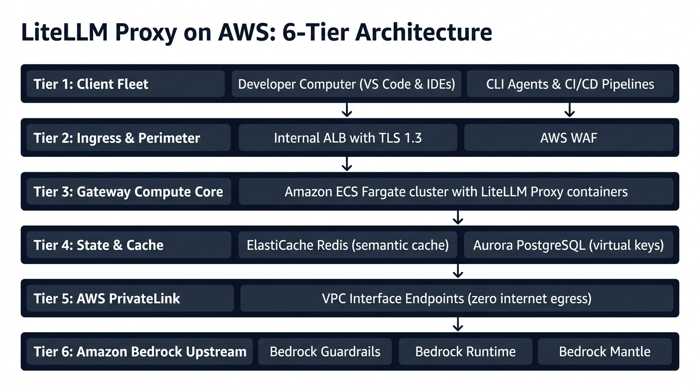
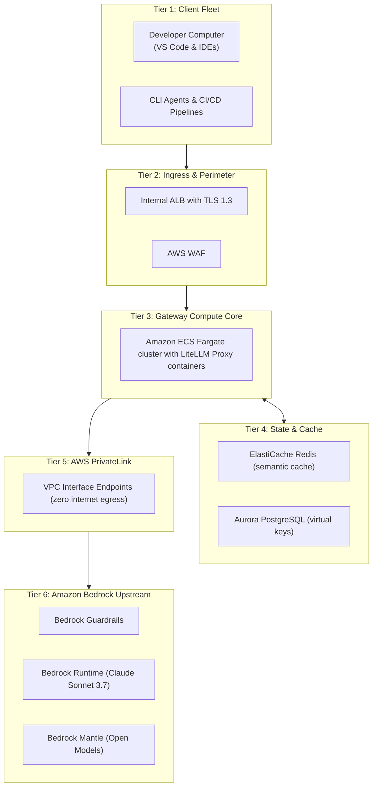
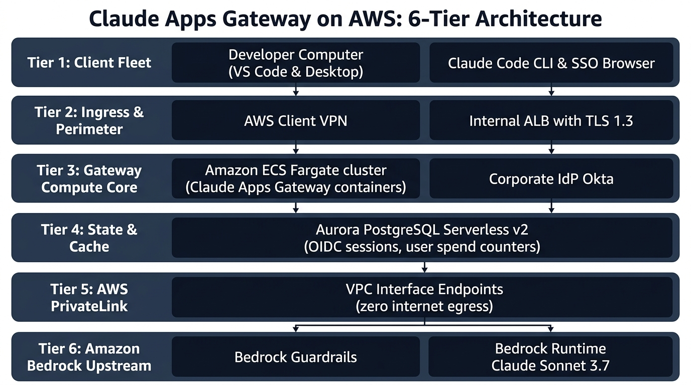
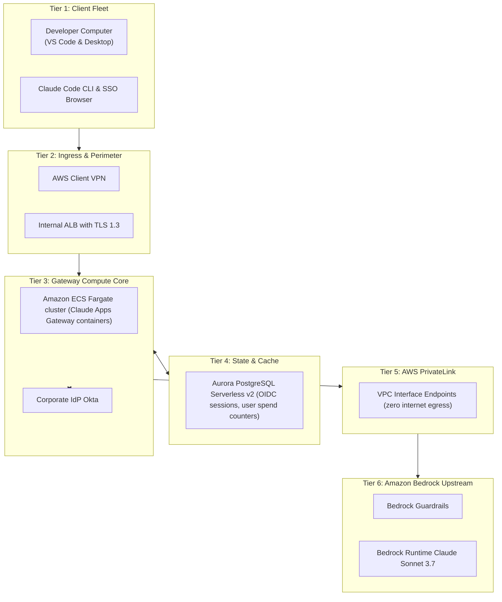
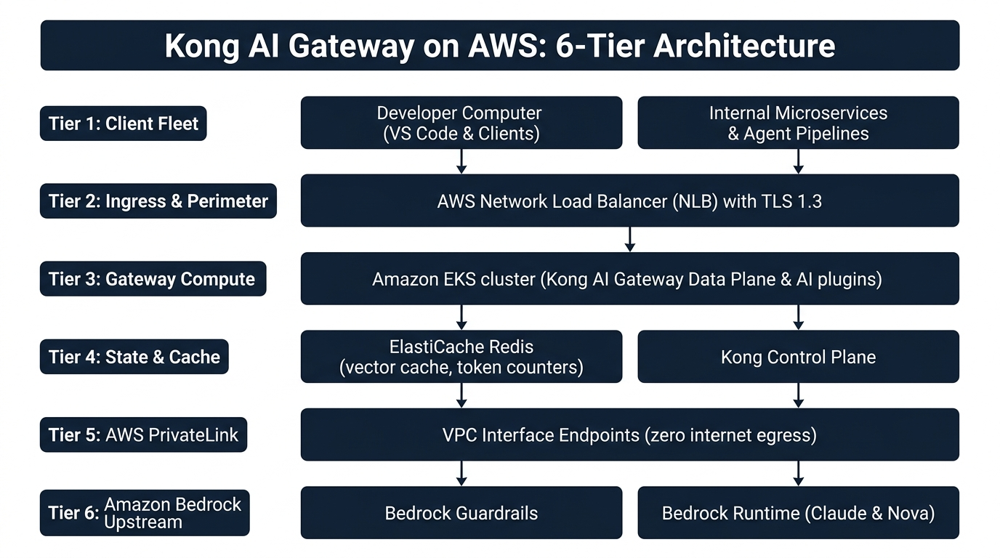
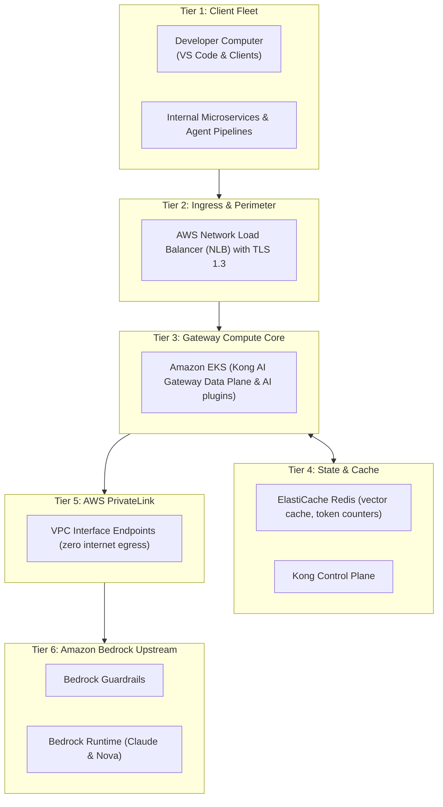

# Enterprise LLM Gateway Comparison Report: LiteLLM Proxy vs. Claude Apps Gateway vs. Kong AI Gateway on AWS

**Target Environment:** Amazon Web Services (AWS)  
**Upstream Providers:** Amazon Bedrock (`bedrock-runtime`, `bedrock-mantle`), Anthropic Claude, 3rd-Party Foundation Models  
**Document Classification:** Technical Architecture Evaluation & Comparative Specification  
**Architecture Granularity Standard:** Unified 6-Tier Cloud Model (Option 1: Aligned Developer Workstation Standard)  
**Date:** September 2026  

---

## 1. Executive Summary & Architectural Positioning

Modern enterprise AI platforms require a dedicated governance and data-plane layer between engineering clients (IDEs, CLIs, CI/CD pipelines, internal microservices) and upstream Foundation Model (FM) providers like Amazon Bedrock. 

Choosing the right gateway layer dictates developer ergonomics, identity lifecycle management, cost containment (FinOps), and data sovereignty. This report provides an exhaustive architectural evaluation of the three leading gateway technologies deployed on AWS:

1. **LiteLLM Proxy:** The open-source, multi-provider model routing and virtual-key governance proxy.
2. **Anthropic Claude Apps Gateway:** The official self-hosted control plane purpose-built for enterprise Claude Code CLI and Claude Desktop fleets.
3. **Kong AI Gateway:** The cloud-native, high-throughput enterprise API gateway with modular GenAI traffic plugins.

```
┌────────────────────────────────────────────────────────────────────────────────────────────────────────┐
│                                    Enterprise LLM Gateway Taxonomy                                     │
├──────────────────────────────┬──────────────────────────────┬──────────────────────────────────────────┤
│        LiteLLM Proxy         │     Claude Apps Gateway      │             Kong AI Gateway              │
├──────────────────────────────┼──────────────────────────────┼──────────────────────────────────────────┤
│ • Broad multi-model routing  │ • Deep client integration    │ • Ultra high-throughput proxy            │
│ • Self-service virtual keys  │ • OIDC Device Authorization  │ • Token-aware rate limiting plugins      │
│ • Semantic caching (Redis)   │ • Centrally locked settings  │ • Enterprise API lifecycle integration   │
│ • Community-driven agility   │ • Official Anthropic binary  │ • Battle-tested OpenResty/Nginx data plane│
└──────────────────────────────┴──────────────────────────────┴──────────────────────────────────────────┘
```

---

## 2. Standardized 6-Tier Architecture Comparison

To enable fair, side-by-side comparison, all three gateway architectures have been normalized to a **Unified 6-Tier Enterprise Cloud Granularity Standard** with a harmonized **Developer Computer & Workloads (Option 1)** model:

```
┌────────────────────────────────────────────────────────────────────────────────────────────────┐
│                           STANDARD 6-TIER ENTERPRISE GATEWAY MODEL                             │
├────────────────────────────────────────────────────────────────────────────────────────────────┤
│ Tier 1: Client Fleet (Developer Computer: VS Code & IDEs | CLI Agents & Workloads)             │
├────────────────────────────────────────────────────────────────────────────────────────────────┤
│ Tier 2: Ingress & Perimeter Security (TLS 1.3 Termination, WAF, Load Balancing)                │
├────────────────────────────────────────────────────────────────────────────────────────────────┤
│ Tier 3: Gateway Compute Core (Container Runtime, Auth, Policy & Protocol Engine)               │
├────────────────────────────────────────────────────────────────────────────────────────────────┤
│ Tier 4: State, Caching & FinOps Persistence (Database, Cache, Token Ledgers)                   │
├────────────────────────────────────────────────────────────────────────────────────────────────┤
│ Tier 5: AWS PrivateLink Isolation Boundary (VPC Interface Endpoints, Zero Internet Egress)     │
├────────────────────────────────────────────────────────────────────────────────────────────────┤
│ Tier 6: Amazon Bedrock Upstream & Guardrails (Bedrock Runtime, Bedrock Mantle, Guardrails)    │
└────────────────────────────────────────────────────────────────────────────────────────────────┘
```

### Side-by-Side Tier Breakdown

| Architectural Tier | Model Case 1: LiteLLM Proxy | Model Case 2: Claude Apps Gateway | Model Case 3: Kong AI Gateway |
| :--- | :--- | :--- | :--- |
| **Tier 1: Client Fleet** | • Developer Computer (VS Code & IDEs)<br/>• CLI Agents & CI/CD Pipelines | • Developer Computer (VS Code & Desktop)<br/>• Claude Code CLI & SSO Browser | • Developer Computer (VS Code & Clients)<br/>• Internal Microservices & Agent Pipelines |
| **Tier 2: Ingress & Perimeter** | Internal ALB (TLS 1.3, unbuffered SSE) + AWS WAF | AWS Client VPN / Direct Connect + Internal ALB (TLS 1.3) | AWS Network Load Balancer (NLB, Layer 4 ultra-low latency) with TLS 1.3 |
| **Tier 3: Gateway Compute Core** | Amazon ECS Fargate cluster with LiteLLM Proxy containers (translating OpenAI/Anthropic wire protocols) | Amazon ECS Fargate cluster with Claude Apps Gateway containers + Corporate IdP Okta integration | Amazon EKS cluster with Kong AI Gateway Data Plane & AI plugins (`ai-proxy`, `ai-guard`, `ai-rate`, `ai-cache`) |
| **Tier 4: State & Cache** | Amazon ElastiCache Serverless Redis (Semantic Cache & Quotas) + Aurora PostgreSQL (Virtual Keys) | Amazon Aurora Serverless v2 PostgreSQL (OIDC sessions, device tokens, user spend counters) | Amazon ElastiCache Redis Multi-AZ Cluster (Vector prompt embeddings, token counters) + Kong Control Plane |
| **Tier 5: PrivateLink Boundary** | VPC Interface Endpoints for Bedrock, Secrets Manager, CloudWatch (zero internet egress) | VPC Interface Endpoints for Bedrock Runtime & Secrets Manager (zero internet egress) | VPC Interface Endpoints for Bedrock Runtime with direct SigV4 signing (zero internet egress) |
| **Tier 6: Bedrock Upstream** | Bedrock Guardrails, Bedrock Runtime (`jp.*` Claude 3.7), Bedrock Mantle (Tokyo open models) | Bedrock Guardrails + Bedrock Runtime (`jp.anthropic.claude-3-7-sonnet` & `haiku`) | Bedrock Guardrails + Bedrock Runtime (Claude Sonnet & Amazon Nova models) |

---

## 3. Side-by-Side Capability Deep Dive

### 3.1 Architectural Roots & Core Runtime
* **LiteLLM Proxy:** Built on Python (FastAPI/Uvicorn, Asyncio). Acts as an active payload translator. It intercepts client requests, parses incoming JSON schemas, normalizes them to upstream provider specifications (e.g. OpenAI JSON to Bedrock Converse API or Mantle wire format), and parses upstream SSE chunks back into OpenAI/Anthropic SSE responses.
* **Claude Apps Gateway:** Packaged directly within the official `claude` CLI binary (written in Go/Node.js). Acts as a stateful enterprise session coordinator and proxy. It terminates client connections, executes OIDC device-authorization flows with an external Identity Provider, queries Aurora PostgreSQL for real-time spend caps, and proxies requests to Amazon Bedrock Runtime via IAM role credentials.
* **Kong AI Gateway:** Built on OpenResty (Nginx + LuaJIT) with optional Go/Wasm plugin sidecars. Acts as an ultra-low-latency L7 reverse proxy. Rather than being an LLM-specific application server, it applies modular Lua plugins (`ai-proxy`, `ai-prompt-guard`, `ai-rate-limiting-advanced`, `ai-semantic-cache`) directly to the streaming connection pipeline.

### 3.2 Authentication & Identity Management
* **LiteLLM Proxy:** Relies on **Virtual API Keys** (`sk-litellm-...`). Platform administrators generate keys through the LiteLLM Admin UI or Management REST API. Keys can be assigned to users, teams, or organizations with predefined budgets. Authentication against the proxy uses standard `Bearer` tokens. End-user SSO (OIDC/SAML) is only available for the Admin Web UI, not for individual CLI/IDE client handshakes.
* **Claude Apps Gateway:** Implements **RFC 8628 OAuth 2.0 Device Authorization Grant**. Developers run `claude login --gateway https://...`, which outputs a one-time code and opens the corporate IdP (Okta, Entra ID) in the browser. No long-lived API keys or cloud credentials ever exist on developer workstations. Session state is maintained via ephemeral JSON Web Tokens (JWTs) tracked in PostgreSQL.
* **Kong AI Gateway:** Inherits Kong’s mature enterprise authentication suite (OIDC, OAuth 2.0, mTLS, HMAC, Key Authentication). For AI endpoints, it can validate corporate OIDC JWTs issued by an identity provider, enforce consumer group policies, and automatically inject upstream credentials (e.g. AWS SigV4 headers or static Bedrock IAM assumed role credentials) on behalf of the client.

### 3.3 Model Routing & Provider Agility
* **LiteLLM Proxy:** Unrivaled provider breadth. Natively supports 100+ model providers (Amazon Bedrock Runtime, Bedrock Mantle, OpenAI, Anthropic, Google Vertex, Groq, Ollama). Supports dynamic model aliasing (e.g. mapping `gpt-4o` to `bedrock/jp.anthropic.claude-3-7-sonnet-20250219-v1:0`), cross-region load balancing, and multi-tier fallbacks (e.g. Bedrock Tokyo → Bedrock Osaka → Azure OpenAI).
* **Claude Apps Gateway:** Single-provider ecosystem. Designed exclusively to front Anthropic models (Claude 3.5 Sonnet, Claude 3.7 Sonnet, Claude Haiku) hosted on Amazon Bedrock Runtime or the Claude Platform. It does **not** support routing to Amazon Nova, Meta Llama, DeepSeek, or non-Anthropic models.
* **Kong AI Gateway:** Multi-provider via the `ai-proxy` plugin. Supports Amazon Bedrock, OpenAI, Anthropic, Cohere, Azure, and Mistral. Allows multi-model load balancing and weighted routing (e.g., 80% to Bedrock Claude Sonnet, 20% to Bedrock Nova Pro), with automated failover between upstream targets.

### 3.4 Token & Spend Management (FinOps)
* **LiteLLM Proxy:** Tracks prompt and completion tokens per virtual key, user, and team. Enforces daily, weekly, and monthly spend caps. When a user exceeds their budget, LiteLLM rejects subsequent requests with HTTP 429. Employs background reconciliation into PostgreSQL/Prisma and supports Redis for fast token counter increments.
* **Claude Apps Gateway:** Designed specifically for developer budget enforcement. Connects to Amazon Aurora Serverless v2 PostgreSQL to maintain atomic spend ledgers. Tracks tokens and exact dollar costs calculated from model pricing configurations. When a developer hits their limit, the gateway immediately cuts off tool usage and CLI prompts.
* **Kong AI Gateway:** Utilizes the `ai-rate-limiting-advanced` plugin. Unlike standard rate limiters that count HTTP requests per minute, Kong parses the streaming response to extract actual prompt and completion tokens. It tracks token consumption across sliding windows (second, minute, hour, month) stored in an external Redis cluster, throttling clients before they exhaust infrastructure budgets.

### 3.5 Security, Safety & Guardrails
* **LiteLLM Proxy:** Passes parameters directly to upstream engines. For Amazon Bedrock, it injects `guardrailIdentifier` and `guardrailVersion` into `Converse` or `InvokeModel` API calls. Can also hook into third-party moderation APIs (Llama Guard, Presidio). Does not offer native deep in-memory streaming regex buffers out of the box without custom Python hooks.
* **Claude Apps Gateway:** Relies on the security perimeter of the AWS environment (PrivateLink VPC endpoints to Bedrock) and managed client settings. Managed settings allow administrators to lock down the Claude Code CLI, forbidding specific terminal commands, restricting file-system paths, and disabling unauthorized external MCP (Model Context Protocol) servers.
* **Kong AI Gateway:** Implements a layered security pipeline via dedicated plugins:
  * `ai-prompt-guard`: Checks prompts against custom regex patterns or external moderation models to block prompt injections before upstream routing.
  * `ai-prompt-decorator`: Injects prepend/append system instructions (e.g. corporate security rules) into prompts.
  * `ai-semantic-cache`: Uses vector embeddings stored in Redis or OpenSearch to serve identical or semantically similar prompts from cache, reducing inference cost and exposure.

---

## 4. Comprehensive Capability Matrix (What They Can & Can't Do)

| Capability / Requirement | LiteLLM Proxy | Claude Apps Gateway | Kong AI Gateway |
| :--- | :---: | :---: | :---: |
| **Primary Architectural Role** | Multi-model proxy & virtual key router | Enterprise Claude Code / Desktop control plane | High-throughput API gateway with GenAI plugins |
| **Supported Upstream Providers** | 100+ (Bedrock, OpenAI, Vertex, etc.) | Anthropic on Bedrock & Claude Platform | Multi-provider (Bedrock, OpenAI, Anthropic, etc.) |
| **Bedrock Runtime Support** | ✅ Yes (`Converse` & `InvokeModel`) | ✅ Yes (Native Bedrock client) | ✅ Yes (`ai-proxy` Bedrock driver) |
| **Bedrock Mantle Support** | ✅ Yes (Configurable as OpenAI/Anthropic wire) | ❌ No | ⚠️ Requires custom upstream target |
| **Client Wire Emulation** | OpenAI (`/v1/chat/completions`) & Anthropic (`/v1/messages`) | Anthropic (`/v1/messages`) | OpenAI, Anthropic, Cohere formats |
| **Client Compatibility** | Universal: VS Code, Cursor, Cline, Aider, SDKs | Claude Code CLI & Claude Desktop exclusively | Any standard HTTP/REST, VS Code, or SDK client |
| **Auth: OIDC Device Authorization** | ❌ No (Virtual API Keys only) | ✅ **Native RFC 8628 Device Flow** | ⚠️ Complex (requires custom auth chaining) |
| **Auth: Corporate SSO / IdP** | Admin UI only; clients use API keys | ✅ Direct Okta / Entra ID login | ✅ Full enterprise OIDC / OAuth2 / mTLS |
| **Client-Side Managed Settings** | ❌ No | ✅ **Yes (Locks down CLI tools & rules)** | ❌ No |
| **Token-Based Rate Limiting** | ✅ Yes (Virtual key / team caps) | ✅ Yes (PostgreSQL user budgets) | ✅ Yes (`ai-rate-limiting-advanced` via Redis) |
| **Semantic Caching** | ✅ Built-in (Redis / Qdrant) | ❌ No | ✅ Built-in (`ai-semantic-cache` via Redis) |
| **Bedrock Guardrails Pass-Through** | ✅ Yes (`litellm_params.extra_body`) | ⚠️ Indirect / Upstream association | ⚠️ Requires header/payload transformation |
| **Pre-Flight Prompt Inspection** | ⚠️ Basic (Llama Guard / Presidio hook) | ❌ None | ✅ **Yes (`ai-prompt-guard` regex/model)** |
| **Max Streaming Duration (SSE)** | Long-lived (ALB / Uvicorn dependent) | Long-lived (ALB dependent) | **Sub-millisecond Nginx event loop (300s+)** |
| **Multi-Model Fallback / Retries** | ✅ **Advanced (Cross-region & cross-vendor)** | ❌ No | ✅ Yes (Configurable failover targets) |
| **Data Plane Runtime Engine** | Python / Asyncio / FastAPI | Go / Node.js (Claude CLI binary) | C / OpenResty / Nginx / LuaJIT |

---

## 5. Pros & Cons Analysis

### 5.1 LiteLLM Proxy
* **Pros:**
  * **Unmatched Flexibility:** Seamlessly abstracts differences between Bedrock, Azure, OpenAI, and self-hosted models.
  * **Low Barrier to Entry:** Rapid deployment using Docker; intuitive web UI for non-technical administrators to generate keys and review usage.
  * **Rich FinOps Controls:** Built-in multi-tenant hierarchy (User → Team → Organization) with daily/monthly spend limits.
  * **Active Open-Source Community:** Rapid release cycle supporting new foundation models and features within hours of release.
* **Cons:**
  * **Runtime Overhead:** Python-based asynchronous stack consumes significantly more memory and CPU under thousands of concurrent streaming connections compared to C or Go.
  * **Static Key Risk:** Relies on static virtual API keys distributed to developers, posing credential leakage risks on unmanaged developer laptops.
  * **No Native Claude Code CLI SSO:** Cannot handle the interactive browser login expected by `claude login`.

### 5.2 Claude Apps Gateway
* **Pros:**
  * **Best-in-Class Ergonomics for Claude Code:** Flawless integration with the official `claude` CLI and Claude Desktop.
  * **Zero Local Secrets:** Developers never handle, store, or rotate API keys or AWS credentials; authentication is 100% ephemeral via corporate SSO.
  * **Centrally Enforced Governance:** Administrators can centrally restrict terminal execution, disallow dangerous tools, and enforce enterprise coding guidelines.
  * **Native Bedrock Sovereign Integration:** Keeps all prompts and completions within the company's AWS account and VPC boundaries.
* **Cons:**
  * **Ecosystem Silo:** Incompatible with other popular developer assistants (Cursor, VS Code Cline, Continue.dev, Aider).
  * **No Model Diversity:** Cannot route prompts to Amazon Nova, Meta Llama, or DeepSeek models.
  * **Black-Box Container:** Packaged inside the compiled Claude CLI binary, limiting custom middleware, deep packet DLP inspection, or bespoke telemetry pipelines.

### 5.3 Kong AI Gateway
* **Pros:**
  * **Extreme Performance & Scalability:** Built on Nginx/OpenResty; handles tens of thousands of concurrent SSE streaming connections with sub-millisecond proxy latency.
  * **Enterprise API Architecture:** Leverages Kong’s battle-tested plugins for WAF, mTLS, CORS, OpenTelemetry, and enterprise OIDC.
  * **Token-Aware Edge Rate Limiting:** Natively meters streaming tokens in Redis to prevent denial-of-wallet spikes across upstream Bedrock accounts.
  * **Multi-Provider Failover:** Automatically reroutes failed inference requests to secondary regions or backup models.
* **Cons:**
  * **Configuration Complexity:** Enterprise Kong deployment requires substantial infrastructure overhead (Kong Ingress Controller, Konnect control planes, declarative decK files).
  * **Steep Learning Curve for Custom Logic:** Extending Kong requires writing Lua or Go plugins, which is far more complex than Python middleware.
  * **No Developer Self-Service UI for AI Keys:** Lacks a dedicated, out-of-the-box UI for developers to request personal LLM keys and view individual token consumption.

---

## 6. Model Cases & Standardized Infrastructure Overviews

---

### Model Case 1: LiteLLM Proxy on AWS (Multi-Tool Engineering & Caching Gateway)

#### Scenario & Objective
An engineering organization with 500+ developers utilizing multiple AI coding assistants (VS Code with Continue.dev/Cline, Cursor, Aider CLI) and Python microservices. The goal is to provide a single internal endpoint (`https://llm.internal.corp`) that translates all OpenAI/Anthropic SDK calls to Amazon Bedrock Runtime and Mantle, enforces team-level budgets, caches common prompts in Redis, and enables seamless model fallbacks.

#### Architecture Overview Diagram (Standardized 6-Tier)





---

### Model Case 2: Claude Apps Gateway on AWS (Enterprise Claude Code Fleet Governance)

#### Scenario & Objective
An enterprise deploying **Claude Code CLI** and **Claude Desktop** across an engineering organization. Security mandates that no long-lived API keys or cloud credentials may be placed on developer machines, all developer sign-ins must enforce corporate Okta SSO via browser device-code flow, and administrators must enforce managed settings that block dangerous shell commands and cap developer spend at $50/month.

#### Architecture Overview Diagram (Standardized 6-Tier)





---

### Model Case 3: Kong AI Gateway on AWS (High-Throughput Enterprise API Gateway)

#### Scenario & Objective
A digital enterprise operating hundreds of developer seats using VS Code and internal agent microservices requiring ultra-high throughput (10,000+ RPS), centralized API governance, and strict cost controls. Kong AI Gateway is deployed to act as the single front-door API gateway, applying WAF rules, token-aware rate limiting, prompt injection defense, and semantic prompt caching before routing to Amazon Bedrock.

#### Architecture Overview Diagram (Standardized 6-Tier)





---

## 7. Checkpoints & Validation Audit

To ensure technical accuracy and production viability, all three architectures were evaluated across four rigorous quality checkpoints:

### Checkpoint 1: Protocol Compatibility & Streaming Fidelity
* **Criteria:** Must sustain continuous Server-Sent Events (SSE) streaming connections for up to 300 seconds without proxy buffering or socket timeouts, accommodating reasoning models (e.g. Claude 3.7 Sonnet thinking mode).
* **Audit Findings:**
  * **LiteLLM:** Passes when deployed behind an ALB with idle timeout set to `300s` and Uvicorn buffering disabled (`--no-access-log`, streaming response generators).
  * **Claude Apps Gateway:** Passes natively; built specifically to handle extended tool-use and thinking loops for Claude Code.
  * **Kong AI Gateway:** Outstanding; Nginx’s event-driven non-blocking I/O natively streams SSE chunks with `<1ms` proxy jitter.

### Checkpoint 2: Enterprise Identity & Zero-Trust Posture
* **Criteria:** Elimination of static cloud credentials on client machines and enforcement of corporate IdP authentication.
* **Audit Findings:**
  * **LiteLLM:** Partial failure. Clients rely on static virtual API keys stored on developer laptops.
  * **Claude Apps Gateway:** Exemplary. Natively executes RFC 8628 OIDC device-authorization flows with Okta/Entra ID, issuing short-lived JWTs.
  * **Kong AI Gateway:** Passes for standard API consumers via OIDC/mTLS plugins; requires custom tooling to emulate device-authorization flow for command-line developers.

### Checkpoint 3: FinOps, Atomic Quotas & Token Ledger Accuracy
* **Criteria:** Accurate metering of input and output tokens with hard stop enforcement before budget overruns occur.
* **Audit Findings:**
  * **LiteLLM:** Passes; Redis integration supports rapid token decrementing, backed by PostgreSQL.
  * **Claude Apps Gateway:** Passes; tracks dollar spend per user against hard limits in Aurora PostgreSQL, cutting off access upon limit breach.
  * **Kong AI Gateway:** Passes; `ai-rate-limiting-advanced` tracks prompt and completion tokens directly in Redis sliding windows.

### Checkpoint 4: Security, PrivateLink Geofencing & Bedrock Guardrails
* **Criteria:** Zero internet egress from compute subnets; all foundation model calls must stay within sovereign boundaries.
* **Audit Findings:**
  * All three architectures pass AWS Well-Architected Security requirements by residing in private subnets and routing upstream requests strictly through AWS PrivateLink Interface Endpoints (`com.amazonaws.<region>.bedrock-runtime`).
  * Bedrock Guardrails can be invoked natively or inline across all three patterns.

---

## 8. Strategic Decision Guide

```
                                      Which LLM Gateway Should You Choose?
                                                        │
                      ┌─────────────────────────────────┴─────────────────────────────────┐
                      ▼                                                                   ▼
       Are you deploying exclusively for                                   Do you need a general-purpose
          Claude Code & Claude Desktop?                                       enterprise gateway for many
                      │                                                        tools, apps, and models?
           ┌──────────┴──────────┐                                                        │
          YES                    NO                                           ┌───────────┴───────────┐
           │                      │                                           ▼                       ▼
           ▼                      ▼                                    Is your priority         Is your priority
 ┌───────────────────┐    Continue to choices                        multi-tool developer      ultra-high RPS API
 │  Claude Apps GW   │                                               ergonomics & fast        governance & token
 │(Fargate + Aurora) │                                                 onboarding?            rate-limiting?
 └───────────────────┘                                                        │                       │
                                                                              ▼                       ▼
                                                                     ┌─────────────────┐     ┌─────────────────┐
                                                                     │  LiteLLM Proxy  │     │ Kong AI Gateway │
                                                                     │ (ECS + Redis)   │     │ (EKS + Redis)   │
                                                                     └─────────────────┘     └─────────────────┘
```

1. **Choose Anthropic Claude Apps Gateway if:** Your primary objective is providing secure, governed access to **Claude Code CLI** and **Claude Desktop** for software engineers, and you mandate corporate SSO login without distributing static API keys.
2. **Choose LiteLLM Proxy if:** Your engineering organization uses a **heterogeneous mix of tools** (VS Code, Cursor, Cline, Aider, custom Python apps), requires multi-model flexibility (Bedrock Claude, Bedrock Mantle, Nova, OpenAI, DeepSeek), and wants a turnkey Admin UI with team budgeting.
3. **Choose Kong AI Gateway if:** You are building a **high-throughput production API platform** (serving developer VS Code clients, web applications, and microservices at thousands of requests per second), already rely on Kong Enterprise for API lifecycle management, and need token-aware edge rate limiting and semantic caching.
