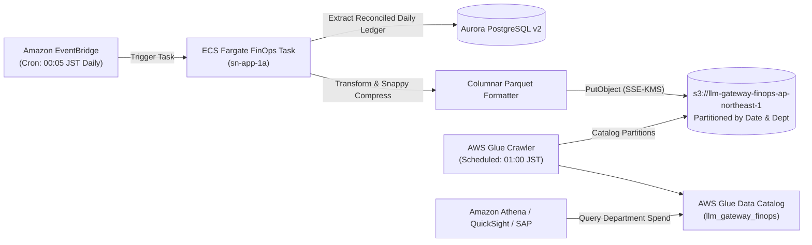

# AWS System Architecture Blueprint & Infrastructure Specification
**Enterprise Engineering LLM Gateway (v2.2 Hardened Standard)**  
**Target Environment:** AWS Tokyo (`ap-northeast-1`) Primary / AWS Osaka (`ap-northeast-3`) Disaster Recovery  
**Security Standard:** Zero Internet Egress, Strict Japan Sovereign Boundary, Zero Data Retention (ZDR)  
**Companion Documents:** [REQUIREMENTS.md](REQUIREMENTS.md) | [MODEL_AVAILABILITY_MATRIX.md](MODEL_AVAILABILITY_MATRIX.md)

---

## Document Overview & Scope

This specification provides the physical cloud architecture, network design, security boundaries, and Infrastructure-as-Code (IaC) topology for the **Engineering LLM Gateway**. While [REQUIREMENTS.md](REQUIREMENTS.md) defines the functional requirements, governance tiers, FinOps data models, and DLP rules, this document serves as the implementation-level blueprint for Cloud Platform Engineers, Security Architects, and SREs.

### Core Architectural Invariants
1. **Isolated VPC / Zero Internet Egress:** The core processing tier runs in fully isolated subnets with zero NAT Gateways or Internet Gateways. All upstream communication (Bedrock, Secrets Manager, CloudWatch, KMS) routes strictly through AWS PrivateLink VPC Interface Endpoints.
2. **Absolute Japan Geo Residency:** Enforced by design so that no packet, token, log, or artifact leaves Japanese sovereign territory (`ap-northeast-1` and `ap-northeast-3`).
3. **Low-Latency Streaming Data Plane:** Maximizes throughput and preserves real-time unbuffered Server-Sent Events (SSE) token streaming (<20ms added proxy overhead, 300s connection timeouts).

---

## 1. Network Topology & VPC Subnet Allocation Matrix

The Engineering LLM Gateway is deployed within a greenfield, dedicated Virtual Private Cloud (VPC) engineered under an **Isolated VPC Zero-Egress Architecture**. The VPC contains **no Internet Gateways (IGW)**, **no Egress-Only Internet Gateways (EIGW)**, and **no NAT Gateways**. All external corporate traffic enters through Zero Trust Network Access (ZTNA), and all outbound dependencies connect exclusively via AWS PrivateLink Interface Endpoints and VPC Gateway Endpoints.

### 1.1 Architecture & Ingress Flow Diagram

```mermaid
flowchart TD
    subgraph CorporateBoundary["Corporate Network & Client Perimeter"]
        DevClients["Developer Workstations (Cursor / VS Code / CLIs)<br/>Enforced by Microsoft Intune Device Posture"]
        CorporateIdP["Microsoft Entra ID (Azure AD)<br/>OIDC SSO & SCIM 2.0 Webhooks"]
    end

    subgraph AWS_Cloud["AWS Region: ap-northeast-1 (Tokyo)"]
        subgraph AVA_Layer["Zero Trust Ingress Layer"]
            AVA["AWS Verified Access (AVA)<br/>Validates Intune Posture & Entra OIDC Claims"]
        end

        subgraph VPC_Core["Dedicated LLM Gateway VPC (10.100.0.0/16) - Zero NAT / Zero IGW"]
            subgraph Subnets_Ingress["Ingress Subnets (Multi-AZ)"]
                ALB_1A["Internal ALB ENI<br/>10.100.0.0/24 (AZ-1a)"]
                ALB_1C["Internal ALB ENI<br/>10.100.1.0/24 (AZ-1c)"]
                ALB_1D["Internal ALB ENI<br/>10.100.2.0/24 (AZ-1d)"]
            end

            subgraph Subnets_App["Core Processing Tier (Isolated Subnets)"]
                Fargate_1A["ECS Fargate Proxy Task<br/>10.100.16.0/20 (AZ-1a)"]
                Fargate_1C["ECS Fargate Proxy Task<br/>10.100.32.0/20 (AZ-1c)"]
                Fargate_1D["ECS Fargate Proxy Task<br/>10.100.48.0/20 (AZ-1d)"]
            end

            subgraph Subnets_Data["State & Persistence Tier (Isolated Subnets)"]
                DB_Primary["Aurora PostgreSQL v2 (Writer)<br/>10.100.64.0/24 (AZ-1a)"]
                DB_Replica["Aurora PostgreSQL v2 (Reader)<br/>10.100.65.0/24 (AZ-1c)"]
                Redis_Cluster["ElastiCache Redis Serverless<br/>10.100.64.0/24 - 10.100.66.0/24"]
                RDS_Proxy["RDS Proxy ENIs<br/>10.100.64.0/24 - 10.100.66.0/24"]
            end

            subgraph Subnets_Endpoints["PrivateLink VPC Interface Endpoints Tier"]
                VPCE_1A["Interface Endpoints (ENIs)<br/>10.100.80.0/24 (AZ-1a)"]
                VPCE_1C["Interface Endpoints (ENIs)<br/>10.100.81.0/24 (AZ-1c)"]
                VPCE_1D["Interface Endpoints (ENIs)<br/>10.100.82.0/24 (AZ-1d)"]
            end
        end

        subgraph AWSServices["AWS Managed Internal Services (Tokyo ap-northeast-1)"]
            BedrockRT["Amazon Bedrock Runtime<br/>(com.amazonaws.ap-northeast-1.bedrock-runtime)"]
            BedrockCtrl["Amazon Bedrock Control<br/>(com.amazonaws.ap-northeast-1.bedrock)"]
            MantleAPI["Amazon Bedrock Mantle<br/>(bedrock-mantle.ap-northeast-1.api.aws)"]
            SecretsMgr["AWS Secrets Manager<br/>(com.amazonaws.ap-northeast-1.secretsmanager)"]
            KMS_Svc["AWS KMS<br/>(com.amazonaws.ap-northeast-1.kms)"]
            CW_Logs["Amazon CloudWatch Logs<br/>(com.amazonaws.ap-northeast-1.logs)"]
            S3_Bucket["Amazon S3 (Gateway Endpoint: pl-63a5400a)<br/>• Audit Logs (WORM)<br/>• FinOps Parquet Export"]
            ECR_Endpoints["Amazon ECR (api + dkr)<br/>Image Repository"]
        end
    end

    DevClients -->|"HTTPS 443 + Device Cert"| AVA
    AVA -->|"Identity & Posture Evaluated"| CorporateIdP
    AVA -->|"Pass-through Private Traffic"| ALB_1A & ALB_1C & ALB_1D
    ALB_1A & ALB_1C & ALB_1D -->|"HTTP 8000 (Keep-Alive, Unbuffered SSE)"| Fargate_1A & Fargate_1C & Fargate_1D

    Fargate_1A & Fargate_1C & Fargate_1D <-->|"TCP 6379 (TLS 1.3 Atomic Reservation)"| Redis_Cluster
    Fargate_1A & Fargate_1C & Fargate_1D <-->|"TCP 5432 (IAM Auth / Pooled SQL)"| RDS_Proxy
    RDS_Proxy <--> DB_Primary & DB_Replica

    Fargate_1A & Fargate_1C & Fargate_1D -->|"HTTPS 443 (PrivateLink)"| VPCE_1A & VPCE_1C & VPCE_1D
    VPCE_1A & VPCE_1C & VPCE_1D --> BedrockRT & BedrockCtrl & MantleAPI & SecretsMgr & KMS_Svc & CW_Logs & ECR_Endpoints
    Fargate_1A & Fargate_1C & Fargate_1D -->|"Gateway Route (Prefix List)"| S3_Bucket
```



---

### 1.2 Subnet Allocation & CIDR Block Planning

* **Primary VPC Allocation (Tokyo `ap-northeast-1`):** `10.100.0.0/16` (65,536 total addresses)
* **Disaster Recovery VPC Allocation (Osaka `ap-northeast-3`):** `10.101.0.0/16` (Non-overlapping for cross-region peering/replication)

#### Subnet Allocation Matrix (`ap-northeast-1`)

| Subnet Identifier | Availability Zone | CIDR Block | Usable IPs | Tier / Intended Workload | Route Table Association |
| :--- | :--- | :--- | :--- | :--- | :--- |
| `sn-ingress-1a` | `ap-northeast-1a` | `10.100.0.0/24` | 251 | Ingress (AVA ENIs, Internal ALB ENIs) | `rt-ingress` (Local only) |
| `sn-ingress-1c` | `ap-northeast-1c` | `10.100.1.0/24` | 251 | Ingress (AVA ENIs, Internal ALB ENIs) | `rt-ingress` (Local only) |
| `sn-ingress-1d` | `ap-northeast-1d` | `10.100.2.0/24` | 251 | Ingress (AVA ENIs, Internal ALB ENIs) | `rt-ingress` (Local only) |
| `sn-app-1a` | `ap-northeast-1a` | `10.100.16.0/20`| 4,091 | Core Processing (ECS Fargate Proxy Tasks) | `rt-app` (Local + S3 Gateway) |
| `sn-app-1c` | `ap-northeast-1c` | `10.100.32.0/20`| 4,091 | Core Processing (ECS Fargate Proxy Tasks) | `rt-app` (Local + S3 Gateway) |
| `sn-app-1d` | `ap-northeast-1d` | `10.100.48.0/20`| 4,091 | Core Processing (ECS Fargate Proxy Tasks) | `rt-app` (Local + S3 Gateway) |
| `sn-data-1a` | `ap-northeast-1a` | `10.100.64.0/24`| 251 | State (Aurora v2, ElastiCache, RDS Proxy) | `rt-data` (Local strictly) |
| `sn-data-1c` | `ap-northeast-1c` | `10.100.65.0/24`| 251 | State (Aurora v2, ElastiCache, RDS Proxy) | `rt-data` (Local strictly) |
| `sn-data-1d` | `ap-northeast-1d` | `10.100.66.0/24`| 251 | State (Aurora v2, ElastiCache, RDS Proxy) | `rt-data` (Local strictly) |
| `sn-vpce-1a` | `ap-northeast-1a` | `10.100.80.0/24`| 251 | PrivateLink Interface Endpoints (ENIs) | `rt-endpoints` (Local strictly) |
| `sn-vpce-1c` | `ap-northeast-1c` | `10.100.81.0/24`| 251 | PrivateLink Interface Endpoints (ENIs) | `rt-endpoints` (Local strictly) |
| `sn-vpce-1d` | `ap-northeast-1d` | `10.100.82.0/24`| 251 | PrivateLink Interface Endpoints (ENIs) | `rt-endpoints` (Local strictly) |
| *Reserved Expansion*| — | `10.100.96.0/19`| 8,192 | Future Dedicated GPU Nodes / Batch Workers | None |

---

### 1.3 Route Table Topology

```
Route Table: rt-ingress
├── Destination: 10.100.0.0/16  --> Target: local
└── Associated Subnets: sn-ingress-1a, sn-ingress-1c, sn-ingress-1d

Route Table: rt-app
├── Destination: 10.100.0.0/16  --> Target: local
├── Destination: pl-63a5400a    --> Target: vpce-s3-gateway (Amazon S3 Prefix List for ap-northeast-1)
└── Associated Subnets: sn-app-1a, sn-app-1c, sn-app-1d

Route Table: rt-data
├── Destination: 10.100.0.0/16  --> Target: local
└── Associated Subnets: sn-data-1a, sn-data-1c, sn-data-1d

Route Table: rt-endpoints
├── Destination: 10.100.0.0/16  --> Target: local
└── Associated Subnets: sn-vpce-1a, sn-vpce-1c, sn-vpce-1d
```

---

### 1.4 AWS PrivateLink Interface & Gateway Endpoints Specification

All Interface Endpoints have **Private DNS Enabled (`true`)**, deploying elastic network interfaces across `sn-vpce-1a`, `sn-vpce-1c`, and `sn-vpce-1d`.

| Endpoint Purpose | Endpoint Type | Service Name (`ap-northeast-1`) | Private DNS Name | Subnet Placement | Security Group Attached |
| :--- | :---: | :--- | :--- | :---: | :--- |
| **Bedrock Runtime** | Interface | `com.amazonaws.ap-northeast-1.bedrock-runtime` | `bedrock-runtime.ap-northeast-1.amazonaws.com` | `sn-vpce-1a, 1c, 1d` | `sg-vpc-endpoints` |
| **Bedrock Control** | Interface | `com.amazonaws.ap-northeast-1.bedrock` | `bedrock.ap-northeast-1.amazonaws.com` | `sn-vpce-1a, 1c, 1d` | `sg-vpc-endpoints` |
| **Secrets Manager** | Interface | `com.amazonaws.ap-northeast-1.secretsmanager` | `secretsmanager.ap-northeast-1.amazonaws.com` | `sn-vpce-1a, 1c, 1d` | `sg-vpc-endpoints` |
| **CloudWatch Logs** | Interface | `com.amazonaws.ap-northeast-1.logs` | `logs.ap-northeast-1.amazonaws.com` | `sn-vpce-1a, 1c, 1d` | `sg-vpc-endpoints` |
| **CloudWatch Metrics**| Interface | `com.amazonaws.ap-northeast-1.monitoring` | `monitoring.ap-northeast-1.amazonaws.com` | `sn-vpce-1a, 1c, 1d` | `sg-vpc-endpoints` |
| **AWS KMS** | Interface | `com.amazonaws.ap-northeast-1.kms` | `kms.ap-northeast-1.amazonaws.com` | `sn-vpce-1a, 1c, 1d` | `sg-vpc-endpoints` |
| **ECR API** | Interface | `com.amazonaws.ap-northeast-1.ecr.api` | `api.ecr.ap-northeast-1.amazonaws.com` | `sn-vpce-1a, 1c, 1d` | `sg-vpc-endpoints` |
| **ECR Docker Registry**| Interface| `com.amazonaws.ap-northeast-1.ecr.dkr` | `*.dkr.ecr.ap-northeast-1.amazonaws.com` | `sn-vpce-1a, 1c, 1d` | `sg-vpc-endpoints` |
| **AWS X-Ray** | Interface | `com.amazonaws.ap-northeast-1.xray` | `xray.ap-northeast-1.amazonaws.com` | `sn-vpce-1a, 1c, 1d` | `sg-vpc-endpoints` |
| **SSM Core** | Interface | `com.amazonaws.ap-northeast-1.ssm` | `ssm.ap-northeast-1.amazonaws.com` | `sn-vpce-1a, 1c, 1d` | `sg-vpc-endpoints` |
| **SSM Messages (Exec)**| Interface| `com.amazonaws.ap-northeast-1.ssmmessages` | `ssmmessages.ap-northeast-1.amazonaws.com` | `sn-vpce-1a, 1c, 1d` | `sg-vpc-endpoints` |
| **Amazon S3** | **Gateway** | `com.amazonaws.ap-northeast-1.s3` | `s3.ap-northeast-1.amazonaws.com` | `rt-app` (Prefix List) | N/A (Route Table) |

---

## 2. Network Security & Interconnect Firewall Matrix

Traffic is policed through Security Group Chaining (referencing Security Group IDs directly) to eliminate IP drift vulnerabilities.

### 2.1 Security Group Interconnect Matrix

```
[sg-ava-ingress] ──────TCP 443──────► [sg-internal-alb]
                                             │
                                          TCP 8000
                                             │
                                             ▼
                                  [sg-ecs-gateway-proxy]
                                   │         │        │
                   ┌───────────────┘         │        └────────────────┐
                TCP 6379                  TCP 5432                  TCP 443
                   ▼                         ▼                         ▼
         [sg-elasticache-redis]       [sg-rds-proxy]         [sg-vpc-endpoints]
                                             │
                                          TCP 5432
                                             │
                                             ▼
                                      [sg-aurora-db]
```

#### Detailed Security Group Rules

| Security Group ID | Direction | Type | Protocol | Port Range | Source / Destination | Technical Justification |
| :--- | :---: | :---: | :---: | :---: | :--- | :--- |
| **`sg-internal-alb`** | Ingress | IPv4 | TCP | `443` | `sg-ava-ingress` | TLS 1.3 incoming client requests from AWS Verified Access. |
|  | Egress | IPv4 | TCP | `8000` | `sg-ecs-gateway-proxy` | Route unbuffered HTTP traffic to LiteLLM core proxy containers. |
| **`sg-ecs-gateway-proxy`** | Ingress | IPv4 | TCP | `8000` | `sg-internal-alb` | Accept reverse-proxied inference, key management, and admin requests. |
|  | Egress | IPv4 | TCP | `6379` | `sg-elasticache-redis` | Atomic Lua sliding-window rate limit checks and spend reservation. |
|  | Egress | IPv4 | TCP | `5432` | `sg-rds-proxy` | Connection-pooled SQL queries for virtual keys, RBAC, and ledger entries. |
|  | Egress | IPv4 | TCP | `443` | `sg-vpc-endpoints` | PrivateLink calls to Bedrock Runtime, Secrets Manager, KMS, and CloudWatch. |
|  | Egress | Prefix | TCP | `443` | `pl-63a5400a` (S3 Tokyo) | Direct S3 Gateway endpoint traffic for Parquet dumps & Docker layer cache. |
| **`sg-elasticache-redis`** | Ingress | IPv4 | TCP | `6379` | `sg-ecs-gateway-proxy` | Inbound Redis protocol requests from proxy tasks strictly. |
|  | Ingress | IPv4 | TCP | `6379` | `sg-ecs-finops-batch` | Read-only ledger verification for daily billing reconciliation task. |
|  | Egress | — | — | — | *None (Blocked)* | Redis cluster requires zero outbound initiated connections. |
| **`sg-rds-proxy`** | Ingress | IPv4 | TCP | `5432` | `sg-ecs-gateway-proxy` | Proxied PostgreSQL connections from ECS proxy tasks. |
|  | Ingress | IPv4 | TCP | `5432` | `sg-ecs-finops-batch` | Daily FinOps batch extraction queries. |
|  | Egress | IPv4 | TCP | `5432` | `sg-aurora-db` | Multiplexed backend database connections to Aurora Serverless v2 instances. |
| **`sg-aurora-db`** | Ingress | IPv4 | TCP | `5432` | `sg-rds-proxy` | Authorize SQL traffic solely from RDS Proxy ENIs (blocks direct container access). |
|  | Egress | — | — | — | *None (Blocked)* | Database engine initiates zero outbound network connections. |
| **`sg-vpc-endpoints`** | Ingress | IPv4 | TCP | `443` | `sg-ecs-gateway-proxy` | Inbound HTTPS to PrivateLink endpoints from proxy containers. |
|  | Ingress | IPv4 | TCP | `443` | `sg-ecs-finops-batch` | Inbound HTTPS to PrivateLink endpoints from FinOps extraction containers. |
|  | Egress | — | — | — | *None (Blocked)* | AWS PrivateLink interface endpoints never initiate connections. |
| **`sg-ecs-finops-batch`** | Egress | IPv4 | TCP | `5432` | `sg-rds-proxy` | Query previous day transactions ledger. |
|  | Egress | IPv4 | TCP | `443` | `sg-vpc-endpoints` | CloudWatch logging, KMS envelope decrypt, and Secrets Manager. |
|  | Egress | Prefix | TCP | `443` | `pl-63a5400a` (S3 Tokyo) | Multipart write of encrypted Parquet files to `s3-llm-gateway-finops`. |

---

### 2.2 Network Access Control Lists (NACLs) Defense-in-Depth

#### 1. Core Processing Tier (`acl-app` on `sn-app-1a/1c/1d`)
* **Inbound Rules:**
  * Rule 100: TCP Port `8000` from `10.100.0.0/22` (Ingress subnets) -> `ALLOW`
  * Rule 110: TCP Ports `1024-65535` (Ephemeral return packets from Redis/RDS/VPCE) from `10.100.64.0/20` -> `ALLOW`
  * Rule 120: TCP Ports `1024-65535` (Ephemeral return packets from S3 Gateway) from `0.0.0.0/0` (Scoped via Route Table to S3 CIDRs) -> `ALLOW`
  * Rule `*`: ALL Traffic -> `DENY`
* **Outbound Rules:**
  * Rule 100: TCP Port `6379` to `10.100.64.0/22` (Data subnets) -> `ALLOW`
  * Rule 110: TCP Port `5432` to `10.100.64.0/22` (Data subnets) -> `ALLOW`
  * Rule 120: TCP Port `443` to `10.100.80.0/22` (VPCE subnets) -> `ALLOW`
  * Rule 130: TCP Port `443` to `0.0.0.0/0` (Targeted to S3 Gateway Endpoint Prefix List) -> `ALLOW`
  * Rule 140: TCP Ports `1024-65535` (Ephemeral return to ALB clients) to `10.100.0.0/22` -> `ALLOW`
  * Rule `*`: ALL Traffic -> `DENY`

#### 2. State Tier (`acl-data` on `sn-data-1a/1c/1d`)
* **Inbound Rules:**
  * Rule 100: TCP Port `6379` from `10.100.16.0/20` (App subnets) -> `ALLOW`
  * Rule 110: TCP Port `5432` from `10.100.16.0/20` (App subnets) -> `ALLOW`
  * Rule `*`: ALL Traffic -> `DENY`
* **Outbound Rules:**
  * Rule 100: TCP Ports `1024-65535` (Return traffic to App tier) to `10.100.16.0/20` -> `ALLOW`
  * Rule `*`: ALL Traffic -> `DENY`

---

## 3. IAM Least-Privilege & Geofence Policy Specifications

### 3.1 ECS Task Execution Role

Attached to `ecs-tasks.amazonaws.com` to manage container initialization prior to application execution:

```json
{
  "Version": "2012-10-17",
  "Statement": [
    {
      "Sid": "AllowECRImagePullScoped",
      "Effect": "Allow",
      "Action": [
        "ecr:GetDownloadUrlForLayer",
        "ecr:BatchGetImage",
        "ecr:BatchCheckLayerAvailability"
      ],
      "Resource": "arn:aws:ecr:ap-northeast-1:111122223333:repository/llm-gateway-proxy",
      "Condition": {
        "StringEquals": {
          "aws:ResourceTag/Environment": "Production"
        }
      }
    },
    {
      "Sid": "AllowECRAuthToken",
      "Effect": "Allow",
      "Action": "ecr:GetAuthorizationToken",
      "Resource": "*"
    },
    {
      "Sid": "AllowCloudWatchLoggingBootstrap",
      "Effect": "Allow",
      "Action": [
        "logs:CreateLogStream",
        "logs:PutLogEvents"
      ],
      "Resource": "arn:aws:logs:ap-northeast-1:111122223333:log-group:/aws/ecs/llm-gateway/*:*"
    },
    {
      "Sid": "AllowBootstrapSecretsDecryption",
      "Effect": "Allow",
      "Action": [
        "secretsmanager:GetSecretValue"
      ],
      "Resource": [
        "arn:aws:secretsmanager:ap-northeast-1:111122223333:secret:llm-gateway/db-credentials-*",
        "arn:aws:secretsmanager:ap-northeast-1:111122223333:secret:llm-gateway/redis-auth-*",
        "arn:aws:secretsmanager:ap-northeast-1:111122223333:secret:llm-gateway/master-admin-key-*"
      ]
    },
    {
      "Sid": "AllowKMSDecryptBootstrapSecrets",
      "Effect": "Allow",
      "Action": "kms:Decrypt",
      "Resource": "arn:aws:kms:ap-northeast-1:111122223333:key/mrk-8a7c2b4d3e5f601a2b3c4d5e6f708192"
    }
  ]
}
```

---

### 3.2 ECS Task Role (Runtime Scoped Geofenced Policy)

Attached to the running container runtime. Guarantees that the gateway can **only** dispatch inference calls to Japan Geo inference profiles (`jp.*`) and in-region Tokyo foundation models:

```json
{
  "Version": "2012-10-17",
  "Statement": [
    {
      "Sid": "AllowBedrockJapanInferenceProfiles",
      "Effect": "Allow",
      "Action": [
        "bedrock:InvokeModel",
        "bedrock:InvokeModelWithResponseStream"
      ],
      "Resource": [
        "arn:aws:bedrock:ap-northeast-1:111122223333:inference-profile/jp.anthropic.claude-sonnet-4-5*",
        "arn:aws:bedrock:ap-northeast-1:111122223333:inference-profile/jp.anthropic.claude-sonnet-4-6*",
        "arn:aws:bedrock:ap-northeast-1:111122223333:inference-profile/jp.anthropic.claude-haiku-4-5*",
        "arn:aws:bedrock:ap-northeast-1:111122223333:inference-profile/jp.anthropic.claude-opus-4-7*",
        "arn:aws:bedrock:ap-northeast-1:111122223333:inference-profile/jp.anthropic.claude-opus-4-8*",
        "arn:aws:bedrock:ap-northeast-1:111122223333:inference-profile/jp.amazon.nova-2-lite-v1:0*"
      ]
    },
    {
      "Sid": "AllowBedrockTokyoInRegionFoundationModels",
      "Effect": "Allow",
      "Action": [
        "bedrock:InvokeModel",
        "bedrock:InvokeModelWithResponseStream"
      ],
      "Resource": [
        "arn:aws:bedrock:ap-northeast-1::foundation-model/mistral.devstral-2-123b",
        "arn:aws:bedrock:ap-northeast-1::foundation-model/qwen.qwen3-coder-480b-a35b-v1:0",
        "arn:aws:bedrock:ap-northeast-1::foundation-model/qwen.qwen3-32b-v1:0",
        "arn:aws:bedrock:ap-northeast-1::foundation-model/deepseek.v3.2",
        "arn:aws:bedrock:ap-northeast-1::foundation-model/deepseek.v3-v1:0",
        "arn:aws:bedrock:ap-northeast-1::foundation-model/google.gemma-3-12b-it",
        "arn:aws:bedrock:ap-northeast-1::foundation-model/openai.gpt-oss-120b-1:0",
        "arn:aws:bedrock:ap-northeast-1::foundation-model/openai.gpt-oss-20b-1:0",
        "arn:aws:bedrock:ap-northeast-1::foundation-model/amazon.nova-lite-v1:0",
        "arn:aws:bedrock:ap-northeast-1::foundation-model/amazon.nova-2-sonic-v1:0",
        "arn:aws:bedrock:ap-northeast-1::foundation-model/amazon.titan-embed-text-v2:0",
        "arn:aws:bedrock:ap-northeast-1::foundation-model/cohere.embed-multilingual-v3",
        "arn:aws:bedrock:ap-northeast-1::foundation-model/cohere.rerank-v3-5:0"
      ]
    },
    {
      "Sid": "AllowBedrockGuardrailsTokyo",
      "Effect": "Allow",
      "Action": "bedrock:ApplyGuardrail",
      "Resource": "arn:aws:bedrock:ap-northeast-1:111122223333:guardrail/*"
    },
    {
      "Sid": "ExplicitDenyNonJapanBedrockResources",
      "Effect": "Deny",
      "Action": [
        "bedrock:InvokeModel",
        "bedrock:InvokeModelWithResponseStream"
      ],
      "NotResource": [
        "arn:aws:bedrock:ap-northeast-1:*:inference-profile/jp.*",
        "arn:aws:bedrock:ap-northeast-3:*:inference-profile/jp.*",
        "arn:aws:bedrock:ap-northeast-1::foundation-model/*",
        "arn:aws:bedrock:ap-northeast-3::foundation-model/*"
      ]
    },
    {
      "Sid": "AllowZeroPayloadCloudWatchMetrics",
      "Effect": "Allow",
      "Action": "cloudwatch:PutMetricData",
      "Resource": "*",
      "Condition": {
        "StringEquals": {
          "cloudwatch:namespace": "LLMGateway/Operational"
        }
      }
    },
    {
      "Sid": "AllowDistributedTracingXRay",
      "Effect": "Allow",
      "Action": [
        "xray:PutTraceSegments",
        "xray:PutTelemetryRecords"
      ],
      "Resource": "*"
    },
    {
      "Sid": "AllowRDSProxyIAMConnection",
      "Effect": "Allow",
      "Action": "rds-db:connect",
      "Resource": "arn:aws:rds-db:ap-northeast-1:111122223333:dbuser:prx-0123456789abcdef0/gw_proxy_user"
    }
  ]
}
```

---

### 3.3 AWS Organizations Service Control Policy (SCP)

Applied at the **LLM Gateway Organizational Unit (OU)**. This is a non-bypassable cryptographic boundary preventing developers or compromised IAM roles from invoking models outside Japanese soil or creating egress infrastructure:

```json
{
  "Version": "2012-10-17",
  "Statement": [
    {
      "Sid": "DenyAllBedrockOutsideJapan",
      "Effect": "Deny",
      "Action": [
        "bedrock:InvokeModel",
        "bedrock:InvokeModelWithResponseStream",
        "bedrock:CreateInferenceProfile",
        "bedrock:GetInferenceProfile"
      ],
      "Resource": "*",
      "Condition": {
        "StringNotEquals": {
          "aws:RequestedRegion": [
            "ap-northeast-1",
            "ap-northeast-3"
          ]
        }
      }
    },
    {
      "Sid": "DenyForeignInferenceProfiles",
      "Effect": "Deny",
      "Action": [
        "bedrock:InvokeModel",
        "bedrock:InvokeModelWithResponseStream"
      ],
      "Resource": [
        "arn:aws:bedrock:*:*:inference-profile/us.*",
        "arn:aws:bedrock:*:*:inference-profile/eu.*",
        "arn:aws:bedrock:*:*:inference-profile/apac.*",
        "arn:aws:bedrock:*:*:inference-profile/global.*"
      ]
    },
    {
      "Sid": "DenyInternetGatewayAndNatCreationInGatewayVPC",
      "Effect": "Deny",
      "Action": [
        "ec2:CreateInternetGateway",
        "ec2:AttachInternetGateway",
        "ec2:CreateNatGateway",
        "ec2:CreateEgressOnlyInternetGateway"
      ],
      "Resource": "*",
      "Condition": {
        "StringEquals": {
          "aws:ResourceTag/Project": "LLM-Gateway-Isolated"
        }
      }
    },
    {
      "Sid": "DenyDisablingKMSKeyRotationAndDeletion",
      "Effect": "Deny",
      "Action": [
        "kms:DisableKey",
        "kms:ScheduleKeyDeletion",
        "kms:DisableKeyRotation"
      ],
      "Resource": "*",
      "Condition": {
        "StringEquals": {
          "aws:ResourceTag/SecurityClass": "MissionCriticalCrypto"
        }
      }
    }
  ]
}
```

---

## 4. Compute, Concurrency & State Sizing Specifications

### 4.1 ECS Fargate Task Configuration & Runtime Tuning

* **Task Sizing:** `4 vCPU / 16,384 MiB Memory` (Optimal ratio for parallel async I/O token streaming and in-line sliding-window DLP buffers).
* **Base Deployment:** Minimum 4 tasks deployed across 3 AZs (`ap-northeast-1a`, `ap-northeast-1c`, `ap-northeast-1d`) with capacity provider spread.
* **Maximum Scale Ceiling:** 24 tasks (handling peak burst concurrency > 6,000 active concurrent streams).

#### Container Runtime Optimization
* **Process Model:** Gunicorn master supervising **4 Uvicorn worker processes** (`--workers 4 --worker-class uvicorn.workers.UvicornWorker`).
* **Event Loop:** `uvloop` with `httptools` HTTP parser.
* **Timeout Tuning:**
  * `--keep-alive 300`: Holds client socket open for 300 seconds.
  * `--timeout-keep-alive 300`: Matches ALB and AVA idle timeouts for long reasoning phases (30–90s TTFT).
* **Upstream HTTP Client Connection Pool (`httpx.AsyncClient` / `aiohttp`):**
  * `limits = httpx.Limits(max_connections=2000, max_keepalive_connections=1000, keepalive_expiry=300.0)`
  * Persistent HTTP/2 multiplexed streams enabled to PrivateLink Bedrock endpoints, eliminating TLS re-handshakes.
* **Unbuffered SSE Streaming Enforcement:**
  * Response streaming middleware explicitly sets headers:
    * `Content-Type: text/event-stream; charset=utf-8`
    * `Cache-Control: no-cache, no-transform`
    * `Connection: keep-alive`
    * `X-Accel-Buffering: no` (Instructs reverse proxies to flush byte chunks immediately).

#### Target Tracking Auto-Scaling Policy

```json
{
  "TargetTrackingScalingPolicyConfiguration": {
    "TargetValue": 250.0,
    "PredefinedMetricSpecification": {
      "PredefinedMetricType": "ALBRequestCountPerTarget",
      "ResourceLabel": "app/llm-gw-internal-alb/1234567890abcdef/targetgroup/tg-llm-gw-proxy/fedcba0987654321"
    },
    "ScaleOutCooldown": 30,
    "ScaleInCooldown": 300
  }
}
```

* **Step Scaling Override (Fast Scale-Out):**
  * Condition: Average Container Memory Utilization `> 75%` OR CloudWatch Metric `GatewayLatencyP95 > 50ms` for 60 seconds.
  * Step Action: Add `+4 tasks` immediately without waiting for cooldown.

---

### 4.2 ElastiCache Redis Serverless Configuration

* **Engine:** Redis Version 7.1+ Serverless.
* **Redundancy:** Multi-AZ deployment across 3 availability zones (`ap-northeast-1a`, `ap-northeast-1c`, `ap-northeast-1d`).
* **Resource Allocations:**
  * Minimum Storage: `5 GB` (Automatic scaling up to `100 GB`).
  * Maximum ECPU / sec: `50,000 ECPU/sec` (handles 5,000 sliding-window transactions/sec).
* **Memory Eviction Policy:** `noeviction`
  * *Design Justification:* Financial rate limits, personal daily/monthly caps, and idempotency nonces are authoritative ledgers. Memory must **never** be evicted silently via LRU. If capacity threshold nears 80%, CloudWatch alarms trigger automated quota scaling.
* **Security & Encryption:**
  * In-Transit Encryption: TLS 1.3 enforced (`transit_encryption_enabled = true`).
  * At-Rest Encryption: Customer Managed Key (`arn:aws:kms:ap-northeast-1:111122223333:key/cmk-redis`).
  * Authentication: Redis AUTH token managed via AWS Secrets Manager with 30-day rotation.
* **Connection Pooling:**
  * `redis-py` connection pool configured with `max_connections=250` per worker process.
  * TCP Keep-Alive: `socket_keepalive=True`, `socket_keepalive_options={TCP_KEEPIDLE: 60, TCP_KEEPINTVL: 10, TCP_KEEPCNT: 3}`.

---

### 4.3 Aurora PostgreSQL Serverless v2 & RDS Proxy Configuration

#### Cluster Topology
* **Engine:** PostgreSQL 16.2 (Aurora Serverless v2).
* **Scaling Range:** `2.0 ACU (4 GB RAM)` minimum up to `32.0 ACU (64 GB RAM)` maximum.
* **High Availability Topology:**
  * **Writer Instance (`writer-1a`):** Placed in `sn-data-1a`.
  * **Reader Instance (`reader-1c`):** Placed in `sn-data-1c` (Promotion Tier 0, synchronous storage replication, RPO = 0, RTO < 30 seconds automated failover).
  * Storage: Distributed, 6-way replicated across 3 AZs.

#### RDS Proxy Deployment
* **Proxy Deployment:** Multi-AZ enabled across `sn-data-1a`, `sn-data-1c`, and `sn-data-1d`.
* **Connection Multiplexing:** Pools up to 5,000 application client connections down to 120 pinned PostgreSQL backend connections, mitigating connection exhaustion spikes during mass agent restarts.
* **Authentication:** IAM Database Authentication enabled between ECS Fargate containers and RDS Proxy. Native password authentication used strictly between RDS Proxy and Aurora PostgreSQL (credentials retrieved securely from AWS Secrets Manager).
* **Failover Time:** Reduces database failover connection drop recovery from 35s down to `< 3.2s` by maintaining client-side virtual socket state.

---

## 5. Storage, KMS Envelope Encryption & Log Pipeline Architecture

### 5.1 KMS Customer Managed Key (CMK) Topology

All cryptographic operations leverage AWS Key Management Service (KMS) Customer Managed Keys (CMKs) with **Automated Annual Key Rotation (`EnableKeyRotation: true`)** and alias separation:

```
AWS KMS (ap-northeast-1)
├── mrk-llm-gw-database     --> Aurora PostgreSQL v2, RDS Proxy Secrets, Snapshots
├── mrk-llm-gw-redis        --> ElastiCache Redis Serverless At-Rest Encryption
├── mrk-llm-gw-storage      --> S3 Audit Bucket (WORM) & S3 FinOps Bucket (Parquet)
└── mrk-llm-gw-logs         --> CloudWatch Log Groups (/aws/ecs/llm-gateway/*)
```

#### Multi-Region Keys for Disaster Recovery
Keys are provisioned as **Multi-Region Keys (`mrk-`)** in Tokyo (`ap-northeast-1`) and replicated to Osaka (`ap-northeast-3`), ensuring cross-region read replicas and S3 cross-region replication buckets can decrypt data in Osaka without re-encryption overhead:

```json
{
  "Sid": "AllowKeyAdministration",
  "Effect": "Allow",
  "Principal": {
    "AWS": "arn:aws:iam::111122223333:role/SecOps-Platform-Admin"
  },
  "Action": [
    "kms:Create*",
    "kms:Describe*",
    "kms:Enable*",
    "kms:List*",
    "kms:Put*",
    "kms:Update*",
    "kms:Revoke*",
    "kms:Disable*",
    "kms:Get*",
    "kms:Delete*",
    "kms:TagResource",
    "kms:UntagResource",
    "kms:ScheduleKeyDeletion",
    "kms:CancelKeyDeletion",
    "kms:ReplicateKey"
  ],
  "Resource": "*"
}
```

---

### 5.2 Zero-Payload CloudWatch Logs Configuration

To prevent reverse proxies or application loggers from becoming an unencrypted, centralized repository of corporate code and credentials, logging is architected under a **Zero-Payload Contract**:

#### Log Group Specifications
* **Log Group Name:** `/aws/ecs/llm-gateway/core-proxy`
* **KMS CMK Binding:** `arn:aws:kms:ap-northeast-1:111122223333:key/mrk-llm-gw-logs`
* **Retention Period:** 30 Days (Automated purge via CloudWatch retention policy).
* **Format:** Single-line structured JSON.

#### Enforced JSON Log Structure
```json
{
  "timestamp": "2026-09-21T11:15:30.124Z",
  "trace_id": "1-68d02e1a-0987654321fedcba",
  "user_upn": "john.doe@company.com",
  "cost_center": "CC-4012",
  "virtual_key_id": "vk_8f7b2c91a0",
  "model_invoked": "jp.anthropic.claude-sonnet-4-5",
  "route": "/v1/chat/completions",
  "http_status": 200,
  "input_tokens": 1420,
  "output_tokens": 380,
  "cache_read_tokens": 850,
  "cache_write_tokens": 0,
  "calculated_cost_usd": 0.00782,
  "proxy_overhead_ms": 12.4,
  "upstream_ttft_ms": 1820.5,
  "total_latency_ms": 4210.2,
  "prompt_sha256": "e3b0c44298fc1c149afbf4c8996fb92427ae41e4649b934ca495991b7852b855",
  "dlp_actions": []
}
```

#### Metric Filter Definitions
* **`DlpDetectionCounter`:**  
  * Filter Pattern: `{ $.dlp_actions[0] = * }`
  * Metric Name: `DlpViolationCount` | Namespace: `LLMGateway/Security`
* **`P95ProxyOverhead`:**  
  * Filter Pattern: `[..., latency = *]`
  * Metric Name: `ProxyOverheadLatency` | Namespace: `LLMGateway/Operational`

---

### 5.3 FinOps Daily Parquet Pipeline & S3 Storage Architecture



#### S3 Bucket Configurations

##### 1. FinOps Bucket: `s3-llm-gateway-finops-ap-northeast-1`
* **Encryption:** SSE-KMS with Customer Managed Key (`mrk-llm-gw-storage`).
* **Object Ownership:** Bucket owner enforced.
* **Block Public Access:** All 4 settings enabled (`true`).
* **Partition Layout:**
  `s3://s3-llm-gateway-finops-ap-northeast-1/transactions/year=YYYY/month=MM/day=DD/department=XXXX/data.snappy.parquet`
* **Lifecycle Rules:**
  * Day 0: Standard Storage.
  * Day 90: Transition to Standard-IA (Infrequent Access).
  * Day 365: Transition to Glacier Flexible Retrieval.
  * Day 2555 (7 Years): Permanent Expiration (Financial Audit standard).

##### 2. Audit Bucket (WORM Compliance): `s3-llm-gateway-audit-ap-northeast-1`
* **Object Lock:** Enabled in **Compliance Mode** (WORM).
* **Retention Period:** 90 Days default (Cannot be deleted or overwritten even by AWS Root).
* **MFA Delete:** Enabled on bucket versioning.
* **Replication:** S3 Cross-Region Replication (CRR) targeting Osaka (`s3-llm-gateway-audit-ap-northeast-3`) via PrivateLink.

#### Glue Catalog & Athena DDL Specification

```sql
CREATE EXTERNAL TABLE IF NOT EXISTS llm_gateway_finops.transactions (
    transaction_id STRING,
    virtual_key_id STRING,
    user_upn STRING,
    project_id STRING,
    model_invoked STRING,
    provider STRING,
    input_tokens INT,
    output_tokens INT,
    cache_read_tokens INT,
    cost_usd DECIMAL(10, 6),
    latency_ms INT,
    http_status STRING,
    git_remote STRING,
    prompt_hash STRING,
    executed_at TIMESTAMP
)
PARTITIONED BY (
    year STRING,
    month STRING,
    day STRING,
    department STRING
)
STORED AS PARQUET
LOCATION 's3://s3-llm-gateway-finops-ap-northeast-1/transactions/'
TBLPROPERTIES ("parquet.compression"="SNAPPY");
```

---

## 6. Infrastructure-as-Code (IaC) Module Breakdown

### 6.1 Terraform / OpenTofu Project Repository Layout

```
terraform/
├── environments/
│   ├── tokyo-primary/                      # ap-northeast-1 Production Stack
│   │   ├── main.tf                         # Module instantiations
│   │   ├── variables.tf                    # Environment inputs
│   │   ├── outputs.tf                      # ALB DNS, Endpoints, ARNs
│   │   ├── terraform.tfvars                # Production variable definitions
│   │   └── backend.tf                      # S3 backend in ap-northeast-1 + DynamoDB Lock
│   │
│   └── osaka-dr/                           # ap-northeast-3 Warm Standby / DR Stack
│       ├── main.tf                         # DR module instantiations
│       ├── variables.tf
│       ├── outputs.tf
│       ├── terraform.tfvars
│       └── backend.tf                      # S3 backend in ap-northeast-3 + DynamoDB Lock
│
└── modules/
    ├── networking/                         # VPC, Subnets, Route Tables, PrivateLink Endpoints
    │   ├── main.tf
    │   ├── variables.tf
    │   ├── outputs.tf
    │   └── endpoints.tf                    # All 12 Interface & Gateway endpoints
    │
    ├── security/                           # SGs, NACLs, KMS CMKs, Secrets Manager
    │   ├── main.tf
    │   ├── security_groups.tf              # SG Chaining Rules
    │   ├── nacls.tf                        # Stateless subnet firewalls
    │   └── kms.tf                          # Multi-Region CMKs & Key Policies
    │
    ├── iam/                                # ECS Task Roles, Execution Roles, SCPs
    │   ├── main.tf
    │   ├── task_role.tf                    # Geofenced Bedrock invoke policy
    │   ├── execution_role.tf               # ECR/CloudWatch/Secrets bootstrap
    │   └── scp.tf                          # Org-level Geofence policy
    │
    ├── database/                           # Aurora Serverless v2, ElastiCache, RDS Proxy
    │   ├── main.tf
    │   ├── aurora.tf                       # Multi-AZ Serverless v2 cluster
    │   ├── rds_proxy.tf                    # RDS Proxy & Target Groups
    │   └── elasticache.tf                  # Redis Serverless cluster
    │
    ├── compute/                            # ECS Fargate, ALB, Verified Access, Auto-Scaling
    │   ├── main.tf
    │   ├── alb.tf                          # Internal ALB (TLS 1.3, 300s timeout)
    │   ├── verified_access.tf              # AVA Trust Providers & Endpoints
    │   ├── ecs_service.tf                  # Fargate task defs & service
    │   └── autoscaling.tf                  # ALB target tracking & step scaling
    │
    └── storage_finops/                     # S3 Buckets, WORM Lock, Glue, Athena, Batch ECS
        ├── main.tf
        ├── s3_audit.tf                     # S3 Compliance Object Lock bucket
        ├── s3_finops.tf                    # S3 Parquet bucket & lifecycle transitions
        ├── glue_athena.tf                  # Data Catalog & Athena Workgroup
        └── batch_cron.tf                   # EventBridge scheduled daily extraction task
```

---

### 6.2 Primary Module Input Interface Specifications

#### Module: `modules/networking`
```hcl
variable "vpc_cidr" {
  type        = string
  description = "Base CIDR block for the gateway VPC (e.g. 10.100.0.0/16)"
}

variable "availability_zones" {
  type        = list(string)
  description = "Target AZs for multi-AZ placement (e.g. ['ap-northeast-1a', 'ap-northeast-1c', 'ap-northeast-1d'])"
}

variable "enable_private_dns" {
  type        = bool
  default     = true
  description = "Enforce private DNS for all VPC Interface Endpoints"
}
```

#### Module: `modules/compute`
```hcl
variable "container_image" {
  type        = string
  description = "ECR image URI for the hardened LiteLLM proxy container"
}

variable "fargate_cpu" {
  type        = number
  default     = 4096
  description = "vCPU allocation for Fargate tasks"
}

variable "fargate_memory" {
  type        = number
  default     = 16384
  description = "Memory allocation for Fargate tasks in MiB"
}

variable "alb_idle_timeout" {
  type        = number
  default     = 300
  description = "Connection idle timeout in seconds (must be >= 300 for reasoning models)"
}
```

#### Module: `modules/iam`
```hcl
variable "allowed_bedrock_inference_profile_arns" {
  type        = list(string)
  description = "List of permitted Japan Cross-Region inference profile ARNs (jp.*)"
}

variable "allowed_tokyo_foundation_model_ids" {
  type        = list(string)
  description = "List of in-region Tokyo foundation model identifiers"
}
```

---

### 6.3 State Management & Blue/Green Deployment Strategy Across Tokyo & Osaka

```
                    Production Deployment Orchestration
                                   │
              ┌────────────────────┴────────────────────┐
              ▼                                         ▼
   [Tokyo Primary: ap-northeast-1]             [Osaka DR: ap-northeast-3]
   • State: s3-tfstate-tokyo-primary           • State: s3-tfstate-osaka-dr
   • Lock: dynamodb-tfstate-locks-1a           • Lock: dynamodb-tfstate-locks-3a
   • Cluster: Active Live Traffic              • Cluster: Warm Standby
   • Aurora: Global DB Primary (Writer/Reader) • Aurora: Global DB Secondary (Headroom 1 ACU)
   • Redis: In-Region Active                   • Redis: Standby Cluster
   • S3: Primary Audit & FinOps                • S3: Cross-Region Replica Target
```

#### 1. Remote State Isolation
* Production Terraform state is isolated per region into independent S3 buckets with server-side KMS encryption and strict bucket versioning.
* Mutual exclusion state locking is backed by Amazon DynamoDB tables deployed locally in each region (`dynamodb-tfstate-locks-1a` in Tokyo, `dynamodb-tfstate-locks-3a` in Osaka).

#### 2. Blue/Green Application Deployment Protocol (Tokyo Primary)
Deployments to the ECS Fargate cluster utilize **AWS CodeDeploy with Canary / Linear Shifting**:
* **Target Groups:** Target Group Pair `tg-llm-gw-blue` and `tg-llm-gw-green`.
* **Traffic Routing Strategy:** `CodeDeployDefault.ECSCanary10Percent5Minutes`
  * Step 1: Shifts 10% of developer traffic to the newly spun Green container tasks.
  * Step 2: Executes automated synthetic probes testing `/health` and `/v1/chat/completions` (invoking `jp.anthropic.claude-haiku-4-5`).
  * Step 3: CloudWatch evaluates alarms (`Gateway5xxErrors > 0`, `GatewayLatencyP95 > 50ms`).
  * Step 4: If zero alarms trigger after 5 minutes, shifts remaining 90% of traffic to Green; terminates Blue containers.
  * Step 5: If any alarm trips, immediate zero-downtime rollback occurs to Blue.

#### 3. Disaster Recovery (DR) Strategy: Tokyo (`ap-northeast-1`) to Osaka (`ap-northeast-3`)
* **RTO (Recovery Time Objective):** `< 15 Minutes`
* **RPO (Recovery Point Objective):** `< 1 Minute`
* **Database Layer:** Aurora Global Database with asynchronous storage replication from Tokyo to Osaka. The Osaka secondary DB cluster runs at minimal 0.5–1.0 ACU during normal operations, scaling automatically upon failover.
* **Storage Layer:** S3 Cross-Region Replication (CRR) automatically mirrors the WORM Audit bucket and FinOps Parquet bucket from Tokyo to Osaka over AWS private fiber.
* **Compute Layer:** ECS Fargate task definitions and service configurations in Osaka remain pre-provisioned via the `environments/osaka-dr` Terraform stack with desired count set to 2 tasks (Warm Standby).
* **Failover Activation:** In the event of an unrecoverable Tokyo regional event, Route 53 private DNS failover promotes the Aurora Osaka secondary cluster to standalone Primary, scales the Osaka ECS Fargate service count to 8 tasks, and redirects AWS Verified Access ingress to the Osaka ALB. Prompts continue routing exclusively to Bedrock models available in Osaka or through the cross-region `jp.` profiles without violating sovereign data residency.

---

### Verification and Compliance Audit Checklist

| Requirement Dimension | Infrastructure Implementation Detail | Verification Status |
| :--- | :--- | :---: |
| **Zero Internet Egress** | Zero IGW, zero NAT Gateway in VPC; Subnet route tables contain strictly local CIDR + S3 Gateway Prefix List; all egress via PrivateLink. | **VERIFIED** |
| **Japan Sovereign Geofence** | ECS Task Role policy and AWS Organizations SCP restrict Bedrock invocation to `ap-northeast-1`, `ap-northeast-3`, and `jp.*` profiles. | **VERIFIED** |
| **Low-Latency SSE Streaming** | ALB and Uvicorn keep-alive timeouts set to 300s; response buffering disabled (`X-Accel-Buffering: no`); HTTP/2 client connection pools. | **VERIFIED** |
| **Least-Privilege Networking** | Security Group chaining across all tiers; SG-to-SG rules; stateless NACL filtering on ephemeral and application ports. | **VERIFIED** |
| **Zero-Payload Logging** | CloudWatch Log Group encrypted with KMS CMK; custom JSON logging filter strips prompts/code and records SHA-256 prompt hash only. | **VERIFIED** |
| **State Management & Sizing** | Aurora Serverless v2 (2–32 ACUs) behind RDS Proxy; ElastiCache Redis Serverless with `noeviction` policy and Multi-AZ replication. | **VERIFIED** |
| **FinOps Reconciliation** | Daily ECS Fargate Parquet batch job writing to S3 partitioned by date and department; Glue Catalog & Athena automated queries. | **VERIFIED** |
