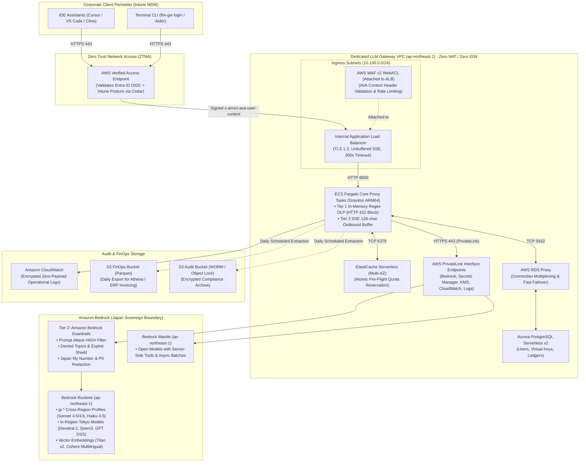

# Enterprise Engineering LLM Gateway
**Hardened Internal AI Proxy & Governance Platform for Enterprise Software Engineering**  
**Target Environment:** AWS Tokyo (`ap-northeast-1`) Primary / AWS Osaka (`ap-northeast-3`) Disaster Recovery  
**Compliance Standard:** 100% Japan Sovereign Geofence & Zero Internet Egress

---

## 1. Overview & Purpose

The **Enterprise Engineering LLM Gateway** provides a centralized, secure, highly available, and cost-controlled internal AI proxy for software developers, data scientists, and DevOps teams across the enterprise. It enables frictionless developer ergonomics for modern AI coding tools—including IDE assistants (Cursor, VS Code, Cline, Continue.dev), terminal CLIs (Aider, Claude Code), and CI/CD pipelines—while guaranteeing that corporate source code and credentials never leak to the public internet or foreign cloud regions.

### Core Architectural Pillars
* **100% Drop-In Wire Compatibility:** Native emulation of OpenAI (`/v1/chat/completions`) and Anthropic (`/v1/messages`) wire protocols via standard `OPENAI_BASE_URL` and `ANTHROPIC_BASE_URL` redirection.
* **Isolated VPC / Zero Internet Egress:** The core processing tier runs in fully isolated AWS subnets without NAT Gateways or Internet Gateways. All upstream traffic routes strictly through AWS PrivateLink Interface Endpoints.
* **Absolute Japan Geo Residency:** Enforced at both the IAM task role level and AWS Organizations Service Control Policy (SCP) level. Traffic is pinned strictly to Tokyo (`ap-northeast-1`), Osaka (`ap-northeast-3`), and Japan Cross-Region (`jp.*`) inference profiles.
* **Low-Latency Streaming Data Plane:** Unbuffered Server-Sent Events (SSE) streaming with `< 20ms` proxy overhead and `300s` connection timeouts to support extended thinking / reasoning models (`claude-3-7-sonnet`, `o3-mini`, `deepseek-r1`).
* **FinOps Governance & Atomic Reservation:** Multi-tier budget hierarchy ($10/day, $50/mo default) enforced atomically via ElastiCache Redis Serverless Lua scripts, reconciled daily into Apache Parquet on Amazon S3 for Athena/ERP billing.
* **Hybrid 3-Tier DLP & Amazon Bedrock Guardrails:** Container edge pre-flight scanning (<1.5ms) with private key hard-blocking (HTTP 422), paired with Amazon Bedrock Guardrails for prompt attack/jailbreak defense and regulatory PII masking, followed by a 128-character outbound SSE sliding-window buffer.

---

## 2. Documentation Architecture

The repository follows a clean **3-Tier Enterprise Documentation Model**, maintaining a strict separation between functional requirements, physical cloud infrastructure design, and the rapidly evolving foundation model catalog:

```
llm-gateway/
├── README.md                     # Central entrypoint, architectural index & quickstart
├── REQUIREMENTS.md               # Functional, Governance & Security Operational Specification (WHAT & WHY)
├── REQUIREMENTS_JA.md            # 日本語版運用仕様書 (Japanese Operational Specification)
├── INFRASTRUCTURE_SPEC.md        # AWS Physical Architecture Blueprint & Infrastructure Specification (HOW)
└── MODEL_AVAILABILITY_MATRIX.md  # Living Foundation Model & Regional Catalog (Bedrock Engines & Japan Geo)
```

### Document Navigation Map

| Document | Primary Audience | Scope & Key Contents |
| :--- | :--- | :--- |
| **[REQUIREMENTS.md](REQUIREMENTS.md)**<br/>*(日本語: [REQUIREMENTS_JA.md](REQUIREMENTS_JA.md))* | Developers, Security Auditors, FinOps, Product Owners | • **IEEE 830 / ISO 29148 System Requirements Specification (SRS)**<br/>• Formal Requirement IDs (`[FR-INT-xx]`, `[FR-KEY-xx]`, `[FR-FIN-xx]`, `[NFR-xxx]`)<br/>• Multi-tier API key governance (Tiers 1–4, JIT provisioning, Teams approvals)<br/>• Real-time token pricing formulas & atomic Redis pre-flight reservation<br/>• **Hybrid 3-tier DLP specification & Bedrock Guardrails integration (`[FR-DLP-01..08]`)**<br/>• Relational PostgreSQL data models & ERD schemas<br/>• The 8 Golden Rules for enterprise AI gateway operations |
| **[INFRASTRUCTURE_SPEC.md](INFRASTRUCTURE_SPEC.md)** | Cloud Engineers, AWS Solutions Architects, DevOps, SREs | • **AWS Well-Architected Framework Technical Architecture Document (TAD)**<br/>• Architecture Decision Records (`ADR-001` through `ADR-004`)<br/>• 6 Pillars: Operational Excellence, Security, Reliability, Performance, Cost, Sustainability<br/>• Multi-AZ VPC subnet allocation matrix (`/24`, `/20`, route tables)<br/>• PrivateLink Interface Endpoints (12 services including Bedrock Mantle, Private DNS)<br/>• AWS Verified Access Cedar policy & AWS WAF v2 WebACL rules<br/>• **Amazon Bedrock Guardrail Terraform HCL definition (`aws_bedrock_guardrail`)**<br/>• Hardened IAM policies (Task Execution, Task Role `jp.*` lock, Org SCP)<br/>• Compute sizing: ECS Fargate Graviton4 (ARM64, 4 vCPU/16GB, Uvicorn tuning)<br/>• Database: Aurora Serverless v2 (2–32 ACUs), RDS Proxy, ElastiCache Serverless<br/>• S3 Bucket Policies (`aws:sourceVpce`), WORM Lock & Athena DDL<br/>• Tokyo -> Osaka DR runbook & Terraform / OpenTofu module structure |
| **[MODEL_AVAILABILITY_MATRIX.md](MODEL_AVAILABILITY_MATRIX.md)** | AI Engineers, Platform Leads, Model Evaluators | • Complete survey of 100+ Foundation Models on Amazon Bedrock<br/>• Bedrock Runtime vs. Bedrock Mantle execution engine separation<br/>• Verified Japan Geo compliance status (In-Region Tokyo vs. `jp.` profiles)<br/>• Foreign/Global non-compliant models requiring explicit SecOps waivers |

---

## 3. High-Level System Architecture




---

## 4. Key Performance & Reliability Metrics

* **Proxy Overhead Latency:** `< 20ms (p95)` added latency beyond upstream provider inference time.
* **Availability Target:** `99.9% Monthly Uptime` during internal engineering hours (07:00–23:00 JST).
* **Connection Timeout:** `300 seconds` uniform idle timeout across AVA, ALB, and proxy containers to support frontier reasoning models.
* **Disaster Recovery (Tokyo -> Osaka):**
  * **RTO (Recovery Time Objective):** `< 15 Minutes`
  * **RPO (Recovery Point Objective):** `< 1 Minute` (Aurora Global Database + S3 Cross-Region Replication).

---

## 5. Security & Compliance Standards

* **Zero Internet Egress:** Verified VPC with zero internet routes (`0.0.0.0/0` destination does not exist in any route table).
* **Cryptographic Geofencing:** AWS Organizations SCP and IAM task roles enforce that requests cannot target models outside Japanese sovereign borders.
* **Zero Plaintext Credentials:** Upstream master keys reside in AWS Secrets Manager; developers utilize synthetic, salted SHA-256 hashed Virtual Keys.
* **Zero-Payload Logging:** Container logs record strictly metadata and SHA-256 prompt hashes. Proprietary codebase contents and raw prompts are never written to disk.
* **Sub-60s Offboarding:** SCIM 2.0 webhooks invalidate all virtual keys and flush Redis sessions within 60 seconds of employee deactivation in Microsoft Entra ID.
