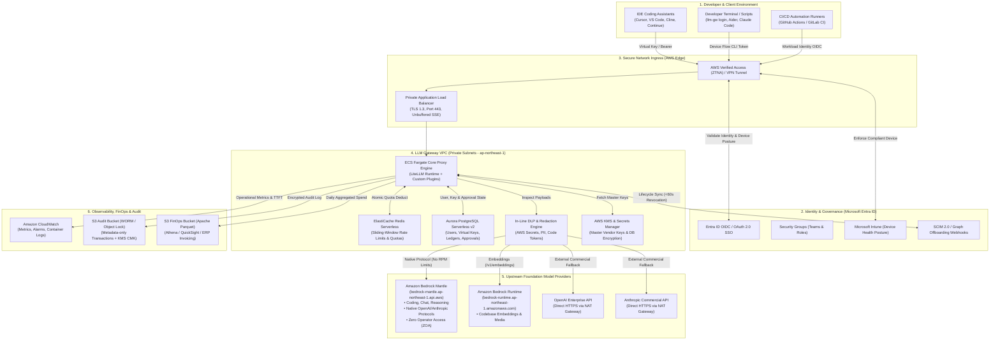
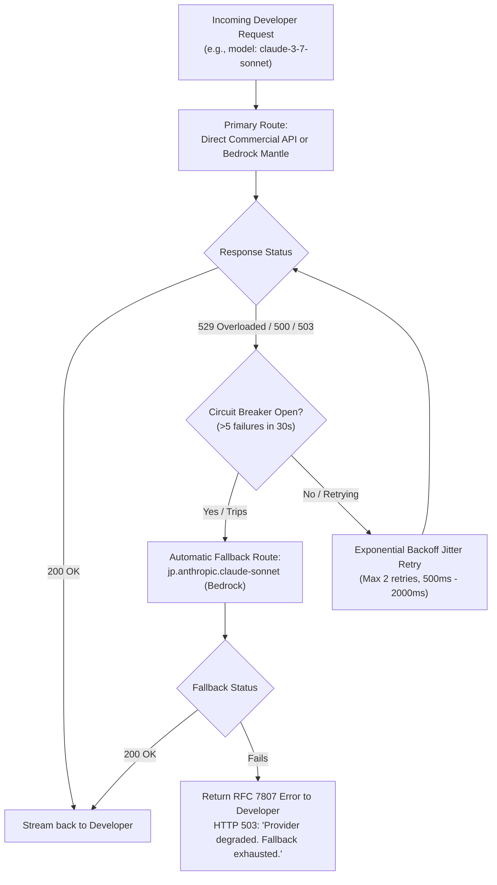
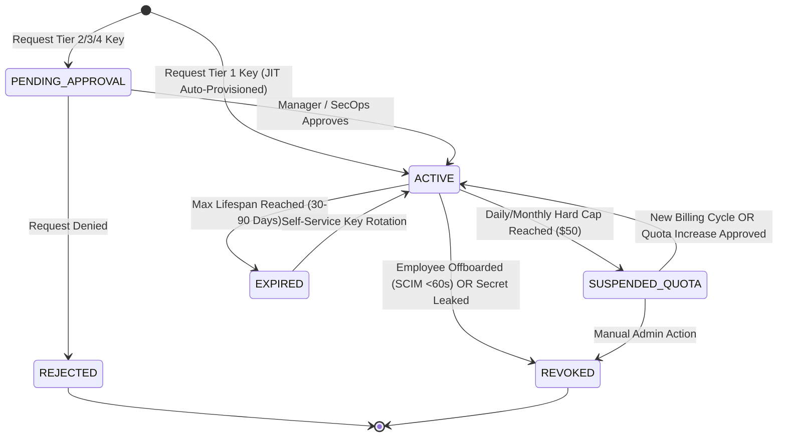
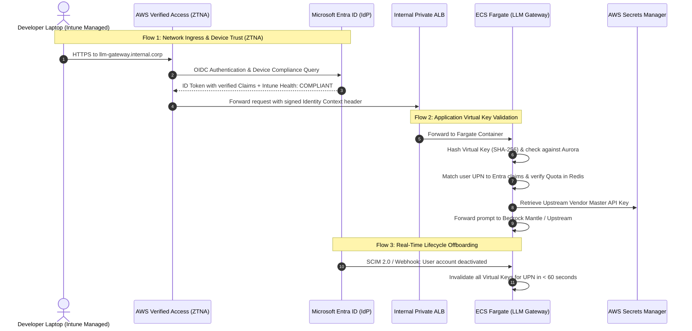
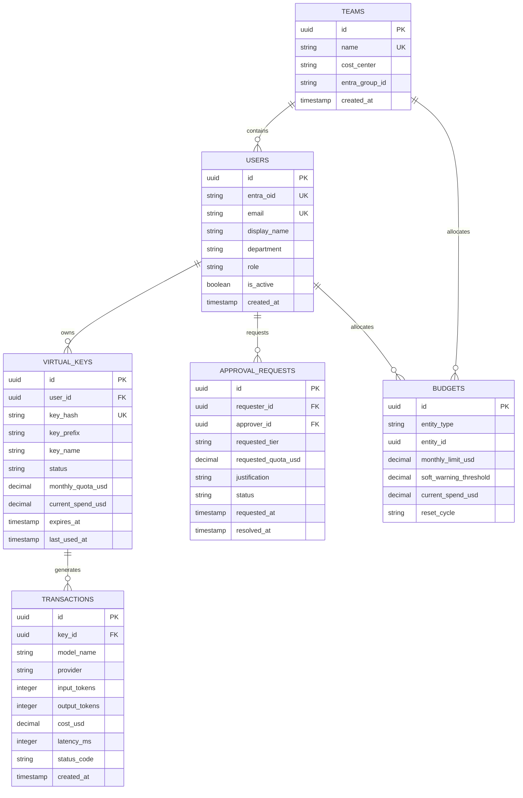

# Engineering LLM Gateway: Production Requirements & Operational Specification

**Document Version:** 2.0 (Hardened Operational Specification)  
**Target Environment:** AWS Cloud (Tokyo Region `ap-northeast-1` / Osaka `ap-northeast-3`)  
**Identity Infrastructure:** Microsoft Entra ID (Azure AD) + Microsoft Intune  
**Primary Scope:** Internal Engineering Workflows & Development (Non-Production / Non-Customer-Facing)  
**Status:** Approved Architectural Blueprint  

---

## 1. Executive Summary & Context

### 1.1 Objective
Provide a unified, highly reliable, secure, and cost-controlled internal **LLM Gateway** for software engineers, data scientists, and DevOps teams across the enterprise. The gateway enables engineering teams to leverage commercial and open-weight Foundation Models in daily workflows—including IDE coding assistants (Cursor, VS Code, Cline, Continue.dev), developer CLIs (Aider, Claude Code, custom tools), local prototyping, test generation, and internal CI/CD pipelines—without exposing corporate source code, incurring runaway cloud costs, or leaking master vendor credentials.

### 1.2 Development Scope vs. Production Gateway
Unlike a production customer-facing gateway (which mandates sub-10ms proxy overhead, rigid schema validation, and 99.99% uptime SLAs), an **Engineering LLM Gateway** operates under distinct priorities:
* **Developer Ergonomics:** 100% drop-in wire compatibility with OpenAI and Anthropic SDKs via `OPENAI_BASE_URL` and `ANTHROPIC_BASE_URL` redirection.
* **Frictionless Onboarding:** Instant self-service access via corporate Single Sign-On (Microsoft Entra ID) without manual ticket queues for standard tiers.
* **Granular Cost Controls & Attribution:** Real-time token metering, daily/monthly personal budget caps, and automated FinOps chargeback/showback exports mapped to departmental Cost Centers.
* **Security & IP Protection:** Mandatory egress boundaries, in-line secret/PII masking, Zero Data Retention (ZDR), and strict Japan Geo data residency pinning.
* **Anti-Abuse & Enclosure:** Preventing token piggybacking, freelance moonlighting, and off-hours unattended autonomous bot runs on company funds.

---

## 2. System Architecture & Identity Integration



---

## 3. Operational Reliability & Day-2 Operations (Production Readiness)

### 3.1 Service Level Agreement (SLA) Targets
* **Gateway Availability Target:** **99.9% Monthly Uptime** for internal engineering hours (07:00–23:00 JST), 99.5% off-hours.
* **Internal Proxy Overhead Latency:** **< 20ms (p95)** added latency beyond upstream provider inference time.
* **Recovery Time Objective (RTO):** < 5 minutes (automated container restart / multi-AZ failover).
* **Recovery Point Objective (RPO):** < 1 minute for transactional budget ledgers (Aurora multi-AZ WAL replication).

### 3.2 Extended Streaming & Connection Lifecycle
Advanced reasoning models (such as OpenAI `o3-mini`, Anthropic `claude-3-7-sonnet` with Extended Thinking, and DeepSeek-R1) exhibit non-standard execution characteristics:
1. **Extended Time-to-First-Token (TTFT):** Reasoning models may spend **30 to 90+ seconds** internally computing reasoning tokens before outputting the first completion chunk.
2. **ALB & Reverse Proxy Timeout Configuration:**
   * **Connection Idle Timeout:** Set to **300 seconds (5 minutes)** minimum across AWS Verified Access, ALB, and ECS Fargate containers. Prevents premature `504 Gateway Timeout` disconnects during reasoning phases.
3. **Unbuffered Server-Sent Events (SSE) Streaming:**
   * Response buffering must be explicitly **disabled** (`proxy_buffering off;` or equivalent HTTP chunked streaming) on the ALB and core proxy for `/v1/chat/completions` and `/v1/messages`.
   * Chunks must stream directly to IDEs (Cursor, VS Code) in real time to maintain developer interactive typing responsiveness.

### 3.3 Upstream Failover & Circuit Breaking
Upstream AI providers experience transient global throttles and outages (e.g., Anthropic `HTTP 529 Overloaded` or OpenAI `HTTP 500/503`). The gateway implements automatic, transparent failover:



* **Circuit Breaker Policies:**
  * If an upstream provider endpoint returns >= 5 consecutive 5xx/529 errors within a 30-second window, the circuit breaker opens for that endpoint for 60 seconds.
  * Requests are instantly routed to secondary provider accounts or equivalent models on Amazon Bedrock without waiting for connection timeouts.
* **Graceful Degradation:** If all candidate endpoints fail, the gateway returns a structured developer-friendly error message detailing provider health and recommended alternative models.

### 3.4 Concurrency, Connection Pooling & Load Shedding
* **ECS Fargate Task Sizing:** Base deployment runs minimum 2 tasks across 2 Availability Zones (`ap-northeast-1a`, `ap-northeast-1c`), auto-scaling up to 10 tasks based on average target connection count (> 250 active connections per container).
* **HTTP Client Connection Pooling:** The proxy engine maintains persistent HTTP/2 keep-alive connection pools to Bedrock Mantle and external APIs, eliminating TLS handshake overhead on every prompt chunk.
* **Load Shedding:** If container memory reaches 85% or thread pools saturate, the gateway sheds non-interactive traffic (e.g., background CI/CD batch test jobs) with an `HTTP 429 Retry-After: 30` header while preserving interactive developer IDE typing streams.

---

## 4. Deep Dive: API Key Management & Multi-Tier Approval Governance

### 4.1 The Virtual Key Paradigm
* Upstream commercial master keys (OpenAI Enterprise keys, Anthropic Commercial keys, AWS IAM Bedrock credentials) are **never exposed to developers**. They reside strictly inside **AWS Secrets Manager** and are accessed via IAM role-based authentication by the gateway containers.
* Developers receive synthetic **Gateway Virtual Keys** (V-Keys, format: `gw-eng-live_xxxxxxxxxxxxxxxxxxxxxxxx`).
* Keys are salted and hashed using **SHA-256** prior to storage in Aurora PostgreSQL. Plaintext keys are displayed **only once** upon generation.

### 4.2 Key Lifecycle State Machine



### 4.3 Multi-Tier Approval Governance Matrix

| Key Tier | Target Persona & Use Case | Default Quota | Permitted Models | Approval Required? | Approver Role & SLA | Authentication Method |
| :--- | :--- | :--- | :--- | :--- | :--- | :--- |
| **Tier 1: Personal Dev (Default)** | All software engineers, QA, data scientists for local IDEs & CLIs | **$10/day<br/>$50/month** | Standard Coding & Fast Tier (`claude-3-5-haiku`, `nova-lite`, `gpt-4o-mini`, standard Sonnet) | **No (100% Automated)** | **System JIT:** Auto-issued upon Entra ID SSO sign-in | Web Portal SSO or CLI Device Flow (`llm-gw login`) |
| **Tier 2: Quota Bump / Team Pool** | Engineers working on high-token tasks (refactoring, synthetic test generation) | **$150–$1,000/month** | Standard + Full Bedrock Japan Catalog | **Yes** | **Engineering Manager / Direct Team Lead**<br/>SLA: < 4 business hours | Web Portal -> Jira/ServiceNow Integration |
| **Tier 3: Frontier / Cross-Region Waiver** | AI researchers, lead architects benchmarking reasoning models | Customized per project | Reasoning Tier (`o3-mini`, `deepseek-r1`, `claude-opus`, preview models) | **Yes** | **SecOps & Platform Admin (Dual Approval)**<br/>SLA: < 24 business hours | Form with project business justification & compliance review |
| **Tier 4: CI/CD Service Account** | Automated pipelines, PR review bots, overnight integration testing | Pooled by Project / Pipeline | Task-specific model allowlist | **Yes** | **Platform Admin**<br/>SLA: < 8 business hours | Entra ID Workload Identity / GitHub Actions OIDC |

### 4.4 Approval Workflows & Systems Integration
1. **Tier 1 (Zero-Friction JIT Provisioning):**
   * Any engineer belonging to authorized Entra ID security groups (e.g., `SG-ENG-Developers`) logs into the portal or runs `llm-gw login`.
   * The gateway validates claims, creates an account in Aurora, and immediately provisions a Virtual Key with default Tier 1 quotas. No humans in the loop.
2. **Tier 2 (Quota Increase via Jira / ServiceNow):**
   * When an engineer consumes 100% of their quota, the gateway returns `HTTP 429` containing an automated deep-link: `https://jira.internal.corp/servicedesk/customer/portal/2/create/45?user=john.doe&quota=150`.
   * A Jira ticket is automatically populated with the user's Entra ID, current spend, and requested quota.
   * The engineer's direct manager (looked up dynamically via the Entra ID Microsoft Graph Manager attribute) receives a Slack/Teams notification with one-click **"Approve / Deny"** buttons.
   * Upon approval, a Jira webhook calls the Gateway Management API (`POST /api/v1/internal/quotas/adjust`) to instantly raise the quota and re-enable the key.
3. **Tier 3 & 4 (Compliance & Service Accounts):**
   * Handled through formal Platform Engineering change tickets, validating IP allowlists, GitHub repository bindings, and 90-day automatic expiration policies.

### 4.5 Developer Key Generation & Quota API Schemas

#### Key Generation Request (`POST /api/v1/keys`)
```json
{
  "key_name": "vscode-laptop-primary",
  "project_id": "PRJ-PAYMENTS-V2",
  "cost_center": "CC-4012",
  "expires_in_days": 60,
  "metadata": {
    "device_hostname": "MAC-ENG-4921",
    "environment": "local_dev"
  }
}
```

#### Key Generation Response (`201 Created`)
```json
{
  "key_id": "vk_8f7b2c91a0",
  "virtual_key": "gw-eng-live_8f7b2c91a0e4d27f8a91bc74e2a104",
  "key_name": "vscode-laptop-primary",
  "user_upn": "john.doe@company.com",
  "monthly_quota_usd": 50.00,
  "expires_at": "2026-11-10T08:30:00Z",
  "notice": "Copy this key now. It will NEVER be displayed again."
}
```

### 4.6 Unified Web Portal & Dashboard UI/UX Specification

The gateway provides a centralized, role-based Web Portal and Dashboard serving three distinct personas: Software Engineers, Engineering Managers, and Platform/SecOps Administrators.

```
┌────────────────────────────────────────────────────────────────────────────────────────┐
│                        LLM Gateway Unified Web Portal                                  │
│   Logged in as: john.doe@company.com (Team: Payments | Cost Center: CC-4012)           │
├──────────────────────────┬─────────────────────────────────────────────────────────────┤
│  Navigation              │  Personal Usage & Virtual Keys                              │
│                          │                                                             │
│  [🔑 My API Keys]        │  Current Month Spend:  $34.20 / $50.00                      │
│  [📊 Team Spend]         │  [████████████████████░░░░░] 68.4% consumed                 │
│  [🧪 Prompt Sandbox]     │  Reset Date: Oct 1, 2026                                    │
│  [📋 Request Quota]      │                                                             │
│  [⚙️ Admin (Restricted)] │  Active Virtual Keys:                                       │
│                          │  ┌──────────────────────┬─────────────┬──────────┬────────┐ │
│                          │  │ Key Name             │ Created     │ Expires  │ Action │ │
│                          │  ├──────────────────────┼─────────────┼──────────┼────────┤ │
│                          │  │ vscode-laptop-main   │ 2026-08-15  │ In 32d   │ Rotate │ │
│                          │  │ aider-terminal-token │ 2026-09-11  │ In 6h    │ Revoke │ │
│                          │  └──────────────────────┴─────────────┴──────────┴────────┘ │
│                          │  [+ Generate New Key]   [Request Quota Bump (Jira)]         │
└──────────────────────────┴─────────────────────────────────────────────────────────────┘
```

#### 1. Developer Portal View
* **Self-Service Key Management:** Generate, label, inspect expiration dates, rotate, or immediately revoke personal Virtual Keys.
* **Live Budget Tracker:** Real-time visual progress bar tracking monthly spend against cap (e.g., `$34.20 / $50.00` spent, 68.4% consumed).
* **Multi-Model Interactive Sandbox & Playground:** Side-by-side prompt testing across Bedrock Mantle Sonnet, Nova, Haiku, and DeepSeek with real-time token counts, estimated USD transaction cost, and latency comparisons.
* **1-Click Quota Extension:** Deep-linked button generating a pre-populated Jira/ServiceNow approval ticket addressed to the developer's direct manager.

#### 2. Engineering Manager / Team Lead Portal View
* **Team Spend Aggregation:** Real-time visibility into total team expenditure broken down by project code, model tier, and individual engineer.
* **Pending Approval Queue:** Review and approve/deny quota increase requests with one click, automatically validating corporate Cost Center allocation.
* **Spend Anomaly Flags:** Instant notifications if a team member exhibits unusual token velocity or off-hours consumption bursts.

#### 3. Platform Admin & SecOps Portal View
* **Upstream Provider & Model Registry:** Manage connections and health status for Amazon Bedrock Mantle, Bedrock Runtime, and commercial fallback endpoints.
* **Global Governance & Rate Limits:** Set default TPM/RPM limits, personal allowance caps, and model permission tiers.
* **In-Line DLP Rule Management:** Configure regex patterns and Presidio detection policies for blocking corporate secrets (AWS keys, GitHub tokens) and customer PII.
* **Lifecycle Audit & SCIM Status:** Monitor active sessions, SCIM de-provisioning sync health, and global key revocation status.

#### 4. Dashboard Technology Options Comparison

| Solution | Key & User Management | Dashboard UI | Entra ID Integration | Maintenance Overhead | Recommendation |
| :--- | :--- | :--- | :--- | :--- | :--- |
| **LiteLLM Proxy UI (Built-in)** | Built-in Virtual Keys, spend tracking, token bucket quotas | Native Next.js/React Web UI (`/ui`) out of the box | Native OIDC SSO support; custom webhook for SCIM | Low (Pre-built container; frequent OSS updates) | **Recommended Core:** Deploy on AWS ECS Fargate alongside proxy. |
| **Custom Internal Web Portal** | Fully custom schema tailored to internal ERP/Jira | Custom internal corporate design system | 100% native integration with Entra Graph API & Jira | High (Ongoing frontend maintenance) | Best as a **lightweight UI wrapper** calling LiteLLM APIs. |
| **Portkey AI Gateway** | Virtual keys, advanced fallbacks, circuit breaking | SaaS-first UI; self-hosted control plane is more complex | Enterprise SAML/OIDC via SaaS tier | Medium-High | Excellent fallback engine, heavier self-hosted control plane. |

---

## 5. Cost Management, FinOps & Departmental Chargeback

### 5.1 Real-Time Pricing & Token Metering Engine
The gateway computes the exact USD cost of every transaction upon stream completion using a synchronized in-memory provider pricing card:

$$\text{Cost}_{\text{Total}} = (T_{\text{in}} \times P_{\text{in}}) + (T_{\text{cached\_read}} \times P_{\text{cached\_read}}) + (T_{\text{cached\_write}} \times P_{\text{cached\_write}}) + (T_{\text{out}} \times P_{\text{out}})$$

* **Prompt Caching Support:** Accurately accounts for Anthropic Prompt Caching discounts (up to 90% discount on cache hits) and OpenAI batch pricing.
* **Atomic Redis Token Bucket:** Before forwarding prompts upstream, the gateway performs an atomic Lua script execution against ElastiCache Redis checking `user_monthly_spend + estimated_cost <= user_quota`.
* **Discrepancy Reconciliation:** If the actual output tokens generated differ from the pre-flight estimate, the delta is balanced immediately in Redis and flushed asynchronously to the Aurora PostgreSQL transactional ledger.

### 5.2 Tiered Quota Thresholds & RFC 7807 Error Structure
* **80% Soft Warning:** When monthly consumption reaches $40.00 (on a $50.00 cap), the gateway sends an asynchronous notification via email/Slack and appends an HTTP response header: `X-LLM-Quota-Remaining-USD: 10.00`.
* **100% Hard Block:** Once consumption reaches $50.00, subsequent calls are rejected at the edge in `< 5ms` with zero upstream cost.
* **Standardized RFC 7807 Error Payload:**
```json
{
  "type": "https://llm-gateway.internal.corp/errors/quota-exceeded",
  "title": "Monthly Development Quota Exceeded",
  "status": 429,
  "detail": "You have consumed $50.00 of your $50.00 monthly development allowance.",
  "instance": "/v1/chat/completions/req_9a8b7c6d",
  "user_id": "john.doe@company.com",
  "quota_limit_usd": 50.00,
  "current_spend_usd": 50.00,
  "reset_date": "2026-10-01T00:00:00Z",
  "upgrade_url": "https://jira.internal.corp/servicedesk/customer/portal/2/create/45?user=john.doe@company.com"
}
```

### 5.3 Daily S3 FinOps Export Schema (Apache Parquet)
Every 24 hours at 00:05 JST, an automated ECS task extracts the day's reconciled ledger records, converts them into **Apache Parquet format**, and writes them to the FinOps S3 bucket partitioned by date and department:  
`s3://corp-finops-llm-gateway-prod/usage/year=2026/month=09/day=11/department=ENG-PAYMENTS/part-0001.parquet`

#### FinOps Parquet Schema

| Column Name | Data Type | Description | Example Value |
| :--- | :--- | :--- | :--- |
| `transaction_id` | `VARCHAR(64)` | Unique gateway transaction identifier | `tx_01J7K8M9PQ2R4S` |
| `timestamp` | `TIMESTAMP` | ISO 8601 UTC timestamp of request | `2026-09-11 08:30:15.123` |
| `entra_user_id` | `VARCHAR(128)` | Entra ID User Principal Name | `john.doe@company.com` |
| `entra_department` | `VARCHAR(64)` | Department mapped from Entra ID claim | `Core-Banking-Engineering` |
| `cost_center` | `VARCHAR(32)` | Finance General Ledger Cost Center code | `CC-4012` |
| `project_id` | `VARCHAR(64)` | Assigned corporate project code | `PRJ-PAYMENTS-V2` |
| `model_invoked` | `VARCHAR(128)` | Full upstream model identifier | `jp.anthropic.claude-sonnet-4-5` |
| `provider` | `VARCHAR(32)` | Upstream inference engine | `bedrock-mantle` |
| `input_tokens` | `INTEGER` | Uncached prompt input tokens | `1420` |
| `cache_read_tokens`| `INTEGER` | Discounted cached prompt tokens | `8500` |
| `cache_write_tokens`| `INTEGER` | Cache creation input tokens | `0` |
| `output_tokens` | `INTEGER` | Completion output tokens | `450` |
| `cost_usd` | `DECIMAL(10,6)`| Net transaction cost in USD | `0.015250` |
| `duration_ms` | `INTEGER` | Total end-to-end latency in milliseconds | `2450` |
| `ttft_ms` | `INTEGER` | Time to first token in milliseconds | `420` |
| `git_remote` | `VARCHAR(256)` | Verified Git remote origin from IDE header | `github.com/company-org/payments` |

### 5.4 Departmental Chargeback & Financial Ledger Integration
1. **Cataloging & Querying:** AWS Glue automatically crawls the FinOps S3 bucket, updating the **Amazon Athena** data catalog table `finops_llm_gateway.daily_usage`.
2. **Automated Monthly Invoicing Pipeline:**
   * On the 1st of each month, an automated Step Function executes an Athena query aggregating total spend per `cost_center` and `entra_department`.
   * The output CSV is pushed via SFTP / API into the corporate ERP system (SAP / Oracle Financials).
   * Finance executes internal journal entries debiting each department's R&D cloud budget and crediting the centralized Platform Operations cost pool.
3. **Weekly Manager Showback:**
   * Automated Amazon QuickSight dashboards and weekly Slack bot summaries deliver reports to Engineering Directors detailing:
     * Top 5 token-consuming engineers.
     * Model distribution (e.g., 65% Claude Sonnet, 25% Haiku, 10% DeepSeek-R1).
     * Spend trajectory against quarterly engineering allocations.

---

## 6. Deep Entra ID & AWS Integration Blueprint

The integration between Microsoft Entra ID (Azure AD) and the AWS infrastructure is architected across three distinct layers:



### 6.1 Authentication Protocols

#### 1. Browser SSO (Developer Web Portal)
* **Protocol:** OpenID Connect (OIDC) Authorization Code Flow with **PKCE (Proof Key for Code Exchange)**.
* **Flow:** Engineer accesses `https://llm-gateway.internal.corp` -> Redirected to `login.microsoftonline.com/<tenant_id>/oauth2/v2.0/authorize` -> Authenticates with Corporate MFA -> Returns authorization code -> Gateway backend exchanges code for JWT Access and ID tokens.

#### 2. Terminal CLI Authentication (`llm-gw login`)
* **Protocol:** OAuth 2.0 Device Authorization Grant (**RFC 8628**).
* **Developer Flow:**
  1. Developer runs `llm-gw login` in iTerm2/Terminal.
  2. CLI requests a device code from the Gateway: returns `verification_uri` (`https://llm-gateway.internal.corp/device`) and `user_code` (`WDJB-MKTL`).
  3. CLI opens developer's browser to the verification URI. Developer completes Entra ID login.
  4. CLI polls token endpoint (`POST /api/v1/auth/device/token`) until authorization completes.
  5. Gateway returns an ephemeral Bearer token (valid for **8–12 hours**, matching a workday shift).
  6. Token is stored securely in the OS native credential store:
     * macOS: **Keychain** via `security` API.
     * Linux: **Secret Service API / Keyring**.
     * Windows: **Windows Credential Manager**.
  7. **Zero Plaintext Secrets:** No raw long-lived keys are ever stored in `.bashrc`, `.zshrc`, or plain `.env` files.

#### 3. CI/CD Pipelines (Workload Identity Federation)
* **Protocol:** OIDC Federation (GitHub Actions / GitLab CI -> AWS IAM / Entra ID).
* **Flow:** GitHub Actions runner requests an OIDC token from GitHub -> Passes token to Gateway -> Gateway validates GitHub token claims (`iss: token.actions.githubusercontent.com`, `repository: company-org/repo-name`) -> Issues a short-lived execution token valid only for the duration of that workflow run.

### 6.2 Entra ID Claims Mapping Specification

| Entra ID Claim | Target Gateway Field | Purpose & RBAC Mapping |
| :--- | :--- | :--- |
| `oid` / `sub` | `users.entra_oid` | Unique immutable user identifier. |
| `userPrincipalName` | `users.email` | Primary human identity (`john.doe@company.com`). |
| `displayName` | `users.display_name` | UI presentation in logs and portal. |
| `department` | `users.department` | Injected into transaction logs for FinOps chargeback. |
| `jobTitle` | `users.job_title` | Context for usage profiling. |
| `groups` (Object IDs) | `users.roles` / `teams` | Mapped to Gateway RBAC roles:<br/>• `SG-ENG-Admins` -> **Platform Admin**<br/>• `SG-ENG-Managers` -> **Team Lead / Approver**<br/>• `SG-ENG-Developers` -> **Engineer (Standard Tier)**<br/>• `SG-AUDIT-SecOps` -> **Security Auditor** |

### 6.3 Automated Offboarding & Deprovisioning (< 60s Revocation)
To prevent ex-employees from retaining access to company LLM tokens after termination:
1. **SCIM 2.0 & Microsoft Graph Webhooks:** The gateway exposes an internal endpoint `POST /api/v1/scim/v2/Users/{id}` and subscribes to Entra ID User Lifecycle events (`/users/{id} delta`).
2. **Instant Invalidation Trigger:**
   * When an employee account is disabled or deleted in Entra ID, Entra fires a webhook to the gateway within seconds.
   * The gateway executes an atomic database update setting `status = 'REVOKED'` for all active Virtual Keys tied to that `userPrincipalName`.
   * The gateway flushes all cached sessions and token buckets for that user from ElastiCache Redis.
3. **SLA:** Total elapsed time between Entra ID deactivation and total gateway API rejection is **< 60 seconds**.

---

## 7. Observability, Logging, & Anomaly Monitoring Blueprint

### 7.1 Multi-Tier Logging Architecture
Balancing regulatory compliance and financial auditing against developer privacy and trade-secret leakage:

```
[Incoming Request & Payload]
       │
       ▼
[In-Line DLP Engine] ──► Detects AWS Secret or PII? ──► Redact with Placeholder [REDACTED_API_KEY]
       │                                            └─► Emit CloudWatch Security Alert
       ▼
[Dual-Tier Audit Router]
       │
       ├─► Tier 1: Default Metadata Logging (All Dev Workloads)
       │   • Logs: Timestamp, UPN, IP, Model, Tokens, Cost, Latency, SHA-256 Prompt Hash
       │   • Raw Prompt / Code Payloads: NEVER WRITTEN TO DISK
       │
       └─► Tier 2: Full-Payload Compliance Archive (Opt-in High-Risk Projects Only)
           • Requires SecOps waiver
           • Payloads encrypted at rest using Customer Managed KMS Key
           • Written to S3 with Object Lock (WORM compliance, 90-day retention)
```

### 7.2 CloudWatch Metrics, Alarms & Operational Thresholds

| Metric Name | Unit | Alarm Condition | Severity | Automated Action |
| :--- | :--- | :--- | :--- | :--- |
| `GatewayLatencyP95` | Milliseconds | `> 50ms` (excluding upstream inference) for 5 consecutive minutes | Warning | Trigger ECS task horizontal auto-scaling. |
| `Gateway5xxErrors` | Count | `> 10` errors in a 1-minute window | Critical | PagerDuty alert to Platform On-Call; inspect container logs. |
| `UpstreamThrottle429`| Count | `> 25` upstream 429s in 2 minutes | Warning | Trip circuit breaker; route to secondary provider region. |
| `TimeFirstTokenP90` | Milliseconds | `> 15000ms` for non-reasoning models | Warning | Notify on-call of upstream provider degradation. |
| `TokenVelocityBurst`| Tokens/Min | `> 150,000 TPM` on any single personal Virtual Key | Critical | Temporarily throttle key; alert SecOps of potential script runaway. |
| `OffHoursSpendSpike`| USD / Hour | `> $30.00/hour` between 23:00 and 06:00 JST | Warning | CloudWatch EventBridge flags anomaly to engineering manager. |

### 7.3 Distributed Tracing (OpenTelemetry & AWS X-Ray)
Every gateway transaction propagates W3C TraceContext headers (`traceparent`, `tracestate`).
* **Trace Spans Measured:**
  1. `gateway_ingress`: ALB TLS termination to ECS Fargate container reception.
  2. `auth_and_quota`: Redis sliding-window quota check + SHA-256 key lookup.
  3. `dlp_inspection`: In-line secret and PII regex scanning.
  4. `upstream_ttft`: Dispatch to Bedrock Mantle / OpenAI -> receipt of first stream chunk.
  5. `upstream_stream`: First chunk -> stream termination (`[DONE]`).
* Enables developers and platform teams to instantly diagnose whether slowness originates from the gateway proxy or upstream model inference.

### 7.4 Anomaly Detection & Anti-Abuse Safeguards
1. **Git Remote Repository Verification (`X-Git-Remote`):**
   * Supported IDE extensions (Cursor, VS Code) and CLI wrappers automatically attach the current Git remote origin header:
     `X-Git-Remote: git@github.com:company-org/payment-service.git`
   * The gateway audits this header. If requests contain personal GitHub remotes (e.g., `github.com/personal-dev/freelance-app`), the gateway immediately rejects the request (`HTTP 403 Forbidden: Unauthorized repository context`).
2. **Off-Hours / Unattended Bot Detection:**
   * Interactive developer coding exhibits bursty, irregular typing patterns (5–20 requests/hour with pauses).
   * Autonomous batch bots run continuous high-QPS loops. If a key sustains high token velocity for > 60 consecutive minutes between midnight and 06:00 JST, the key is automatically locked pending manager review.

---

## 8. Relational Database Schema & Data Models (Aurora PostgreSQL)

The gateway utilizes **Amazon Aurora PostgreSQL Serverless v2** for transactional integrity, RBAC, key hashing, and budget state:



---

## 9. Core Engine Blueprint & Recommended Implementation (LiteLLM on ECS Fargate)

### 9.1 Engine Architecture Decision
Rather than writing and maintaining a custom reverse proxy from scratch (which requires constant maintenance to match rapid OpenAI/Anthropic API updates), the recommended architectural core is **LiteLLM Proxy** wrapped with custom enterprise middleware:

```
┌────────────────────────────────────────────────────────────────────────┐
│             ECS Fargate Task (llm-gateway:v2.0)                        │
│                                                                        │
│  ┌──────────────────────────────────────────────────────────────────┐  │
│  │ Custom Middleware Layer (FastAPI / Python)                       │  │
│  │ • Validates AWS Verified Access Identity Headers                 │  │
│  │ • Enforces Intune Device Posture Checks                          │  │
│  │ • In-Line DLP & Secret Masking (Presidio / Regex Engine)         │  │
│  │ • Git Remote Origin Audit (`X-Git-Remote`)                       │  │
│  └──────────────────────────────────┬───────────────────────────────┘  │
│                                     │                                  │
│  ┌──────────────────────────────────▼───────────────────────────────┐  │
│  │ LiteLLM Proxy Core Engine (Open Source)                          │  │
│  │ • Standard OpenAI & Anthropic Wire Protocol Emulation            │  │
│  │ • Bedrock Mantle & Bedrock Runtime Routing                       │  │
│  │ • Multi-Provider Failover & Circuit Breaking                     │  │
│  │ • Token Counting & Pricing Calculation Engine                    │  │
│  └──────────────────────────────────┬───────────────────────────────┘  │
│                                     │                                  │
│  ┌──────────────────────────────────▼───────────────────────────────┐  │
│  │ State & Persistence Connector                                    │  │
│  │ • Redis Serverless (Sliding-window token bucket)                 │  │
│  │ • Aurora PostgreSQL (User state, Virtual Keys, Ledgers)          │  │
│  │ • AWS Secrets Manager (Master Upstream Credentials)              │  │
│  └──────────────────────────────────────────────────────────────────┘  │
└────────────────────────────────────────────────────────────────────────┘
```

### 9.2 Key Configuration Snippet (`config.yaml`)
```yaml
model_list:
  # Coding Tier (Primary Bedrock Mantle Sonnet - Japan Geo)
  - model_name: claude-3-7-sonnet
    litellm_params:
      model: bedrock/jp.anthropic.claude-sonnet-4-5
      aws_region_name: ap-northeast-1
      api_base: https://bedrock-mantle.ap-northeast-1.api.aws
    model_info:
      mode: chat

  # Fast / Inline Completion Tier
  - model_name: fast-tier
    litellm_params:
      model: bedrock/jp.anthropic.claude-3-5-haiku-20241022-v1:0
      aws_region_name: ap-northeast-1

  # Embeddings (Bedrock Runtime Exclusive)
  - model_name: text-embedding-3-small
    litellm_params:
      model: bedrock/cohere.embed-multilingual-v3
      aws_region_name: ap-northeast-1
      api_base: https://bedrock-runtime.ap-northeast-1.amazonaws.com

router_settings:
  routing_strategy: latency-based-routing
  enable_pre_call_checks: true
  num_retries: 2
  timeout: 300.0  # 300s timeout for reasoning models
  allowed_fails: 5
  cooldown_time: 60

general_settings:
  master_key: os.environ/GATEWAY_ADMIN_KEY
  database_url: os.environ/AURORA_POSTGRES_URL
  redis_url: os.environ/REDIS_SERVERLESS_URL
```

---

## 10. Enterprise Best Practices & Corporate Operating Model (The 8 Golden Rules)

Deploying and operating a high-scale internal LLM Gateway requires technical, architectural, and cultural alignment. The following **8 Golden Rules** govern the corporate operating model:

### Rule 1: The "Carrot & Stick" Governance Model
* **The Challenge:** Overly restrictive change ticket queues incentivize engineers to bypass corporate controls and use personal credit cards for ChatGPT/Claude subscriptions (Shadow AI).
* **The Standard:**
  * **The Carrot (The Gateway):** Make the internal gateway **10x faster, better, and frictionless**. Offer instant self-service access via Entra ID, zero-friction IDE setup (`OPENAI_BASE_URL`), subsidized $50/mo dev quotas, and high-performance access to premier coding models (`jp.anthropic.claude-sonnet-4-5`).
  * **The Stick (Network Enclosure):** Block public AI endpoints (`api.openai.com`, `api.anthropic.com`, `claude.ai`) at the corporate Secure Web Gateway (Zscaler/Netskope) and ban expense reimbursement for unapproved personal AI subscriptions.

### Rule 2: Multi-Runtime Separation (Bedrock Mantle for Code, Runtime for Embeddings)
* **The Standard:** Route text, code generation, and interactive agent calls to **`bedrock-mantle.ap-northeast-1.api.aws`** to benefit from native wire compatibility, Zero Operator Access (ZOA), and token-only queuing with no RPM throttling. Route vector search and embeddings (`/v1/embeddings`) exclusively to **`bedrock-runtime.ap-northeast-1.amazonaws.com`**.

### Rule 3: 300-Second Timeouts & Unbuffered SSE for Reasoning Models
* **The Challenge:** Frontier reasoning models (`o3-mini`, `claude-3-7-sonnet` with Extended Thinking, `deepseek-r1`) can spend 30 to 90+ seconds thinking before emitting the first stream token.
* **The Standard:** Mandate **300-second (5-minute) connection idle timeouts** across AWS Verified Access, ALB, and ECS Fargate. Explicitly **disable response buffering** on reverse proxies so Server-Sent Events (SSE) stream to IDEs chunk-by-chunk in real time.

### Rule 4: Default to "Metadata-Only" Logging (Protect Codebase IP)
* **The Challenge:** Storing full prompt and completion payloads turns the gateway into an unencrypted, centralized honeypot containing the entire company's proprietary source code and architecture discussions.
* **The Standard:** Record **only transaction metadata** by default (timestamp, user UPN, model, token counts, USD cost, latency, and SHA-256 prompt hash). Restrict full-payload capture strictly to opt-in, high-risk compliance projects, encrypted with Customer Managed KMS keys into S3 Object Lock (WORM).

### Rule 5: In-Line DLP & Secret Redaction at the Edge
* **The Challenge:** Developers frequently paste live AWS credentials (`AKIA...`), GitHub Personal Access Tokens (`ghp_...`), private SSH keys, and customer PII into coding assistants.
* **The Standard:** Enforce in-line regex and DLP scanning at the proxy container. Secrets must be masked with placeholders (e.g., `[REDACTED_AWS_SECRET]`) before payloads leave the corporate VPC boundary.

### Rule 6: Ephemeral CLI Tokens over Static Dotfile Keys
* **The Challenge:** Static Virtual Keys saved in terminal dotfiles (`~/.bashrc`, `~/.zshrc`) are easily committed to Git or backed up to personal cloud storage.
* **The Standard:** Standardize developer terminal workflows on `llm-gw login` (OAuth 2.0 Device Authorization Grant RFC 8628). The resulting token is ephemeral (valid for 8–12 hours) and stored in the OS native secure keychain (macOS Keychain, Linux Keyring, Windows Credential Manager).

### Rule 7: Anti-Abuse, Moonlighting Defenses & Network Enclosure
* **The Challenge:** Subsidized corporate tokens incentivize employees to run private freelance projects, hobby apps, or overnight autonomous scraping bots on company funds.
* **The Standard:**
  * Host the ALB strictly in private VPC subnets with no public IP, accessible only via Corporate VPN / AWS Verified Access.
  * Cap personal development quotas at $10/day or $50/month.
  * Audit IDE `X-Git-Remote` headers; reject or flag calls referencing personal GitHub repositories.
  * Trigger automated alerts for off-hours sustained velocity spikes (> 100k TPM at night/weekends).

### Rule 8: Automated FinOps via Daily Parquet Exports & ERP Invoicing
* **The Challenge:** Manual end-of-month spreadsheet reconciliation is labor-intensive, error-prone, and causes financial friction between engineering teams.
* **The Standard:** Enrich every request with `entra_department` and `cost_center` tags. Automatically export reconciled daily transaction ledgers to Amazon S3 in **Apache Parquet format**, queryable via Amazon Athena, and feed automated monthly journal entries directly into the corporate ERP system (SAP / Oracle Financials).

---

## 11. Summary Checklist & Acceptance Criteria

* [x] **1. Operational Reliability & Resiliency**
  * [x] 99.9% availability target with multi-AZ ECS Fargate and Aurora Serverless v2.
  * [x] 300-second connection idle timeout across ALB, Verified Access, and proxy containers.
  * [x] Unbuffered SSE streaming for Cursor, VS Code, and Cline.
  * [x] Circuit breaking and automated fallback from Anthropic/OpenAI direct to Amazon Bedrock.
* [x] **2. API Key Management & Governance**
  * [x] Virtual Key architecture (upstream vendor keys locked in AWS Secrets Manager).
  * [x] Tier 1: 100% automated JIT key issuance for all developers upon Entra ID SSO login ($50/mo cap).
  * [x] Tier 2: Engineering Manager approval workflow via Jira/ServiceNow for quota extensions.
  * [x] Tier 3: Dual SecOps/Platform approval for frontier reasoning models and compliance waivers.
  * [x] CLI Device Flow (`llm-gw login`) storing 8–12h ephemeral tokens in OS secure keychain.
  * [x] SCIM 2.0 / Graph API automated key revocation (< 60s upon employee termination).
* [x] **3. Unified Web Portal & Dashboard**
  * [x] Developer Portal: Live budget progress bar, self-service key generation/rotation, and multi-model sandbox.
  * [x] Manager Portal: Team spend aggregation, member rankings, and 1-click quota approval queue.
  * [x] Admin & SecOps Portal: Upstream provider registry, DLP rule configuration, and SCIM sync health.
* [x] **4. Cost Management & FinOps Chargeback**
  * [x] Real-time token calculation engine with Anthropic prompt caching discounts.
  * [x] Tiered quota enforcement (80% warning, 100% hard block returning RFC 7807 HTTP 429).
  * [x] Daily automated S3 Apache Parquet export partitioned by date and department.
  * [x] Automated AWS Athena / Glue integration for monthly ERP journal entry chargebacks.
* [x] **5. Identity & Infrastructure Integration**
  * [x] Native Microsoft Entra ID OIDC SSO with PKCE.
  * [x] Device compliance posture enforcement via Microsoft Intune and AWS Verified Access.
  * [x] Entra ID claims mapping table for department, email, and RBAC security groups.
* [x] **6. Data Residency & Compliance**
  * [x] 100% Japan Geo in-country processing guarantee (`ap-northeast-1`, `ap-northeast-3`, `jp.` profiles).
  * [x] Complete model routing separation: `bedrock-mantle` for text/code/reasoning, `bedrock-runtime` for embeddings.
  * [x] Strict Zero Data Retention (ZDR) verification.
* [x] **7. Observability & Security Monitoring**
  * [x] Dual-tier audit logging: Metadata-only by default (zero raw code stored for developer privacy); encrypted WORM S3 for compliance.
  * [x] CloudWatch metrics and alarms for RPS, TPM, 5xx errors, and Time-to-First-Token (TTFT).
  * [x] In-line DLP scanning for exposed AWS keys, GitHub tokens, and customer PII.
  * [x] Anti-abuse heuristics: Off-hours velocity burst alerts and Git remote origin (`X-Git-Remote`) auditing.
* [x] **8. Corporate Best Practices Adoption**
  * [x] Adoption of the 8 Golden Rules for enterprise LLM gateway operation.

