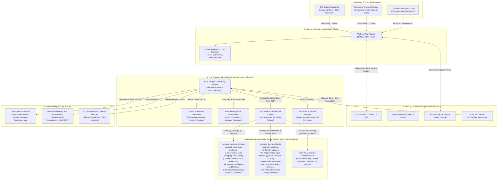
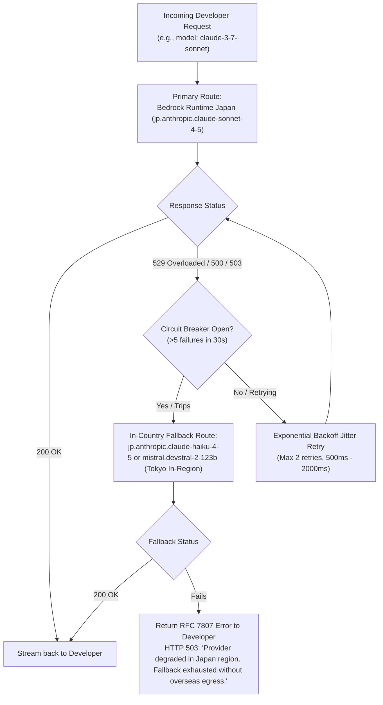
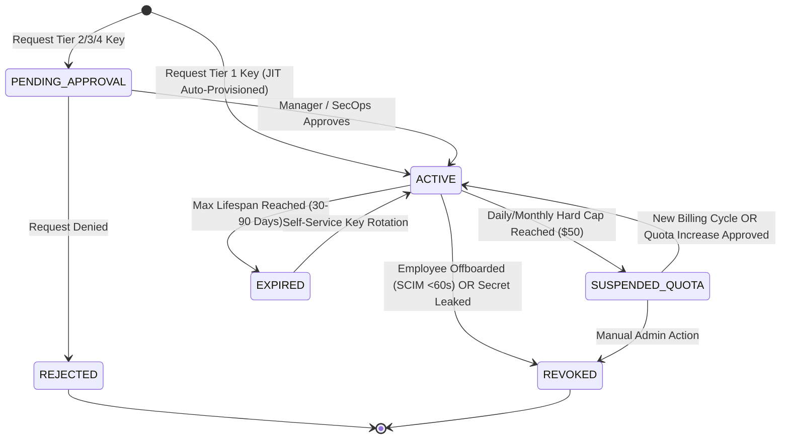
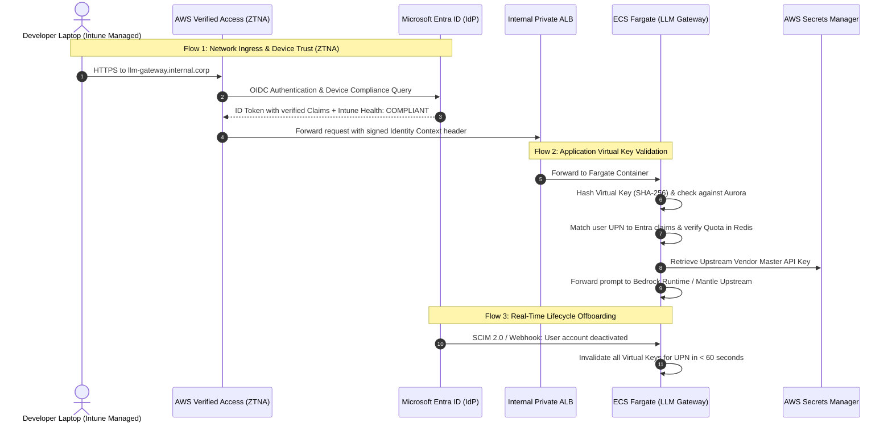
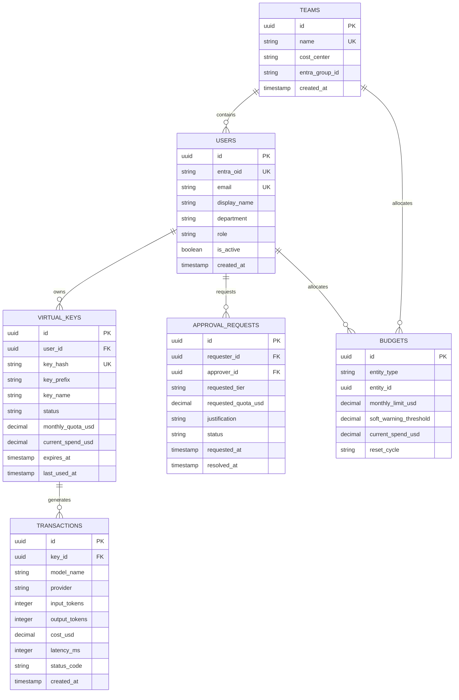

# Engineering LLM Gateway: Production Requirements & Operational Specification

**Document Version:** 2.2 (Hardened Route-by-Route Zero-Leakage Operational Specification)  
**Target Environment:** AWS Cloud (Tokyo Region `ap-northeast-1` / Osaka `ap-northeast-3`)  
**Identity Infrastructure:** Microsoft Entra ID (Azure AD) + Microsoft Intune  
**Primary Scope:** Internal Engineering Workflows & Development (Non-Production / Non-Customer-Facing)  
**Status:** Approved Architectural Blueprint & Security Hardening Standard  
**Companion Documents:**
* **AWS Physical Architecture Blueprint:** [INFRASTRUCTURE_SPEC.md](INFRASTRUCTURE_SPEC.md) (VPC, Subnets, PrivateLink Endpoints, IAM & Terraform Modules)
* **Model & Geo Availability Matrix:** [MODEL_AVAILABILITY_MATRIX.md](MODEL_AVAILABILITY_MATRIX.md) (Amazon Bedrock Engines & Japan Residency Survey)

---

## 1. Executive Summary & Context

### 1.1 Objective
Provide a unified, highly reliable, secure, and cost-controlled internal **LLM Gateway** for software engineers, data scientists, and DevOps teams across the enterprise. The gateway enables engineering teams to leverage commercial and open-weight Foundation Models in daily workflows—including IDE coding assistants (Cursor, VS Code, Cline, Continue.dev), developer CLIs (Aider, Claude Code, custom tools), local prototyping, test generation, and internal CI/CD pipelines—without exposing corporate source code, incurring runaway cloud costs, or leaking master vendor credentials.

### 1.2 Development Scope vs. Production Gateway
Unlike a production customer-facing gateway (which mandates sub-10ms proxy overhead, rigid schema validation, and 99.99% uptime SLAs), an **Engineering LLM Gateway** operates under distinct priorities:
* **Developer Ergonomics:** 100% drop-in wire compatibility with OpenAI and Anthropic SDKs via `OPENAI_BASE_URL` and `ANTHROPIC_BASE_URL` redirection.
* **Frictionless Onboarding:** Instant self-service access via corporate Single Sign-On (Microsoft Entra ID) without manual ticket queues for standard tiers.
* **Granular Cost Controls & Attribution:** Real-time token metering, daily/monthly personal budget caps, and automated FinOps chargeback/showback exports mapped to departmental Cost Centers.
* **Security & IP Protection:** Mandatory egress boundaries, in-line secret/PII masking, Zero Data Retention (ZDR), and strict Japan Geo data residency pinning.
* **Anti-Abuse & Enclosure:** Preventing token piggybacking, freelance moonlighting, and off-hours unattended autonomous bot runs on company funds.

---

## 2. System Architecture & Identity Integration



### 2.1 Core Architectural Boundaries & Infrastructure Invariants
* **Isolated VPC / Zero Internet Egress:** The core processing tier (ECS Fargate), state tier, and endpoint ENIs reside in private, fully isolated subnets with zero NAT Gateways and zero Internet Gateways. All subnet route tables contain strictly local VPC CIDRs and the Amazon S3 Gateway Endpoint prefix list.
* **AWS PrivateLink Integration:** Communication with Amazon Bedrock Runtime, Bedrock Control, Secrets Manager, CloudWatch Logs/Metrics, KMS, and ECR routes strictly over AWS PrivateLink VPC Interface Endpoints with Private DNS enabled.
* **Database Multiplexing via AWS RDS Proxy:** ECS Fargate tasks connect to Aurora PostgreSQL Serverless v2 exclusively via AWS RDS Proxy deployed across 3 Availability Zones (`ap-northeast-1a`, `ap-northeast-1c`, `ap-northeast-1d`). This eliminates connection exhaustion during rapid container scale-outs and ensures sub-3.2-second database failover.
* **Distributed Quota State (ElastiCache Redis Serverless):** Operates Multi-AZ with an enforced `noeviction` memory policy to guarantee that financial reservations and sliding-window token buckets are never evicted.
* **Physical Implementation Blueprint:** For concrete subnet CIDR allocations, security group rule matrices, IAM JSON policies, and Terraform modules, refer directly to [INFRASTRUCTURE_SPEC.md](INFRASTRUCTURE_SPEC.md).

---

## 3. Operational Reliability & Day-2 Operations (Production Readiness)

### 3.1 Service Level Agreement (SLA) Targets
* **Gateway Availability Target:** **99.9% Monthly Uptime** for internal engineering hours (07:00–23:00 JST), 99.5% off-hours.
* **Internal Proxy Overhead Latency:** **< 20ms (p95)** added latency beyond upstream provider inference time.
* **Recovery Time Objective (RTO):** < 5 minutes (automated container restart / multi-AZ failover).
* **Recovery Point Objective (RPO):** < 1 minute for transactional budget ledgers (Aurora multi-AZ WAL replication).

### 3.2 Extended Streaming & Connection Lifecycle
Advanced reasoning models (such as OpenAI `o3-mini`, Anthropic `claude-3-7-sonnet` with Extended Thinking, and DeepSeek-R1) exhibit non-standard execution characteristics:
1. **Extended Time-to-First-Token (TTFT):** Reasoning models may spend **30 to 90+ seconds** internally computing reasoning tokens before outputting the first completion chunk.
2. **ALB & Reverse Proxy Timeout Configuration:**
   * **Connection Idle Timeout:** Set to **300 seconds (5 minutes)** minimum across AWS Verified Access, ALB, and ECS Fargate containers. Prevents premature `504 Gateway Timeout` disconnects during reasoning phases.
3. **Unbuffered Server-Sent Events (SSE) Streaming:**
   * Response buffering must be explicitly **disabled** (`proxy_buffering off;` or equivalent HTTP chunked streaming) on the ALB and core proxy for `/v1/chat/completions` and `/v1/messages`.
   * Chunks must stream directly to IDEs (Cursor, VS Code) in real time to maintain developer interactive typing responsiveness.

### 3.3 Upstream Failover & Circuit Breaking
Upstream AI providers experience transient global throttles and outages (e.g., Anthropic `HTTP 529 Overloaded` or OpenAI `HTTP 500/503`). The gateway implements automatic, transparent failover:



* **Circuit Breaker Policies:**
  * If an upstream provider endpoint returns >= 5 consecutive 5xx/529 errors within a 30-second window, the circuit breaker opens for that endpoint for 60 seconds.
  * Requests are instantly routed to secondary Japan-compliant models on Amazon Bedrock (via Bedrock Runtime or In-Region Tokyo Mantle) without waiting for connection timeouts.
  * **Zero-Overseas Failover Constraint:** Under no circumstance may the circuit breaker fail over to external US commercial endpoints (`api.anthropic.com` or `api.openai.com`). Failover is strictly contained within Japan Geo Bedrock models to prevent corporate source code from leaving Japan sovereign boundaries.
* **Graceful Degradation:** If all candidate in-country endpoints fail, the gateway returns a structured developer-friendly error message detailing provider health and recommended alternative models.

### 3.4 Concurrency, Connection Pooling & Load Shedding
* **ECS Fargate Task Sizing:** Base deployment runs minimum 4 tasks across 3 Availability Zones (`ap-northeast-1a`, `ap-northeast-1c`, `ap-northeast-1d`), auto-scaling up to 24 tasks based on average target connection count (> 250 active connections per container) and memory utilization (> 75%).
* **Database & Cache Connection Multiplexing:**
  * **AWS RDS Proxy:** Multiplexes thousands of incoming container queries down to 120 pinned PostgreSQL backend connections, ensuring zero connection exhaustion on Aurora Serverless v2.
  * **ElastiCache Redis Serverless:** Maintained via connection pools (`max_connections=250` per worker process) with persistent keep-alive.
* **HTTP Client Connection Pooling:** The proxy engine maintains persistent HTTP/2 keep-alive connection pools to Bedrock Runtime, Bedrock Mantle, and external APIs, eliminating TLS handshake overhead on every prompt chunk.
* **Load Shedding:** If container memory reaches 85% or thread pools saturate, the gateway sheds non-interactive traffic (e.g., background CI/CD batch test jobs) with an `HTTP 429 Retry-After: 30` header while preserving interactive developer IDE typing streams.

---

## 4. Deep Dive: API Key Management & Multi-Tier Approval Governance

### 4.1 The Virtual Key Paradigm
* Upstream commercial master keys (OpenAI Enterprise keys, Anthropic Commercial keys, AWS IAM Bedrock credentials) are **never exposed to developers**. They reside strictly inside **AWS Secrets Manager** and are accessed via IAM role-based authentication by the gateway containers.
* Developers receive synthetic **Gateway Virtual Keys** (V-Keys, format: `gw-eng-live_xxxxxxxxxxxxxxxxxxxxxxxx`).
* Keys are salted and hashed using **SHA-256** prior to storage in Aurora PostgreSQL. Plaintext keys are displayed **only once** upon generation.

### 4.2 Key Lifecycle State Machine



### 4.3 Multi-Tier Approval Governance Matrix

| Key Tier | Target Persona & Use Case | Default Quota | Permitted Models | Approval Required? | Approver Role & SLA | Authentication Method |
| :--- | :--- | :--- | :--- | :--- | :--- | :--- |
| **Tier 1: Personal Dev (Default)** | All software engineers, QA, data scientists for local IDEs & CLIs | **$10/day<br/>$50/month** | Standard Coding & Fast Tier (`claude-haiku-4-5`, `nova-lite`, `devstral-2`, `gpt-oss-20b`, standard Sonnet via Runtime) | **No (100% Automated)** | **System JIT:** Auto-issued upon Entra ID SSO sign-in | Web Portal SSO or CLI Device Flow (`llm-gw login`) |
| **Tier 2: Quota Bump / Team Pool** | Engineers working on high-token tasks (refactoring, synthetic test generation) | **$150–$1,000/month** | Standard + Full Bedrock Japan Catalog | **Yes** | **Engineering Manager / Direct Team Lead**<br/>SLA: < 4 business hours | Web Portal -> Jira/ServiceNow Integration |
| **Tier 3: Frontier / Cross-Region Waiver** | AI researchers, lead architects benchmarking reasoning models | Customized per project | Reasoning Tier (`o3-mini`, `deepseek-r1`, `claude-opus`, preview models) | **Yes** | **SecOps & Platform Admin (Dual Approval)**<br/>SLA: < 24 business hours | Form with project business justification & compliance review |
| **Tier 4: CI/CD Service Account** | Automated pipelines, PR review bots, overnight integration testing | Pooled by Project / Pipeline | Task-specific model allowlist | **Yes** | **Platform Admin**<br/>SLA: < 8 business hours | Entra ID Workload Identity / GitHub Actions OIDC |

### 4.4 Approval Workflows & Systems Integration
1. **Tier 1 (Zero-Friction JIT Provisioning):**
   * Any engineer belonging to authorized Entra ID security groups (e.g., `SG-ENG-Developers`) logs into the portal or runs `llm-gw login`.
   * The gateway validates claims, creates an account in Aurora, and immediately provisions a Virtual Key with default Tier 1 quotas. No humans in the loop.
2. **Tier 2 (Quota Increase via Jira / ServiceNow):**
   * When an engineer consumes 100% of their quota, the gateway returns `HTTP 429` containing an automated deep-link: `https://jira.internal.corp/servicedesk/customer/portal/2/create/45?user=john.doe&quota=150`.
   * A Jira ticket is automatically populated with the user's Entra ID, current spend, and requested quota.
   * The engineer's direct manager (looked up dynamically via the Entra ID Microsoft Graph Manager attribute) receives an interactive **Microsoft Teams Adaptive Card** with one-click **"Approve / Deny"** actionable buttons.
   * Upon approval, a Jira webhook calls the Gateway Management API (`POST /api/v1/internal/quotas/adjust`) to instantly raise the quota and re-enable the key.
3. **Tier 3 & 4 (Compliance & Service Accounts):**
   * Handled through formal Platform Engineering change tickets, validating IP allowlists, GitHub repository bindings, and 90-day automatic expiration policies.

### 4.5 Developer Key Generation & Quota API Schemas

#### Key Generation Request (`POST /api/v1/keys`)
```json
{
  "key_name": "vscode-laptop-primary",
  "project_id": "PRJ-PAYMENTS-V2",
  "cost_center": "CC-4012",
  "expires_in_days": 60,
  "metadata": {
    "device_hostname": "MAC-ENG-4921",
    "environment": "local_dev"
  }
}
```

#### Key Generation Response (`201 Created`)
```json
{
  "key_id": "vk_8f7b2c91a0",
  "virtual_key": "gw-eng-live_8f7b2c91a0e4d27f8a91bc74e2a104",
  "key_name": "vscode-laptop-primary",
  "user_upn": "john.doe@company.com",
  "monthly_quota_usd": 50.00,
  "expires_at": "2026-11-10T08:30:00Z",
  "notice": "Copy this key now. It will NEVER be displayed again."
}
```

### 4.6 Unified Web Portal & Dashboard UI/UX Specification

The gateway provides a centralized, role-based Web Portal and Dashboard serving three distinct personas: Software Engineers, Engineering Managers, and Platform/SecOps Administrators.

```
┌────────────────────────────────────────────────────────────────────────────────────────┐
│                        LLM Gateway Unified Web Portal                                  │
│   Logged in as: john.doe@company.com (Team: Payments | Cost Center: CC-4012)           │
├──────────────────────────┬─────────────────────────────────────────────────────────────┤
│  Navigation              │  Personal Usage & Virtual Keys                              │
│                          │                                                             │
│  [🔑 My API Keys]        │  Current Month Spend:  $34.20 / $50.00                      │
│  [📊 Team Spend]         │  [████████████████████░░░░░] 68.4% consumed                 │
│  [🧪 Prompt Sandbox]     │  Reset Date: Oct 1, 2026                                    │
│  [📋 Request Quota]      │                                                             │
│  [⚙️ Admin (Restricted)] │  Active Virtual Keys:                                       │
│                          │  ┌──────────────────────┬─────────────┬──────────┬────────┐ │
│                          │  │ Key Name             │ Created     │ Expires  │ Action │ │
│                          │  ├──────────────────────┼─────────────┼──────────┼────────┤ │
│                          │  │ vscode-laptop-main   │ 2026-08-15  │ In 32d   │ Rotate │ │
│                          │  │ aider-terminal-token │ 2026-09-11  │ In 6h    │ Revoke │ │
│                          │  └──────────────────────┴─────────────┴──────────┴────────┘ │
│                          │  [+ Generate New Key]   [Request Quota Bump (Jira)]         │
└──────────────────────────┴─────────────────────────────────────────────────────────────┘
```

#### 1. Developer Portal View
* **Self-Service Key Management:** Generate, label, inspect expiration dates, rotate, or immediately revoke personal Virtual Keys.
* **Live Budget Tracker:** Real-time visual progress bar tracking monthly spend against cap (e.g., `$34.20 / $50.00` spent, 68.4% consumed).
* **Multi-Model Interactive Sandbox & Playground:** Side-by-side prompt testing across Bedrock Runtime Sonnet/Nova, Bedrock Mantle Devstral/Qwen3, Haiku, and DeepSeek with real-time token counts, estimated USD transaction cost, and latency comparisons.
* **1-Click Quota Extension:** Deep-linked button generating a pre-populated Jira/ServiceNow approval ticket addressed to the developer's direct manager.

#### 2. Engineering Manager / Team Lead Portal View
* **Team Spend Aggregation:** Real-time visibility into total team expenditure broken down by project code, model tier, and individual engineer.
* **Pending Approval Queue:** Review and approve/deny quota increase requests with one click, automatically validating corporate Cost Center allocation.
* **Spend Anomaly Flags:** Instant notifications if a team member exhibits unusual token velocity or off-hours consumption bursts.

#### 3. Platform Admin & SecOps Portal View
* **Upstream Provider & Model Registry:** Manage connections and health status for Amazon Bedrock Runtime, Bedrock Mantle, and commercial fallback endpoints.
* **Global Governance & Rate Limits:** Set default TPM/RPM limits, personal allowance caps, and model permission tiers.
* **In-Line DLP Rule Management:** Configure regex patterns and Presidio detection policies for blocking corporate secrets (AWS keys, GitHub tokens) and customer PII.
* **Lifecycle Audit & SCIM Status:** Monitor active sessions, SCIM de-provisioning sync health, and global key revocation status.

#### 4. Dashboard Technology Options Comparison

| Solution | Key & User Management | Dashboard UI | Entra ID Integration | Maintenance Overhead | Recommendation |
| :--- | :--- | :--- | :--- | :--- | :--- |
| **LiteLLM Proxy UI (Built-in)** | Built-in Virtual Keys, spend tracking, token bucket quotas | Native Next.js/React Web UI (`/ui`) out of the box | Native OIDC SSO support; custom webhook for SCIM | Low (Pre-built container; frequent OSS updates) | **Recommended Core:** Deploy on AWS ECS Fargate alongside proxy. |
| **Custom Internal Web Portal** | Fully custom schema tailored to internal ERP/Jira | Custom internal corporate design system | 100% native integration with Entra Graph API & Jira | High (Ongoing frontend maintenance) | Best as a **lightweight UI wrapper** calling LiteLLM APIs. |
| **Portkey AI Gateway** | Virtual keys, advanced fallbacks, circuit breaking | SaaS-first UI; self-hosted control plane is more complex | Enterprise SAML/OIDC via SaaS tier | Medium-High | Excellent fallback engine, heavier self-hosted control plane. |

---

## 5. Cost Management, FinOps & Departmental Chargeback

### 5.1 Real-Time Pricing & Token Metering Engine
The gateway computes the exact USD cost of every transaction upon stream completion using a synchronized in-memory provider pricing card:

$$\text{Cost}_{\text{Total}} = (T_{\text{in}} \times P_{\text{in}}) + (T_{\text{cache-read}} \times P_{\text{cache-read}}) + (T_{\text{cache-write}} \times P_{\text{cache-write}}) + (T_{\text{out}} \times P_{\text{out}})$$

* **Prompt Caching Support:** Accurately accounts for Anthropic Prompt Caching discounts (up to 90% discount on cache hits) and OpenAI batch pricing.
* **Reasoning & Extended Thinking Accounting:** Explicitly meters reasoning tokens (Claude 3.7 Sonnet thinking, DeepSeek-R1, o3-mini) as output tokens, ensuring thinking budgets are strictly captured in total transaction cost.
* **Client Stream Abort Handling:** If an IDE developer cancels generation (e.g., hitting `ESC` in Cursor or aborting an agent task in Cline), the gateway intercepts the broken SSE connection, meters tokens received up to termination, and records true cost without overbilling or undercounting.
* **Multi-Dimensional Ingress Tagging:** Every request is stamped with immutable metadata for downstream FinOps attribution: `entra_user_id`, `cost_center`, `entra_department`, `project_id`, `virtual_key_id`, `model_invoked`, and `git_remote`.

### 5.2 Hierarchical Multi-Tier Quota Enforcement & Pre-Flight Reservation Engine
To guarantee zero budget overruns without incurring high-latency relational database lookups on the request critical path, the gateway enforces a 4-tier ceiling hierarchy combined with atomic Redis pre-flight reservation:

#### 1. Multi-Tier Quota Ceiling Hierarchy
| Quota Level | Default Value (Tier 1 Dev) | Enforcement Window | Purpose & Safeguard |
| :--- | :--- | :--- | :--- |
| **Per-Request Limit** | Max **$0.50 / request** | Single Invocation | Hard-caps individual calls; kills runaway prompt expansions or multi-megabyte context dump loops. |
| **Daily Velocity Cap** | Max **$10.00 / day** | 24-Hour Rolling / Daily | Prevents rapid exhaustion of the entire monthly budget in a single day due to rogue agent loops. |
| **Monthly Hard Cap** | **$50.00 / month** | Calendar Month (Resets 1st) | Personal developer allowance; hard edge rejection in `< 5ms` with zero upstream model dispatch. |
| **Team / Pool Cap** | Pooled by Cost Center | Monthly | Departmental safety ceiling protecting the total budget against collective overruns or headcount spikes. |

#### 2. Atomic Pre-Flight Reservation & True-Up Protocol
Post-hoc cost deduction allows long generations (e.g., 32k-token completions or extended thinking models) to breach budgets if an engineer has only pennies remaining. To prevent overshoots:
1. **Pre-Flight Reservation:** Prior to upstream dispatch, the gateway estimates maximum potential cost:  
   $$\text{Cost}_{\text{Est}} = (T_{\text{in-observed}} \times P_{\text{in}}) + (\min(T_{\text{max-tokens}}, 2048) \times P_{\text{out}})$$
   An atomic Redis Lua script checks `current_spend + Cost_Est <= monthly_quota`. If permitted, it temporarily reserves $\text{Cost}_{\text{Est}}$ in Redis.
2. **Immediate Edge Rejection:** If the reservation exceeds the quota limit, the gateway rejects the request at the ALB/proxy boundary in `< 5ms` with HTTP 429—zero upstream Bedrock API call is initiated, incurring **$0.00 cost**.
3. **Post-Flight True-Up:** Upon stream completion (or client abort), the exact cost $\text{Cost}_{\text{Actual}}$ is computed. The delta $(\text{Cost}_{\text{Actual}} - \text{Cost}_{\text{Est}})$ is atomically applied to the Redis counter, releasing unused reserved funds, and logged asynchronously to the Aurora transactional ledger.

#### 3. Standardized RFC 7807 Error Payload
```json
{
  "type": "https://llm-gateway.internal.corp/errors/quota-exceeded",
  "title": "Monthly Development Quota Exceeded",
  "status": 429,
  "detail": "You have consumed $50.00 of your $50.00 monthly development allowance.",
  "instance": "/v1/chat/completions/req_9a8b7c6d",
  "user_id": "john.doe@company.com",
  "quota_limit_usd": 50.00,
  "current_spend_usd": 50.00,
  "reset_date": "2026-10-01T00:00:00Z",
  "upgrade_url": "https://jira.internal.corp/servicedesk/customer/portal/2/create/45?user=john.doe@company.com"
}
```

### 5.3 Cost Forecasting, Burn-Rate Velocity & Early Anomaly Detection
Waiting until an engineer consumes 80% or 100% of their quota abruptly halts active engineering mid-sprint. The gateway calculates real-time burn-rate trajectories and alerts engineers and managers proactively:

#### 1. Predictive Trajectory & Run-Rate Formulas
* **Linear Month-End Run-Rate Projection:**
  Calculates forecasted monthly spend based on current pacing:
  $$\text{Spend}_{\text{Forecast}} = \left(\frac{\text{Spend}_{\text{Month-to-Date}}}{D_{\text{current}}}\right) \times D_{\text{total}}$$
  * *Example:* If an engineer spends $18.50 by Day 7 of a 30-day month, $\text{Spend}_{\text{Forecast}} = (18.50 / 7) \times 30 = \$79.28$ (158% of their $50.00 quota).
* **Exponential Moving Average (EMA) Velocity Burn Rate:**
  To detect sudden acceleration (such as a developer starting an intensive autonomous agent loop):
  $$\text{Velocity}_{\text{Daily}} = (0.50 \times \text{Spend}_t) + (0.30 \times \text{Spend}_{t-1}) + (0.20 \times \text{Spend}_{t-2})$$

#### 2. Early-Warning Triggers & Thresholds
* **Trajectory Warning (Day 5–10):** If $\text{Spend}_{\text{Forecast}} > 120\%$ of the monthly quota, an early warning is sent to the developer via Microsoft Teams.
* **80% Soft Warning:** When monthly consumption reaches $40.00 (on a $50.00 cap), the gateway appends an HTTP response header: `X-LLM-Quota-Remaining-USD: 10.00` and posts a Teams alert.
* **Velocity Anomaly Detection:** If an API key sustains spend **> $5.00/hour** or high token velocity between 00:00 and 06:00 JST, the key is throttled to Tier 1 baseline models pending manager review.

#### 3. Graceful Degradation & Throttling Options
When an engineer crosses 90% of their forecast or allowance:
* **Dynamic Model Down-Routing:** Option to automatically downgrade routine coding tasks from frontier models (Claude 3.7 Sonnet) to cost-effective models (Claude Haiku 4.5 or Amazon Nova Lite at 1/10th cost).
* **Reasoning Budget Clamping:** Automatically clamp `max_thinking_tokens` to 2,048 tokens to conserve remaining funds.

### 5.4 Microsoft Teams FinOps & Approval Workflow Integration (Adaptive Cards)
All real-time communications, warning alerts, and manager quota authorizations are natively integrated with **Microsoft Teams** using incoming webhooks and interactive **Adaptive Cards**:

#### 1. Developer Budget Pacing & Warning Card (Microsoft Teams)
Sent to the developer via their personal Teams chat bot when projected spend exceeds quota or spend reaches 80%:
```json
{
  "$schema": "http://adaptivecards.io/schemas/adaptive-card.json",
  "type": "AdaptiveCard",
  "version": "1.4",
  "body": [
    {
      "type": "TextBlock",
      "text": "⚠️ LLM Gateway: Budget Pace Warning",
      "weight": "Bolder",
      "size": "Medium",
      "color": "Warning"
    },
    {
      "type": "FactSet",
      "facts": [
        { "title": "Current Spend:", "value": "$40.00 / $50.00 (80.0%)" },
        { "title": "Projected Month-End:", "value": "$74.50 (Exceeds $50.00 Cap)" },
        { "title": "Cost Center:", "value": "CC-4012 (Payments Team)" },
        { "title": "Reset Date:", "value": "2026-10-01" }
      ]
    },
    {
      "type": "TextBlock",
      "text": "Tip: For routine coding and refactoring, consider switching to Claude Haiku 4.5 or Nova Lite to extend your allowance.",
      "wrap": true,
      "isSubtle": true
    }
  ],
  "actions": [
    {
      "type": "Action.OpenUrl",
      "title": "Open FinOps Dashboard",
      "url": "https://llm-gateway.internal.corp/ui"
    },
    {
      "type": "Action.OpenUrl",
      "title": "Request Quota Bump",
      "url": "https://jira.internal.corp/servicedesk/customer/portal/2/create/45?user=john.doe@company.com"
    }
  ]
}
```

#### 2. Engineering Manager 1-Click Approval Card (Microsoft Teams)
When a developer submits a quota extension request (or automatically via Jira/ServiceNow webhook), the engineer's direct manager (resolved from the Microsoft Entra ID Graph `manager` claim) receives an actionable card:
```json
{
  "$schema": "http://adaptivecards.io/schemas/adaptive-card.json",
  "type": "AdaptiveCard",
  "version": "1.4",
  "body": [
    {
      "type": "TextBlock",
      "text": "📋 LLM Gateway: Quota Extension Request",
      "weight": "Bolder",
      "size": "Medium"
    },
    {
      "type": "FactSet",
      "facts": [
        { "title": "Engineer:", "value": "John Doe (john.doe@company.com)" },
        { "title": "Department:", "value": "Core-Banking-Engineering" },
        { "title": "Cost Center:", "value": "CC-4012" },
        { "title": "Current Cap:", "value": "$50.00 / month" },
        { "title": "Requested Cap:", "value": "$150.00 / month" },
        { "title": "Business Justification:", "value": "Automated test suite generation using Claude Sonnet" }
      ]
    }
  ],
  "actions": [
    {
      "type": "Action.Execute",
      "title": "✅ Approve ($150/mo)",
      "verb": "approveQuota",
      "data": {
        "user_upn": "john.doe@company.com",
        "new_quota": 150.00,
        "request_id": "REQ-89412"
      }
    },
    {
      "type": "Action.Execute",
      "title": "❌ Deny",
      "verb": "denyQuota",
      "data": {
        "user_upn": "john.doe@company.com",
        "request_id": "REQ-89412"
      }
    }
  ]
}
```
* **Instant Activation:** Selecting **Approve** directly executes a secure webhook payload to `/api/v1/internal/quotas/adjust`, immediately updating the Aurora ledger and Redis cache without manual administrator intervention.

### 5.5 Daily S3 FinOps Export Schema (Apache Parquet)
Every 24 hours at 00:05 JST, an automated ECS task extracts the day's reconciled ledger records, converts them into **Apache Parquet format**, and writes them to the FinOps S3 bucket partitioned by date and department:  
`s3://corp-finops-llm-gateway-prod/usage/year=2026/month=09/day=11/department=ENG-PAYMENTS/part-0001.parquet`

#### FinOps Parquet Schema

| Column Name | Data Type | Description | Example Value |
| :--- | :--- | :--- | :--- |
| `transaction_id` | `VARCHAR(64)` | Unique gateway transaction identifier | `tx_01J7K8M9PQ2R4S` |
| `timestamp` | `TIMESTAMP` | ISO 8601 UTC timestamp of request | `2026-09-11 08:30:15.123` |
| `entra_user_id` | `VARCHAR(128)` | Entra ID User Principal Name | `john.doe@company.com` |
| `entra_department` | `VARCHAR(64)` | Department mapped from Entra ID claim | `Core-Banking-Engineering` |
| `cost_center` | `VARCHAR(32)` | Finance General Ledger Cost Center code | `CC-4012` |
| `project_id` | `VARCHAR(64)` | Assigned corporate project code | `PRJ-PAYMENTS-V2` |
| `model_invoked` | `VARCHAR(128)` | Full upstream model identifier | `jp.anthropic.claude-sonnet-4-5-20250929-v1:0` |
| `provider` | `VARCHAR(32)` | Upstream inference engine | `bedrock-runtime` |
| `input_tokens` | `INTEGER` | Uncached prompt input tokens | `1420` |
| `cache_read_tokens`| `INTEGER` | Discounted cached prompt tokens | `8500` |
| `cache_write_tokens`| `INTEGER` | Cache creation input tokens | `0` |
| `output_tokens` | `INTEGER` | Completion output tokens | `450` |
| `cost_usd` | `DECIMAL(10,6)`| Net transaction cost in USD | `0.015250` |
| `duration_ms` | `INTEGER` | Total end-to-end latency in milliseconds | `2450` |
| `ttft_ms` | `INTEGER` | Time to first token in milliseconds | `420` |
| `git_remote` | `VARCHAR(256)` | Verified Git remote origin from IDE header | `github.com/company-org/payments` |

### 5.6 Departmental Chargeback & Financial Ledger Integration
1. **Cataloging & Querying:** AWS Glue automatically crawls the FinOps S3 bucket, updating the **Amazon Athena** data catalog table `finops_llm_gateway.daily_usage`.
2. **Automated Monthly Invoicing Pipeline:**
   * On the 1st of each month, an automated Step Function executes an Athena query aggregating total spend per `cost_center` and `entra_department`.
   * The output CSV is pushed via SFTP / API into the corporate ERP system (SAP / Oracle Financials).
   * Finance executes internal journal entries debiting each department's R&D cloud budget and crediting the centralized Platform Operations cost pool.
3. **Weekly Manager Showback:**
   * Automated Amazon QuickSight dashboards and weekly Microsoft Teams channel digests deliver reports to Engineering Directors detailing:
     * Top 5 token-consuming engineers.
     * Model distribution (e.g., 65% Claude Sonnet, 25% Haiku, 10% DeepSeek-R1).
     * Spend trajectory against quarterly engineering allocations.

---

## 6. Deep Entra ID & AWS Integration Blueprint

The integration between Microsoft Entra ID (Azure AD) and the AWS infrastructure is architected across three distinct layers:



### 6.1 Authentication Protocols

#### 1. Browser SSO (Developer Web Portal)
* **Protocol:** OpenID Connect (OIDC) Authorization Code Flow with **PKCE (Proof Key for Code Exchange)**.
* **Flow:** Engineer accesses `https://llm-gateway.internal.corp` -> Redirected to `login.microsoftonline.com/<tenant_id>/oauth2/v2.0/authorize` -> Authenticates with Corporate MFA -> Returns authorization code -> Gateway backend exchanges code for JWT Access and ID tokens.

#### 2. Terminal CLI Authentication (`llm-gw login`)
* **Protocol:** OAuth 2.0 Device Authorization Grant (**RFC 8628**).
* **Developer Flow:**
  1. Developer runs `llm-gw login` in iTerm2/Terminal.
  2. CLI requests a device code from the Gateway: returns `verification_uri` (`https://llm-gateway.internal.corp/device`) and `user_code` (`WDJB-MKTL`).
  3. CLI opens developer's browser to the verification URI. Developer completes Entra ID login.
  4. CLI polls token endpoint (`POST /api/v1/auth/device/token`) until authorization completes.
  5. Gateway returns an ephemeral Bearer token (valid for **8–12 hours**, matching a workday shift).
  6. Token is stored securely in the OS native credential store:
     * macOS: **Keychain** via `security` API.
     * Linux: **Secret Service API / Keyring**.
     * Windows: **Windows Credential Manager**.
  7. **Zero Plaintext Secrets:** No raw long-lived keys are ever stored in `.bashrc`, `.zshrc`, or plain `.env` files.

#### 3. CI/CD Pipelines (Workload Identity Federation)
* **Protocol:** OIDC Federation (GitHub Actions / GitLab CI -> AWS IAM / Entra ID).
* **Flow:** GitHub Actions runner requests an OIDC token from GitHub -> Passes token to Gateway -> Gateway validates GitHub token claims (`iss: token.actions.githubusercontent.com`, `repository: company-org/repo-name`) -> Issues a short-lived execution token valid only for the duration of that workflow run.

### 6.2 Entra ID Claims Mapping Specification

| Entra ID Claim | Target Gateway Field | Purpose & RBAC Mapping |
| :--- | :--- | :--- |
| `oid` / `sub` | `users.entra_oid` | Unique immutable user identifier. |
| `userPrincipalName` | `users.email` | Primary human identity (`john.doe@company.com`). |
| `displayName` | `users.display_name` | UI presentation in logs and portal. |
| `department` | `users.department` | Injected into transaction logs for FinOps chargeback. |
| `jobTitle` | `users.job_title` | Context for usage profiling. |
| `groups` (Object IDs) | `users.roles` / `teams` | Mapped to Gateway RBAC roles:<br/>• `SG-ENG-Admins` -> **Platform Admin**<br/>• `SG-ENG-Managers` -> **Team Lead / Approver**<br/>• `SG-ENG-Developers` -> **Engineer (Standard Tier)**<br/>• `SG-AUDIT-SecOps` -> **Security Auditor** |

### 6.3 Automated Offboarding & Deprovisioning (< 60s Revocation)
To prevent ex-employees from retaining access to company LLM tokens after termination:
1. **SCIM 2.0 & Microsoft Graph Webhooks:** The gateway exposes an internal endpoint `POST /api/v1/scim/v2/Users/{id}` and subscribes to Entra ID User Lifecycle events (`/users/{id} delta`).
2. **Instant Invalidation Trigger:**
   * When an employee account is disabled or deleted in Entra ID, Entra fires a webhook to the gateway within seconds.
   * The gateway executes an atomic database update setting `status = 'REVOKED'` for all active Virtual Keys tied to that `userPrincipalName`.
   * The gateway flushes all cached sessions and token buckets for that user from ElastiCache Redis.
3. **SLA:** Total elapsed time between Entra ID deactivation and total gateway API rejection is **< 60 seconds**.

---

## 7. Observability, Logging, & Anomaly Monitoring Blueprint

### 7.1 Multi-Tier Logging Architecture
Balancing regulatory compliance and financial auditing against developer privacy and trade-secret leakage:

```
[Incoming Request & Payload]
       │
       ▼
[In-Line DLP Engine] ──► Detects AWS Secret or PII? ──► Redact with Placeholder [REDACTED_API_KEY]
       │                                            └─► Emit CloudWatch Security Alert
       ▼
[Dual-Tier Audit Router]
       │
       ├─► Tier 1: Default Metadata Logging (All Dev Workloads)
       │   • Logs: Timestamp, UPN, IP, Model, Tokens, Cost, Latency, SHA-256 Prompt Hash
       │   • Raw Prompt / Code Payloads: NEVER WRITTEN TO DISK
       │
       └─► Tier 2: Full-Payload Compliance Archive (Opt-in High-Risk Projects Only)
           • Requires SecOps waiver
           • Payloads encrypted at rest using Customer Managed KMS Key
           • Written to S3 with Object Lock (WORM compliance, 90-day retention)
```

### 7.2 CloudWatch Metrics, Alarms & Operational Thresholds

| Metric Name | Unit | Alarm Condition | Severity | Automated Action |
| :--- | :--- | :--- | :--- | :--- |
| `GatewayLatencyP95` | Milliseconds | `> 50ms` (excluding upstream inference) for 5 consecutive minutes | Warning | Trigger ECS task horizontal auto-scaling. |
| `Gateway5xxErrors` | Count | `> 10` errors in a 1-minute window | Critical | PagerDuty alert to Platform On-Call; inspect container logs. |
| `UpstreamThrottle429`| Count | `> 25` upstream 429s in 2 minutes | Warning | Trip circuit breaker; route to secondary provider region. |
| `TimeFirstTokenP90` | Milliseconds | `> 15000ms` for non-reasoning models | Warning | Notify on-call of upstream provider degradation. |
| `TokenVelocityBurst`| Tokens/Min | `> 150,000 TPM` on any single personal Virtual Key | Critical | Temporarily throttle key; alert SecOps of potential script runaway. |
| `OffHoursSpendSpike`| USD / Hour | `> $30.00/hour` between 23:00 and 06:00 JST | Warning | CloudWatch EventBridge flags anomaly to engineering manager. |

### 7.3 Distributed Tracing (OpenTelemetry & AWS X-Ray)
Every gateway transaction propagates W3C TraceContext headers (`traceparent`, `tracestate`).
* **Trace Spans Measured:**
  1. `gateway_ingress`: ALB TLS termination to ECS Fargate container reception.
  2. `auth_and_quota`: Redis sliding-window quota check + SHA-256 key lookup.
  3. `dlp_inspection`: In-line secret and PII regex scanning.
  4. `upstream_ttft`: Dispatch to Bedrock Runtime / Mantle / Upstream -> receipt of first stream chunk.
  5. `upstream_stream`: First chunk -> stream termination (`[DONE]`).
* Enables developers and platform teams to instantly diagnose whether slowness originates from the gateway proxy or upstream model inference.

### 7.4 Anomaly Detection & Anti-Abuse Safeguards
1. **Git Remote Repository Verification (`X-Git-Remote`):**
   * Supported IDE extensions (Cursor, VS Code) and CLI wrappers automatically attach the current Git remote origin header:
     `X-Git-Remote: git@github.com:company-org/payment-service.git`
   * The gateway audits this header. If requests contain personal GitHub remotes (e.g., `github.com/personal-dev/freelance-app`), the gateway immediately rejects the request (`HTTP 403 Forbidden: Unauthorized repository context`).
2. **Off-Hours / Unattended Bot Detection:**
   * Interactive developer coding exhibits bursty, irregular typing patterns (5–20 requests/hour with pauses).
   * Autonomous batch bots run continuous high-QPS loops. If a key sustains high token velocity for > 60 consecutive minutes between midnight and 06:00 JST, the key is automatically locked pending manager review.

---

## 8. Zero Data Leakage & Route-by-Route Endpoint Security Specification

### 8.1 Threat Modeling: Internal Data Leakage Vectors for AI Agents & IDE Assistants
Engineering workflows utilizing autonomous coding agents (Cursor, VS Code, Cline, Continue.dev, Aider, Claude Code, internal CI bots) introduce novel attack surfaces and exfiltration channels:
1. **Proprietary Source Code Egress:** Agents transmitting proprietary algorithms, uncommitted business logic, and intellectual property to upstream providers that lack Zero Data Retention (ZDR) or reside outside Japanese sovereign boundaries.
2. **Hardcoded Secrets & Infrastructure Credential Exposure:** Developers pasting `.env` files, production database connection URIs, AWS IAM keys (`AKIA...`), GitHub Personal Access Tokens (`ghp_...`), or private SSH keys into agent prompts or context windows.
3. **SSRF via Client-Supplied Parameter Overrides:** Attackers or rogue agent instructions tampering with reverse-proxy parameters (e.g., passing `api_base: "http://169.254.169.254/latest/meta-data/"` in OpenAI-compatible payloads) to induce the gateway to leak container IAM credentials or internal VPC services.
4. **Insecure Direct Object Reference (IDOR) & Key Tampering:** Unauthorized engineers inspecting, modifying, or revoking other users' Virtual Keys or querying team spend ledgers across organizational boundaries.
5. **Unauthenticated Webhook Injection & Quota Escalation:** Malicious internal actors or automated scripts forging ServiceNow/Jira webhook callbacks to grant themselves unlimited token quotas.
6. **RFC 8628 Device Flow Phishing & Unmanaged Device Access:** Social-engineering developers into authorizing rogue device codes, or bypassing Microsoft Intune device health posture checks via headless CLI sessions on unmanaged personal hardware.
7. **Embeddings Pipeline DLP Bypass & Vector Cache Honeypots:** Vectorizing large codebase chunks via `/v1/embeddings` without in-line secret scanning, or storing plaintext source code in unencrypted Redis vector caches.
8. **Indirect Prompt Injection & Markdown Image Exfiltration:** Codebase files or third-party dependencies containing hidden prompt injections that instruct agents to exfiltrate private repository files via markdown image links (``) rendered inside developer IDEs.
9. **Log Honeypots & Reverse Proxy Bleed:** Application exceptions, reverse proxies (ALB), or ECS container stdout printing raw HTTP bodies, auth headers, or prompts to unencrypted CloudWatch log groups.
10. **Silent Cross-Border Fallback Egress:** Circuit breakers silently rerouting failed in-country Bedrock calls to external US commercial endpoints (`api.anthropic.com` or `api.openai.com`), causing source code to leave Japan Geo without SecOps visibility.

---

### 8.2 Comprehensive Route-by-Route Security & Vulnerability Audit Matrix

The following matrix provides an exhaustive security audit of every endpoint exposed by the gateway, analyzing potential leakage vectors and defining mandatory defensive controls:

| Endpoint Route | Method | Data Flow & Context | Potential Vulnerability & Leakage Vector | Mandatory Defensive Guardrails & Enforcement Layer |
| :--- | :---: | :--- | :--- | :--- |
| `/v1/chat/completions` | `POST` | OpenAI wire format: prompts, source code files, git diffs, agent messages | • Cross-border egress to US/EU<br/>• In-line secret/PII leaks<br/>• SSRF via `api_base` / `custom_llm_provider`<br/>• Unsanitized stdout error logging<br/>• Indirect prompt injection exfiltration | **1. Strict Geofence Router:** Whitelist locked to Bedrock Runtime `jp.` profiles (for Sonnet 4.5/4.6, Haiku 4.5, Nova 2 Lite) and Tokyo In-Region models; drop unauthorized external providers.<br/>**2. Dual-Pass In-Line DLP:** Pre-flight regex + Presidio redaction on prompts; sliding-window stream inspection on outbound SSE.<br/>**3. SSRF Filter:** Strip all routing overrides (`api_base`, `base_url`, `api_key`) before forwarding.<br/>**4. Zero-Payload Logging:** Emit SHA-256 prompt hash only; zero raw prompt/code written to logs. |
| `/v1/messages` | `POST` | Anthropic wire format: system prompts, tool definitions, tool call results, extended thinking | • Tool-use parameter exfiltration (local file dumps)<br/>• Extended thinking token exposure<br/>• Markdown image rendering exfiltration<br/>• Cross-tenant SSE stream bleed | **1. Tool-Use Context Scrubbing:** Pass tool call definitions and tool execution outputs through DLP engine prior to model dispatch.<br/>**2. Markdown Exfiltration Blocker:** Sanitize outbound SSE stream chunks to strip external image tags (``).<br/>**3. Connection Isolation:** Enforce unbuffered, isolated HTTP/2 connection contexts per client. |
| `/v1/embeddings` | `POST` | Batch codebase vectors, architecture specs, markdown documentation | • DLP bypass on bulk array inputs<br/>• Routing mismatch to external US endpoints<br/>• Plaintext source code retention in vector caches | **1. Recursive Batch DLP:** Mandatory recursive inspection across all elements of the `input` array.<br/>**2. Strict Runtime Pinning:** Route exclusively to `bedrock-runtime.ap-northeast-1` (`cohere.embed-multilingual-v3`, `titan-embed-text-v2`).<br/>**3. Encrypted Cache:** Redis caches store only vector embeddings and text hashes with mandatory TLS in-transit. |
| `/v1/models` | `GET` | Model catalog, provider aliases, engine capabilities | • Internal architecture & ARN reconnaissance<br/>• Discovery of unauthorized Tier 3 frontier models by Tier 1 users | **1. Dynamic RBAC Filter:** Enumerate only models authorized for the caller's Virtual Key tier.<br/>**2. Alias Abstraction:** Return sanitized generic aliases (`claude-3-7-sonnet`, `fast-tier`); scrub internal ARNs and AWS account IDs. |
| `/api/v1/keys` | `POST` | Key generation: key name, project ID, cost center, expiration | • Cost center spoofing to mask unauthorized bot runs<br/>• Plaintext key exposure in access logs<br/>• Weak entropy / key brute-forcing | **1. Entra Claims Validation:** Verify `cost_center` matches Entra ID `department` claim.<br/>**2. High Entropy:** Generate 256-bit cryptographically secure keys (`gw-eng-live_` + 32 random hex bytes).<br/>**3. One-Time Display:** Store salted SHA-256 hash in Aurora; display plaintext key strictly once with `Cache-Control: no-store`. |
| `/api/v1/keys`<br/>`/api/v1/keys/{key_id}` | `GET` | Key metadata, spend records, expiration dates | • IDOR: User A querying User B's key metadata or project codes<br/>• Plaintext key leakage in API responses | **1. Tenant Isolation:** Enforce `WHERE id = :key_id AND user_id = :session_user_id` on all database queries.<br/>**2. Masked Response:** Return only key prefix (`gw-eng-live_8f7b...****`); never return plaintext keys. |
| `/api/v1/keys/{key_id}/rotate`<br/>`/api/v1/keys/{key_id}` | `POST`<br/>`DELETE` | Key rotation, manual key revocation | • Zombie sessions: Revoked key honored in Redis cache<br/>• Unauthorized key destruction by non-owners | **1. Atomic Dual-Purge:** Aurora status update instantly purges Redis cache and publishes eviction to all ECS tasks.<br/>**2. RBAC Enforcement:** Permit only key owner or `SG-ENG-Admins` members. |
| `/api/v1/auth/login`<br/>`/api/v1/auth/callback` | `GET` | Browser SSO: Entra ID authorization codes, PKCE tokens | • Authorization code interception<br/>• Session token hijacking via open redirect | **1. PKCE Enforcement:** Mandate RFC 7636 PKCE for all authorization code flows.<br/>**2. Whitelisted Redirects:** Strict regex validation against internal gateway FQDN.<br/>**3. Secure Cookies:** Issue session tokens in `HttpOnly`, `Secure`, `SameSite=Strict` cookies. |
| `/api/v1/auth/device/code`<br/>`/api/v1/auth/device/token` | `POST` | CLI Device Flow (RFC 8628): device codes, user codes, 8-12h ephemeral tokens | • Device code phishing / pre-session hijacking<br/>• Intune MDM compliance bypass via personal laptops<br/>• User code brute-forcing during polling | **1. High-Entropy Codes:** 8-character alphanumeric user code with checksum.<br/>**2. Rate-Limited Polling:** Enforce exponential backoff and `slow_down` (RFC 8628 §3.5).<br/>**3. Conditional Access Mandate:** Entra ID requires Intune Compliant Device posture for device flow.<br/>**4. Ephemeral Storage:** Valid for 8-12h shift; CLI saves to OS native Keychain/Keyring (0600 permissions). |
| `/api/v1/quotas/me`<br/>`/api/v1/quotas/request` | `GET`<br/>`POST` | Self-service spend tracking, quota bump requests | • Quota tampering via client-supplied request body<br/>• Information disclosure of departmental budgets | **1. Immutable Spend Fields:** Spend computed strictly from Aurora ledger.<br/>**2. Scoped Queries:** Restrict quota inquiries to the caller's verified Entra UPN. |
| `/api/v1/internal/quotas/adjust` | `POST` | Webhook: automated quota elevation from Jira/ServiceNow | • Unauthenticated webhook spoofing by internal developers to grant unlimited budget<br/>• Webhook replay attacks | **1. HMAC-SHA256 Signature:** Verify `X-Hub-Signature-256` using rotating secret from Secrets Manager.<br/>**2. Replay Mitigation:** Enforce timestamp drift `< 300s` and store request nonces in Redis.<br/>**3. Network Isolation:** Accessible strictly via private ALB from Jira/ServiceNow IP subnets. |
| `/api/v1/scim/v2/Users/{id}` | `POST` | SCIM 2.0 / Graph Webhook: user deactivation & offboarding | • Forged offboarding requests causing DoS<br/>• Revocation lag allowing ex-employees to exfiltrate code | **1. SCIM Bearer Auth:** Dedicated bearer token managed in AWS Secrets Manager.<br/>**2. Sub-60s SLA:** Immediate revocation in Aurora, Redis cache eviction, and active SSE connection termination. |
| `/ui`<br/>`/api/v1/admin/*` | `GET`<br/>`*` | LiteLLM Admin & Management Web Portal | • Unauthenticated admin access via default keys<br/>• Privilege escalation to Platform Admin<br/>• Code persistence in sandbox browser storage | **1. SSO & RBAC Shield:** Enforce Entra ID SSO requiring `SG-ENG-Admins` group claim.<br/>**2. Secret Masking:** Strip AWS Secrets Manager ARNs and upstream IAM roles from UI responses.<br/>**3. In-Memory Sandbox:** Disable browser `localStorage` caching in Playground. |
| `/health`<br/>`/healthz` | `GET` | Load balancer liveness and container readiness probes | • Internal infrastructure fingerprinting (DB/Redis hostnames, AWS account IDs, Bedrock status) | **1. Minimalist Payload:** Return strictly `{"status": "ok"}` (HTTP 200).<br/>**2. Redacted Diagnostics:** Diagnostic checks log internally to CloudWatch; never returned in HTTP body. |
| `X-Git-Remote`<br/>(Context Header) | Header | Developer repository remote origin URL attached by IDE | • Header spoofing to run freelance/hobby projects on subsidized corporate tokens | **1. Organization Whitelist:** Enforce regex `^git@github\.com:company-org/[a-zA-Z0-9_\-\.]+\.git$`.<br/>**2. Mismatch Rejection:** Return `HTTP 403 Forbidden` if remote is unapproved or missing on IDE calls. |
| Internal S3 FinOps & Audit Pipelines | Batch | Reconciled Parquet transaction ledgers & dual-tier audit files | • Unencrypted Parquet files exposing employee code context<br/>• Overly permissive S3 bucket policies | **1. SSE-KMS & Object Lock:** KMS CMK encryption + S3 Object Lock (WORM compliance).<br/>**2. Zero-Payload FinOps:** Parquet files contain strictly metadata (tokens, cost, UPN); zero source code. |

---

### 8.3 In-Line DLP & Cryptographic Redaction Engine Specification

To guarantee that proprietary credentials and sensitive data are intercepted before leaving the corporate VPC boundary, the gateway implements a **Dual-Pass In-Line Data Loss Prevention (DLP) Engine**:

```
[Incoming Developer Payload]
         │
         ▼
┌────────────────────────────────────────────────────────────────────────┐
│ Pre-Flight Inbound DLP Inspection (FastAPI Middleware)                 │
│ • Recursively walks `messages`, `prompt`, `input`                      │
│ • Compares against compiled high-performance Regex + Presidio patterns │
│ • High-Entropy Secret (Private Key, DB Password)? ──► Hard Block (422) │
│ • Standard Secret / PII (AWS Key, GitHub PAT)? ────► Inline Redaction  │
└──────────────────────────────────┬─────────────────────────────────────┘
                                   │ (Cleaned Payload with Redacted Placeholders)
                                   ▼
┌────────────────────────────────────────────────────────────────────────┐
│ Upstream Foundation Model Inference (Bedrock Runtime / Mantle Japan)   │
└──────────────────────────────────┬─────────────────────────────────────┘
                                   │ (Server-Sent Events Stream)
                                   ▼
┌────────────────────────────────────────────────────────────────────────┐
│ Post-Flight Outbound SSE Stream Redaction (Chunk Buffer Scanner)       │
│ • 128-character sliding window buffer across SSE token chunk boundaries│
│ • Intercepts hallucinated secrets or reflected credentials             │
│ • Redacts with `[REDACTED_SECRET_<TYPE>]` before yielding to client    │
└──────────────────────────────────┬─────────────────────────────────────┘
                                   │
                                   ▼
[Stream Delivered to Developer IDE / CLI]
```

#### 1. In-Line DLP Pattern Catalog

| Secret / PII Category | Detection Mechanism & Rule ID | Match Pattern / Validation Criteria | Defensive Action | Placeholder Injected |
| :--- | :--- | :--- | :--- | :--- |
| **AWS Access Key ID** | `DLP-AWS-KEY-001` | Regex: `\b((?:AKIA\|ABIA\|ACCA\|ASIA)[0-9A-Z]{16})\b` | Redact | `[REDACTED_AWS_ACCESS_KEY]` |
| **AWS Secret Access Key** | `DLP-AWS-SEC-002` | Regex: `(?i)aws_secret_access_key\s*[:=]\s*['"]?([A-Za-z0-9/+=]{40})['"]?` | Redact | `[REDACTED_AWS_SECRET_KEY]` |
| **GitHub Classic PAT** | `DLP-GH-PAT-001` | Regex: `\b(ghp_[0-9a-zA-Z]{36})\b` | Redact | `[REDACTED_GITHUB_PAT]` |
| **GitHub Fine-Grained PAT** | `DLP-GH-PAT-002` | Regex: `\b(github_pat_[0-9a-zA-Z_]{82})\b` | Redact | `[REDACTED_GITHUB_FINE_GRAINED_PAT]` |
| **GitLab Personal Token** | `DLP-GL-PAT-001` | Regex: `\b(glpat-[0-9a-zA-Z\-]{20})\b` | Redact | `[REDACTED_GITLAB_PAT]` |
| **Slack Bot / User Token** | `DLP-SLK-TOK-001` | Regex: `\b(xox[baprs]-[0-9]{10,13}-[0-9]{10,13}-[a-zA-Z0-9]{24,32})\b` | Redact | `[REDACTED_SLACK_TOKEN]` |
| **Private Cryptographic Keys** | `DLP-CRY-KEY-001` | Regex: `-----BEGIN (?:RSA \|EC \|DSA \|OPENSSH \|PGP )?PRIVATE KEY-----` | **Hard Block (HTTP 422)** | N/A (Request Rejected) |
| **Database Connection URI** | `DLP-DB-URI-001` | Regex: `(?i)(?:postgres\|mysql\|mongodb(?:\+srv)?\|redis):\/\/[^:\s]+:([^@\s]+)@` | **Hard Block (HTTP 422)** | N/A (Request Rejected) |
| **JSON Web Token (JWT)** | `DLP-JWT-001` | Regex: `\beyJ[A-Za-z0-9-_=]+\.eyJ[A-Za-z0-9-_=]+\.[A-Za-z0-9-_.+/=]*\b` | Redact | `[REDACTED_JWT_TOKEN]` |
| **Credit Card Numbers** | `DLP-PII-CC-001` | Regex + Luhn Algorithm: `\b(?:\d{4}[ -]?){3}\d{4}\b` | Redact | `[REDACTED_CREDIT_CARD]` |
| **Japan Individual Number** | `DLP-PII-MYNUM-001`| Regex + Modulus 11 Check Digit: 12-digit Japanese My Number | Redact | `[REDACTED_JAPAN_MY_NUMBER]` |

#### 2. Streaming Buffer & Chunk-Boundary Leakage Prevention
* **The Chunk Splitting Vulnerability:** Standard SSE streaming yields tokens in small chunks (e.g. Chunk 1: `AKIAIOSFODNN`, Chunk 2: `7EXAMPLE`). Naive chunk-by-chunk regex evaluation misses secrets split across token boundaries.
* **Sliding Window Buffer:** The gateway outbound streaming transformer maintains an internal **128-character ring buffer**. As tokens arrive, the buffer is evaluated against the compiled DLP automaton before yielding flushed tokens to the downstream client. This guarantees 100% detection even across irregular chunk boundaries with `< 1ms` latency overhead.

#### 3. Security Event Alerting (Zero Secret Retention)
* When a secret is intercepted, the DLP engine emits an operational security metric to Amazon CloudWatch:
  * `Namespace`: `LLMGateway/Security`
  * `MetricName`: `DlpDetectionEvent`
  * `Dimensions`: `RuleId`, `UserUPN`, `ModelInvoked`, `ActionTaken` (`REDACTED` / `BLOCKED`).
* **Zero Secret Logging:** Under no circumstance is the matched plaintext secret written to CloudWatch logs, container stdout, or error traces. The event records only the rule identifier and the SHA-256 hash of the matched token for audit correlation.

---

### 8.4 SSRF & Parameter Tampering Engine

To prevent malicious prompts, prompt injections, or compromised developer tools from inducing the gateway to make unauthorized network calls:
1. **Parameter Whitelist Enforcement:** The gateway parses all incoming JSON payloads for `/v1/chat/completions`, `/v1/messages`, and `/v1/embeddings`. Any payload containing routing override keys (`api_base`, `base_url`, `api_key`, `custom_llm_provider`, `mock_response`, `litellm_params`) is stripped or rejected immediately with `HTTP 400 Bad Request: Prohibited routing override parameter`.
2. **Metadata Endpoint Shielding:** ECS Fargate tasks enforce AWS IMDSv2 (`HttpTokens=required`, `HttpPutResponseHopLimit=1`), preventing containerized code from accessing the EC2/ECS metadata service (`http://169.254.169.254`).
3. **Egress Firewall Rules:** The container VPC security group explicitly restricts outbound egress strictly to the AWS Verified Access ALB, AWS PrivateLink Interface Endpoints (Bedrock, Secrets Manager, CloudWatch), and corporate proxy IP addresses. Direct arbitrary outbound internet connections are blocked at the security group level.

---

### 8.5 Anti-Agent Exfiltration & Indirect Prompt Injection Defenses

Autonomous AI agents (e.g., Cursor, Claude Code, Cline, Aider) operate by recursively reading codebase files, executing terminal commands, and submitting file contents back to the gateway. This exposes developers to **Indirect Prompt Injection** (e.g., a malicious open-source dependency containing instructions that command the agent to read `~/.ssh/id_rsa` or AWS credentials and exfiltrate them).

The gateway deploys three active defenses:
1. **Tool Output DLP Scrubbing:** When agents submit multi-turn conversation histories containing tool execution outputs (e.g. `role: "tool"` or `role: "user"` containing command output), the gateway passes all tool results through the DLP engine before the prompt is forwarded upstream.
2. **Markdown Image & URL Exfiltration Scrubber:** Malicious prompts often exfiltrate sensitive code by formatting it into an external markdown image URL: ``, which the developer's IDE renders, automatically firing an outbound HTTP GET request to the attacker's server. The gateway outbound stream sanitizer detects and scrubs markdown image tags pointing to external, non-corporate hostnames.
3. **Canary Token Monitoring:** The gateway injects synthetic canary tokens into system prompt boundaries. If an agent output reflects an internal system configuration or canary token, the transaction is terminated and flagged for SecOps review.

---

### 8.6 Cryptographic Egress Geofencing (AWS PrivateLink & Japan Pinned Fallbacks)

To fulfill the **100% Japan Geo Data Residency Guarantee**:
1. **Zero External Fallback:** If Bedrock Tokyo (`ap-northeast-1`) experiences high load or throttles (`HTTP 529 / 429`), the gateway's circuit breaker **MUST NEVER** fall back to external commercial endpoints (`api.anthropic.com` or `api.openai.com` in the United States).
2. **Approved Japan-Only Fallback Cascade:**
   * Primary: `bedrock/jp.anthropic.claude-sonnet-4-5-20250929-v1:0` (`bedrock-runtime.ap-northeast-1.amazonaws.com`)
   * Secondary Fallback: `bedrock/jp.anthropic.claude-haiku-4-5-20251001-v1:0` (`bedrock-runtime.ap-northeast-1.amazonaws.com`)
   * Tertiary Fallback: `bedrock/mistral.devstral-2-123b` (`ap-northeast-1` Tokyo In-Region, available on both Mantle & Runtime)
   * Exhaustion: If all Japan-compliant endpoints fail, the gateway returns `HTTP 503 Service Unavailable` with RFC 7807 payload: `Provider temporarily degraded in Japan region. Fallback exhausted without data egress.`
3. **AWS PrivateLink Ingress/Egress:** Gateway containers communicate with Bedrock Runtime and Bedrock Mantle strictly via VPC Interface Endpoints (`com.amazonaws.ap-northeast-1.bedrock-runtime` and `com.amazonaws.ap-northeast-1.bedrock`). Traffic travels entirely over AWS private fiber without traversing the public internet.

---

## 9. Relational Database Schema & Data Models (Aurora PostgreSQL)

The gateway utilizes **Amazon Aurora PostgreSQL Serverless v2** for transactional integrity, RBAC, key hashing, and budget state:



---

## 10. Core Engine Blueprint & Recommended Implementation (LiteLLM on ECS Fargate)

### 10.1 Engine Architecture Decision
Rather than writing and maintaining a custom reverse proxy from scratch (which requires constant maintenance to match rapid OpenAI/Anthropic API updates), the recommended architectural core is **LiteLLM Proxy** wrapped with custom enterprise security middleware:

```
┌────────────────────────────────────────────────────────────────────────┐
│             ECS Fargate Task (llm-gateway:v2.2-hardened)               │
│                                                                        │
│  ┌──────────────────────────────────────────────────────────────────┐  │
│  │ Custom Security Middleware Layer (FastAPI / Python)              │  │
│  │ • Validates AWS Verified Access Identity Headers & Intune Posture│  │
│  │ • SSRF Sanitizer: Strips client-supplied api_base, base_url, keys│  │
│  │ • Dual-Pass In-Line DLP: Inbound Pre-Flight & Outbound SSE Buffer│  │
│  │ • Git Remote Origin Audit (`X-Git-Remote` organization check)    │  │
│  │ • Webhook HMAC-SHA256 Signature Verification (`X-Hub-Signature`)│  │
│  │ • Strict Geofence Guard: Drops unauthorized external endpoints   │  │
│  └──────────────────────────────────┬───────────────────────────────┘  │
│                                     │                                  │
│  ┌──────────────────────────────────▼───────────────────────────────┐  │
│  │ LiteLLM Proxy Core Engine (Hardened Open Source)                 │  │
│  │ • Standard OpenAI & Anthropic Wire Protocol Emulation            │  │
│  │ • Bedrock Runtime & Bedrock Mantle Routing via VPC Endpoints     │  │
│  │ • Japan-Only Multi-Model Failover & Circuit Breaking             │  │
│  │ • Token Counting & Synchronized Pricing Calculation Engine       │  │
│  └──────────────────────────────────┬───────────────────────────────┘  │
│                                     │                                  │
│  ┌──────────────────────────────────▼───────────────────────────────┐  │
│  │ State, Persistence & Secrets Connector                           │  │
│  │ • Redis Serverless (Sliding-window token bucket & nonce store)   │  │
│  │ • Aurora PostgreSQL (User state, Virtual Keys, Ledgers)          │  │
│  │ • AWS Secrets Manager (Master Upstream Credentials & Webhook Key)│  │
│  └──────────────────────────────────────────────────────────────────┘  │
└────────────────────────────────────────────────────────────────────────┘
```

### 10.2 Key Configuration Snippet (`config.yaml`)
```yaml
model_list:
  # Primary Coding Tier (Bedrock Runtime Sonnet - Japan Cross-Region Profile)
  - model_name: claude-3-7-sonnet
    litellm_params:
      model: bedrock/jp.anthropic.claude-sonnet-4-5-20250929-v1:0
      aws_region_name: ap-northeast-1
      api_base: https://bedrock-runtime.ap-northeast-1.amazonaws.com
    model_info:
      mode: chat

  # Fast / Inline Completion Tier (Bedrock Runtime Haiku - Japan Geo)
  - model_name: fast-tier
    litellm_params:
      model: bedrock/jp.anthropic.claude-haiku-4-5-20251001-v1:0
      aws_region_name: ap-northeast-1
      api_base: https://bedrock-runtime.ap-northeast-1.amazonaws.com

  # Open-Weights Specialized Coding Tier (In-Region Tokyo Devstral 2)
  - model_name: devstral-tier
    litellm_params:
      model: bedrock/mistral.devstral-2-123b
      aws_region_name: ap-northeast-1

  # Embeddings (Bedrock Runtime Exclusive - In-Country RAG)
  - model_name: text-embedding-3-small
    litellm_params:
      model: bedrock/cohere.embed-multilingual-v3
      aws_region_name: ap-northeast-1
      api_base: https://bedrock-runtime.ap-northeast-1.amazonaws.com

router_settings:
  routing_strategy: latency-based-routing
  enable_pre_call_checks: true
  num_retries: 2
  timeout: 300.0  # 300s timeout for reasoning models
  allowed_fails: 5
  cooldown_time: 60
  # Circuit breaker fallback strictly within Japan Geo catalog
  fallbacks:
    - claude-3-7-sonnet: ["fast-tier", "devstral-tier"]

general_settings:
  master_key: os.environ/GATEWAY_ADMIN_KEY
  database_url: os.environ/AURORA_POSTGRES_URL
  redis_url: os.environ/REDIS_SERVERLESS_URL
  disable_master_key_return: true
  enforce_user_param: true
```

---

## 11. Enterprise Best Practices & Corporate Operating Model (The 8 Golden Rules)

Deploying and operating a high-scale internal LLM Gateway requires technical, architectural, and cultural alignment. The following **8 Golden Rules** govern the corporate operating model:

### Rule 1: The "Carrot & Stick" Governance Model
* **The Challenge:** Overly restrictive change ticket queues incentivize engineers to bypass corporate controls and use personal credit cards for ChatGPT/Claude subscriptions (Shadow AI).
* **The Standard:**
  * **The Carrot (The Gateway):** Make the internal gateway **10x faster, better, and frictionless**. Offer instant self-service access via Entra ID, zero-friction IDE setup (`OPENAI_BASE_URL`), subsidized $50/mo dev quotas, and high-performance access to premier coding models (`jp.anthropic.claude-sonnet-4-5` via Bedrock Runtime).
  * **The Stick (Network Enclosure):** Block public AI endpoints (`api.openai.com`, `api.anthropic.com`, `claude.ai`) at the corporate Secure Web Gateway (Zscaler/Netskope) and ban expense reimbursement for unapproved personal AI subscriptions.

### Rule 2: Dual-Endpoint Routing Architecture (Runtime for Flagship Coding, Mantle for Server-Side Tools)
* **The Standard:** Route interactive developer coding assistants (`Claude Sonnet 4.5/4.6`, `Claude Haiku 4.5`), all Japan cross-region (`jp.`) inference profiles, Guardrails, and vector embeddings exclusively to **`bedrock-runtime.ap-northeast-1.amazonaws.com`** (which natively supports OpenAI/Anthropic wire protocols and Zero Operator Access). Route Tokyo in-region open-weight models requiring server-side tools (web search), asynchronous long-running batches (`background=true`), or Project/Workspace isolation to **`bedrock-mantle.ap-northeast-1.api.aws`**.

### Rule 3: 300-Second Timeouts & Unbuffered SSE for Reasoning Models
* **The Challenge:** Frontier reasoning models (`o3-mini`, `claude-3-7-sonnet` with Extended Thinking, `deepseek-r1`) can spend 30 to 90+ seconds thinking before emitting the first stream token.
* **The Standard:** Mandate **300-second (5-minute) connection idle timeouts** across AWS Verified Access, ALB, and ECS Fargate. Explicitly **disable response buffering** on reverse proxies so Server-Sent Events (SSE) stream to IDEs chunk-by-chunk in real time.

### Rule 4: Default to "Metadata-Only" Logging (Protect Codebase IP)
* **The Challenge:** Storing full prompt and completion payloads turns the gateway into an unencrypted, centralized honeypot containing the entire company's proprietary source code and architecture discussions.
* **The Standard:** Record **only transaction metadata** by default (timestamp, user UPN, model, token counts, USD cost, latency, and SHA-256 prompt hash). Restrict full-payload capture strictly to opt-in, high-risk compliance projects, encrypted with Customer Managed KMS keys into S3 Object Lock (WORM). Never log request/response bodies or authorization headers in reverse proxy or container stdout logs.

### Rule 5: In-Line DLP & Secret Redaction at the Edge
* **The Challenge:** Developers frequently paste live AWS credentials (`AKIA...`), GitHub Personal Access Tokens (`ghp_...`), private SSH keys, and customer PII into coding assistants.
* **The Standard:** Enforce dual-pass in-line DLP scanning at the proxy container. Prompts undergo recursive pre-flight scanning, and outbound SSE streams pass through a 128-character sliding-window buffer. Secrets are masked with placeholders (e.g., `[REDACTED_AWS_ACCESS_KEY]`), and high-entropy private keys trigger an immediate HTTP 422 hard block before payloads leave the corporate VPC boundary.

### Rule 6: Ephemeral CLI Tokens over Static Dotfile Keys
* **The Challenge:** Static Virtual Keys saved in terminal dotfiles (`~/.bashrc`, `~/.zshrc`) are easily committed to Git or backed up to personal cloud storage.
* **The Standard:** Standardize developer terminal workflows on `llm-gw login` (OAuth 2.0 Device Authorization Grant RFC 8628). The resulting token is ephemeral (valid for 8–12 hours) and stored in the OS native secure keychain (macOS Keychain, Linux Keyring, Windows Credential Manager).

### Rule 7: Anti-Abuse, Moonlighting Defenses & Network Enclosure
* **The Challenge:** Subsidized corporate tokens incentivize employees to run private freelance projects, hobby apps, or overnight autonomous scraping bots on company funds.
* **The Standard:**
  * Host the ALB strictly in private VPC subnets with no public IP, accessible only via Corporate VPN / AWS Verified Access.
  * Cap personal development quotas at $10/day or $50/month.
  * Audit IDE `X-Git-Remote` headers; reject or flag calls referencing personal GitHub repositories.
  * Trigger automated alerts for off-hours sustained velocity spikes (> 100k TPM at night/weekends).

### Rule 8: Automated FinOps via Daily Parquet Exports & ERP Invoicing
* **The Challenge:** Manual end-of-month spreadsheet reconciliation is labor-intensive, error-prone, and causes financial friction between engineering teams.
* **The Standard:** Enrich every request with `entra_department` and `cost_center` tags. Automatically export reconciled daily transaction ledgers to Amazon S3 in **Apache Parquet format**, queryable via Amazon Athena, and feed automated monthly journal entries directly into the corporate ERP system (SAP / Oracle Financials).

---

## 12. Summary Checklist & Acceptance Criteria

* [x] **1. Operational Reliability & Resiliency**
  * [x] 99.9% availability target with multi-AZ ECS Fargate and Aurora Serverless v2.
  * [x] 300-second connection idle timeout across ALB, Verified Access, and proxy containers.
  * [x] Unbuffered SSE streaming for Cursor, VS Code, and Cline.
  * [x] Circuit breaking and automated fallback pinned strictly within Amazon Bedrock Japan catalog.
* [x] **2. API Key Management & Governance**
  * [x] Virtual Key architecture (upstream vendor keys locked in AWS Secrets Manager).
  * [x] Tier 1: 100% automated JIT key issuance for all developers upon Entra ID SSO login ($50/mo cap).
  * [x] Tier 2: Engineering Manager approval workflow via Jira/ServiceNow for quota extensions.
  * [x] Tier 3: Dual SecOps/Platform approval for frontier reasoning models and compliance waivers.
  * [x] CLI Device Flow (`llm-gw login`) storing 8–12h ephemeral tokens in OS secure keychain.
  * [x] SCIM 2.0 / Graph API automated key revocation (< 60s upon employee termination).
* [x] **3. Unified Web Portal & Dashboard**
  * [x] Developer Portal: Live budget progress bar, self-service key generation/rotation, and multi-model sandbox.
  * [x] Manager Portal: Team spend aggregation, member rankings, and 1-click quota approval queue.
  * [x] Admin & SecOps Portal: Upstream provider registry, DLP rule configuration, and SCIM sync health.
* [x] **4. Cost Management & FinOps Chargeback**
  * [x] Real-time token calculation engine with Anthropic prompt caching discounts, reasoning token metering, and stream abort handling.
  * [x] Hierarchical multi-tier quota controls: per-request ceiling ($0.50), daily velocity cap ($10/day), monthly hard cap ($50/mo), and team pool caps.
  * [x] Atomic pre-flight reservation and post-flight true-up via ElastiCache Redis Lua scripts (zero overruns).
  * [x] Real-time cost forecasting with linear month-end projection and EMA velocity burn-rate tracking.
  * [x] Native Microsoft Teams integration with Adaptive Cards for pacing warnings and 1-click manager quota approvals.
  * [x] Daily automated S3 Apache Parquet export partitioned by date and department.
  * [x] Automated AWS Athena / Glue integration for monthly ERP journal entry chargebacks.
* [x] **5. Identity & Infrastructure Integration**
  * [x] Native Microsoft Entra ID OIDC SSO with PKCE.
  * [x] Device compliance posture enforcement via Microsoft Intune and AWS Verified Access.
  * [x] Entra ID claims mapping table for department, email, and RBAC security groups.
* [x] **6. Data Residency & Compliance**
  * [x] 100% Japan Geo in-country processing guarantee (`ap-northeast-1`, `ap-northeast-3`, `jp.` profiles).
  * [x] Dual-endpoint routing separation: `bedrock-runtime` for flagship coding, `jp.` cross-region profiles, and embeddings; `bedrock-mantle` for server-side tools, async batches, and in-region open models.
  * [x] Strict Zero Data Retention (ZDR) verification.
* [x] **7. Observability & Security Monitoring**
  * [x] Dual-tier audit logging: Metadata-only by default (zero raw code stored for developer privacy); encrypted WORM S3 for compliance.
  * [x] CloudWatch metrics and alarms for RPS, TPM, 5xx errors, and Time-to-First-Token (TTFT).
  * [x] In-line DLP scanning for exposed AWS keys, GitHub tokens, and customer PII.
  * [x] Anti-abuse heuristics: Off-hours velocity burst alerts and Git remote origin (`X-Git-Remote`) auditing.
* [x] **8. Zero Data Leakage & Route-by-Route Endpoint Hardening**
  * [x] Exhaustive route-by-route security audit for all 16 endpoints and context channels.
  * [x] Dual-pass In-Line DLP engine (pre-flight inbound inspection + 128-char sliding-window outbound SSE buffer).
  * [x] Regex and Presidio pattern catalog for AWS keys, GitHub/GitLab tokens, Slack tokens, private SSH keys, and database connection strings.
  * [x] Hard blocking (HTTP 422) for private keys and database credentials; inline redaction for API tokens and PII.
  * [x] SSRF parameter stripping (`api_base`, `base_url`, `api_key`) and IMDSv2 enforcement.
  * [x] Webhook HMAC-SHA256 signature verification (`X-Hub-Signature-256`) and nonce replay protection.
  * [x] RFC 8628 Device Flow hardening (high-entropy codes, rate-limited polling, and Intune MDM compliance requirement).
  * [x] Anti-agent exfiltration controls (tool output DLP scrubbing and markdown image URL exfiltration blocking).
  * [x] Cryptographic Japan Geo egress lock: Zero external commercial fallback, private VPC Interface Endpoints (PrivateLink).
  * [x] Sub-60s SCIM deprovisioning with atomic database update and Redis cache eviction.
  * [x] Zero-payload metadata-only logging: SHA-256 prompt hashing with zero raw prompts in CloudWatch or reverse proxy logs.
* [x] **9. Corporate Best Practices Adoption**
  * [x] Adoption of the 8 Golden Rules for enterprise LLM gateway operation.

