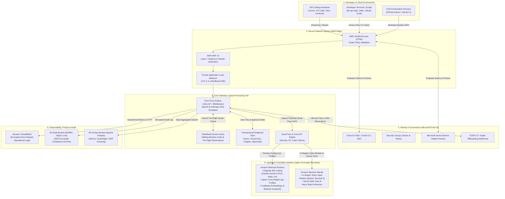
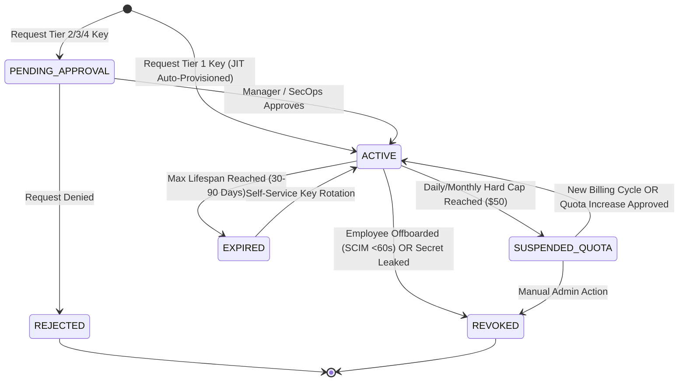
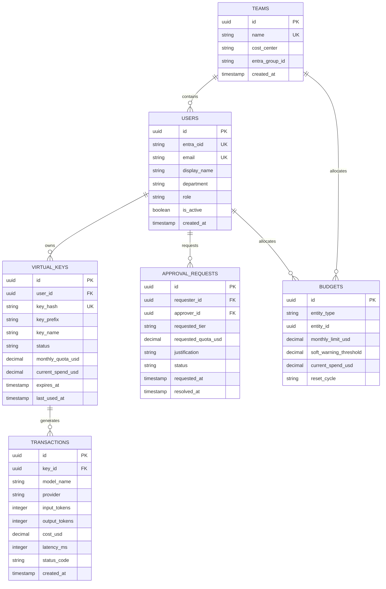

# Engineering LLM Gateway: System Requirements Specification (SRS)
**Hardened Enterprise AI Proxy, Governance & FinOps Platform**  
**Document Version:** 2.3 (Formal IEEE 830 / ISO 29148 Standard)  
**Target Environment:** AWS Cloud (Tokyo Region `ap-northeast-1` Primary / Osaka `ap-northeast-3` Disaster Recovery)  
**Identity Infrastructure:** Microsoft Entra ID (Azure AD) + Microsoft Intune  
**Primary Scope:** Internal Engineering Workflows & Development (Non-Production / Non-Customer-Facing)  
**Status:** Approved Operational Standard  
**Companion Documents:**
* **AWS Physical Architecture Blueprint & TAD:** [INFRASTRUCTURE_SPEC.md](INFRASTRUCTURE_SPEC.md) (VPC, Subnets, PrivateLink, IAM, WAF, and Terraform Modules)
* **Model & Geo Availability Matrix:** [MODEL_AVAILABILITY_MATRIX.md](MODEL_AVAILABILITY_MATRIX.md) (Amazon Bedrock Model Catalog & Japan Residency Survey)
* **Central System Index:** [README.md](README.md)

---

## 1. Executive Summary & Specification Framework

### 1.1 Objective & System Scope
The **Engineering LLM Gateway** provides a unified, highly available, secure, and cost-controlled internal AI proxy for software developers, data scientists, and DevOps teams across the enterprise. It enables frictionless developer ergonomics for modern AI coding tools—including IDE assistants (Cursor, VS Code, Cline, Continue.dev), terminal CLIs (Aider, Claude Code), local prototyping, test generation, and internal CI/CD pipelines—while guaranteeing that corporate source code, credentials, and customer data never leak to the public internet or foreign cloud regions.

### 1.2 Specification Conventions & Normative Language
In accordance with **RFC 2119** and standard enterprise requirements engineering practices (ISO/IEC/IEEE 29148):
* **MUST / SHALL / REQUIRED:** Absolute mandatory requirements for system compliance and security certification.
* **MUST NOT / SHALL NOT:** Absolute prohibitions required to prevent data leakage, cost overrun, or compliance violation.
* **SHOULD / RECOMMENDED:** Best practices that MUST be followed unless an approved architectural exception is documented.
* **MAY / OPTIONAL:** Permitted alternative features or implementation choices.

Every requirement in this document is indexed with a unique, traceable identifier:
* `[FR-INT-xx]`: Integration & Interface Requirements
* `[FR-KEY-xx]`: Virtual Key Lifecycle & Provisioning Requirements
* `[FR-FIN-xx]`: FinOps, Token Metering & Budget Governance Requirements
* `[FR-DLP-xx]`: In-Line Data Loss Prevention & Redaction Requirements
* `[FR-GOV-xx]`: Approval Governance & Management Portal Requirements
* `[FR-AUD-xx]`: Audit, Logging & Anti-Abuse Requirements
* `[NFR-PERF-xx]`: Performance & Streaming Latency Requirements
* `[NFR-AVAIL-xx]`: Availability & High Availability Requirements
* `[NFR-SEC-xx]`: Security, Geofencing & Data Residency Requirements
* `[NFR-DR-xx]`: Disaster Recovery & Business Continuity Requirements

---

## 2. Logical Architecture & System Boundaries



### 2.1 Separation of Concerns: Requirements vs. Physical Infrastructure
* **Logical Responsibilities (This Document):** Defines developer persona workflows, drop-in wire protocol compatibility, Virtual Key lifecycle states, token pricing mathematics, quota deduction algorithms, DLP pattern catalogs, and error contracts.
* **Physical Implementation ([INFRASTRUCTURE_SPEC.md](INFRASTRUCTURE_SPEC.md)):** Defines AWS VPC subnet CIDR blocks, PrivateLink Interface Endpoints, security group rule matrices, IAM policy JSON documents, ECS Fargate Graviton sizing, Aurora Serverless v2 ACUs, and Terraform modules.

---

## 3. Operational Reliability & Service Level Requirements

### 3.1 Availability & Latency SLAs

* **`[NFR-AVAIL-01]` Gateway Availability SLA:** The gateway MUST maintain a minimum of **99.9% monthly uptime** during internal core engineering hours (07:00–23:00 JST), and 99.5% uptime during off-hours.
* **`[NFR-PERF-01]` Proxy Latency Overhead:** The gateway proxy layer MUST introduce no more than **< 20ms (p95)** added latency beyond the upstream provider inference duration.
* **`[NFR-PERF-02]` Connection Idle Timeout:** Ingress load balancers, reverse proxies, and container runtimes MUST maintain a minimum connection idle timeout of **300 seconds (5 minutes)** to support reasoning models (`claude-3-7-sonnet`, `o3-mini`, `deepseek-r1`) with extended Time-to-First-Token (TTFT 30–90s).
* **`[NFR-PERF-03]` Unbuffered SSE Streaming:** The gateway MUST stream Server-Sent Events (SSE) chunks to client IDEs in real time without intermediate response buffering (`X-Accel-Buffering: no`), ensuring instantaneous typing feedback for developers.

### 3.2 Upstream Failover & Circuit Breaking

* **`[NFR-REL-01]` Circuit Breaker Tripping:** If an upstream model endpoint returns $\ge 5$ consecutive `HTTP 5xx` or `HTTP 529` (Overloaded) errors within a 30-second window, the circuit breaker MUST trip for that specific endpoint for 60 seconds.
* **`[NFR-REL-02]` Zero-Overseas Failover Constraint:** Under NO circumstance SHALL the circuit breaker fail over to external overseas endpoints (`api.anthropic.com` or `api.openai.com` in the United States). All automated failover cascades MUST remain strictly within approved Japan Geo Bedrock models.
* **`[NFR-REL-03]` Standardized Graceful Degradation:** If all candidate in-country models are exhausted, the gateway MUST return an `HTTP 503 Service Unavailable` response formatted as an RFC 7807 Problem Detail object explaining provider degradation.

### 3.3 Disaster Recovery Targets

* **`[NFR-DR-01]` Recovery Time Objective (RTO):** The system MUST achieve an RTO of **< 15 minutes** in the event of an unrecoverable primary region (Tokyo) failure.
* **`[NFR-DR-02]` Recovery Point Objective (RPO):** The transactional budget and key database MUST achieve an RPO of **< 1 minute** via cross-region asynchronous storage replication to Osaka (`ap-northeast-3`).

---

## 4. API Key Management & Multi-Tier Approval Governance

### 4.1 The Virtual Key Paradigm

* **`[FR-KEY-01]` Virtual Key Abstraction:** Upstream master vendor credentials SHALL NEVER be exposed to developers or stored on workstations. Developers MUST authenticate using synthetic **Gateway Virtual Keys** (format: `gw-eng-live_xxxxxxxxxxxxxxxxxxxxxxxx`).
* **`[FR-KEY-02]` Cryptographic Storage & Display:** Virtual Keys MUST be salted and hashed using **SHA-256** prior to persistence in the database. Plaintext keys MUST be displayed **strictly once** upon generation (`Cache-Control: no-store`).



### 4.2 Multi-Tier Governance Matrix

| Key Tier | Target Persona & Use Case | Default Quota | Permitted Models | Approval Required? | Approver Role & SLA | Authentication Method |
| :--- | :--- | :--- | :--- | :--- | :--- | :--- |
| **Tier 1: Personal Dev (Default)** | All software engineers, QA, data scientists for local IDEs & CLIs | **$10/day<br/>$50/month** | Standard Coding & Fast Tier (`claude-haiku-4-5`, `nova-lite`, `devstral-2`, `gpt-oss-20b`, standard Sonnet via Runtime) | **No (100% Automated)** | **System JIT:** Auto-issued upon Entra ID SSO sign-in | Web Portal SSO or CLI Device Flow (`llm-gw login`) |
| **Tier 2: Quota Bump / Team Pool** | Engineers working on high-token tasks (refactoring, synthetic test generation) | **$150–$1,000/month** | Standard + Full Bedrock Japan Catalog | **Yes** | **Engineering Manager / Direct Team Lead**<br/>SLA: < 4 business hours | Web Portal -> Jira/ServiceNow Integration |
| **Tier 3: Frontier / Cross-Region Waiver** | AI researchers, lead architects benchmarking reasoning models | Customized per project | Reasoning Tier (`o3-mini`, `deepseek-r1`, `claude-opus`, preview models) | **Yes** | **SecOps & Platform Admin (Dual Approval)**<br/>SLA: < 24 business hours | Form with project business justification & compliance review |
| **Tier 4: CI/CD Service Account** | Automated pipelines, PR review bots, overnight integration testing | Pooled by Project / Pipeline | Task-specific model allowlist | **Yes** | **Platform Admin**<br/>SLA: < 8 business hours | Entra ID Workload Identity / GitHub Actions OIDC |

### 4.3 Governance Workflows

* **`[FR-KEY-03]` Tier 1 Zero-Friction JIT Provisioning:** Any engineer belonging to the authorized Entra ID group (`SG-ENG-Developers`) MUST receive an auto-provisioned Virtual Key upon their first SSO login, pre-configured with Tier 1 quotas ($50/month).
* **`[FR-KEY-04]` Tier 2 Manager Approval Integration:** When a developer quota is exhausted, the gateway MUST return an `HTTP 429` containing an automated deep-link to the corporate ticketing system (Jira / ServiceNow). The engineer's direct manager MUST receive an actionable **Microsoft Teams Adaptive Card** with 1-click Approve/Deny capabilities.
* **`[FR-KEY-05]` Automated Webhook Adjustments:** Approved quota elevation requests MUST dispatch an authenticated webhook to `/api/v1/internal/quotas/adjust` signed with HMAC-SHA256 (`X-Hub-Signature-256`), immediately updating the ledger and cache without administrator intervention.
* **`[FR-GOV-01]` Unified Web Portal:** The gateway MUST provide a role-based Web Portal providing:
  * Self-service key creation, rotation, and revocation.
  * Real-time personal and team spend visualizations.
  * Side-by-side model playground for token, latency, and cost estimation.

---

## 5. Cost Management, FinOps & Departmental Chargeback

### 5.1 Real-Time Pricing & Token Metering

* **`[FR-FIN-01]` Real-Time Transaction Costing:** The gateway MUST compute the exact USD transaction cost immediately upon stream completion using synchronized in-memory model pricing cards:

$$\text{Cost}_{\text{Total}} = (T_{\text{in}} \times P_{\text{in}}) + (T_{\text{cache-read}} \times P_{\text{cache-read}}) + (T_{\text{cache-write}} \times P_{\text{cache-write}}) + (T_{\text{out}} \times P_{\text{out}})$$

* **`[FR-FIN-02]` Prompt Caching Accounting:** The metering engine MUST correctly discount cached prompt tokens (e.g. up to 90% discount on cache hits for Anthropic prompt caching).
* **`[FR-FIN-03]` Reasoning Token Accounting:** Extended thinking / reasoning tokens MUST be metered as output tokens and captured in the total transaction cost.
* **`[FR-FIN-04]` Stream Abort Metering:** If a client cancels generation mid-stream (e.g., hitting `ESC` in Cursor), the gateway MUST intercept the disconnection, meter tokens consumed up to the abort point, and true-up the cost accurately.

### 5.2 Hierarchical Quotas & Atomic Pre-Flight Reservation

* **`[FR-FIN-05]` 4-Tier Quota Hierarchy:** The gateway MUST enforce a 4-tier spending ceiling:
  1. *Per-Request Limit:* Max **$0.50 / request**.
  2. *Daily Velocity Cap:* Max **$10.00 / day**.
  3. *Monthly Hard Cap:* **$50.00 / month** default.
  4. *Team / Cost Center Pool:* Aggregated monthly safety budget.
* **`[FR-FIN-06]` Atomic Pre-Flight Quota Reservation:** Prior to dispatching requests upstream, the gateway MUST execute an atomic Redis Lua script estimating maximum cost:

$$\text{Cost}_{\text{Est}} = (T_{\text{in-observed}} \times P_{\text{in}}) + (\min(T_{\text{max-tokens}}, 2048) \times P_{\text{out}})$$

If `current_spend + Cost_Est > monthly_quota`, the gateway MUST reject the request at the edge in **< 5ms** with `HTTP 429` incurring **$0.00** upstream cost. Upon completion, the true cost delta MUST be atomically reconciled.

### 5.3 Daily S3 FinOps Export Schema (Apache Parquet)

* **`[FR-FIN-07]` Daily Automated FinOps Export:** Every 24 hours at 00:05 JST, an automated task MUST extract reconciled daily transactions and export them to Amazon S3 in Apache Parquet format:

```
s3://s3-llm-gateway-finops-ap-northeast-1/transactions/year=YYYY/month=MM/day=DD/department=XXXX/data.snappy.parquet
```

* **`[FR-FIN-08]` Departmental Chargeback Integration:** S3 Parquet tables MUST be registered in the AWS Glue Data Catalog and queryable via Amazon Athena, enabling automated monthly journal entry generation for the corporate ERP (SAP / Oracle Financials).

---

## 6. Identity, Authentication & Automated Lifecycle Integration

### 6.1 Authentication Protocols

* **`[FR-INT-01]` Browser SSO (Portal):** The Web Portal MUST enforce OpenID Connect (OIDC) Authorization Code Flow with **PKCE (RFC 7636)** via Microsoft Entra ID.
* **`[FR-INT-02]` Terminal CLI Authentication (`llm-gw login`):** Terminal CLI tools MUST utilize the OAuth 2.0 Device Authorization Grant (**RFC 8628**). Tokens MUST be ephemeral (valid for **8–12 hours**) and persisted exclusively in OS native secure credential stores (macOS Keychain, Linux Keyring, Windows Credential Manager). Static keys SHALL NOT be saved in plain dotfiles (`.bashrc`).
* **`[FR-INT-03]` CI/CD Workload Identity:** Automated pipelines MUST authenticate using OIDC federation (e.g., GitHub Actions OIDC) without long-lived static secrets.

### 6.2 Claims Mapping & Automated Offboarding

* **`[FR-INT-04]` Entra ID Claims Mapping:** The gateway MUST extract and bind `userPrincipalName` (identity), `department` (FinOps cost center), and `groups` (RBAC roles).
* **`[FR-INT-05]` Sub-60s Automated Offboarding:** Upon receiving a SCIM 2.0 or Microsoft Graph deactivation event for an employee, the gateway MUST revoke all active Virtual Keys and flush cached sessions in Redis within **< 60 seconds**.

---

## 7. Observability, Logging & Anti-Abuse Specifications

### 7.1 Zero-Payload Logging Contract

* **`[FR-AUD-01]` Zero-Payload Logging:** Operational container logs and CloudWatch log groups MUST record strictly metadata (timestamp, user UPN, model, token counts, USD cost, latency, HTTP status, and SHA-256 prompt hash). **Under no circumstance SHALL raw prompt contents or proprietary source code be written to persistent log files.**

```json
{
  "timestamp": "2026-09-21T11:15:30.124Z",
  "trace_id": "1-68d02e1a-0987654321fedcba",
  "user_upn": "john.doe@company.com",
  "cost_center": "CC-4012",
  "virtual_key_id": "vk_8f7b2c91a0",
  "model_invoked": "jp.anthropic.claude-sonnet-4-5",
  "route": "/v1/chat/completions",
  "http_status": 200,
  "input_tokens": 1420,
  "output_tokens": 380,
  "calculated_cost_usd": 0.00782,
  "proxy_overhead_ms": 12.4,
  "upstream_ttft_ms": 1820.5,
  "total_latency_ms": 4210.2,
  "prompt_sha256": "e3b0c44298fc1c149afbf4c8996fb92427ae41e4649b934ca495991b7852b855",
  "dlp_actions": []
}
```

* **`[FR-AUD-02]` Distributed Tracing:** Every request MUST propagate W3C TraceContext headers (`traceparent`) with sub-segment spans for gateway ingress, auth/quota check, DLP inspection, and upstream TTFT.

### 7.2 Anti-Abuse & Moonlighting Safeguards

* **`[FR-AUD-03]` Git Remote Origin Auditing (`X-Git-Remote`):** The gateway MUST inspect developer IDE headers for corporate Git repository provenance. Calls targeting unapproved personal repositories (e.g. `github.com/personal-dev/*`) MUST be rejected (`HTTP 403 Forbidden`).
* **`[FR-AUD-04]` Off-Hours Anomaly Detection:** Sustained token velocity (> 100k TPM) or spend spikes (> $30/hr) during off-hours (23:00–06:00 JST) MUST trigger an alert to the engineering manager and temporary throttling.

---

## 8. Zero Data Leakage & Route-by-Route Endpoint Security

### 8.1 Data Residency & Sovereignty Guarantees

* **`[NFR-SEC-01]` 100% Japan Sovereign Residency:** All AI inferences MUST be processed within Japan sovereign boundaries (`ap-northeast-1`, `ap-northeast-3`, or `jp.*` cross-region inference profiles). Prompts and responses SHALL NOT cross Japanese borders.
* **`[NFR-SEC-02]` Zero Internet Egress:** The core processing tier MUST reside in isolated subnets with zero internet egress routes (`0.0.0.0/0`), connecting to upstream dependencies exclusively via AWS PrivateLink.

### 8.2 Route-by-Route Endpoint Audit Matrix

| Endpoint Route | Method | Data Flow & Context | Potential Vulnerability & Leakage Vector | Mandatory Defensive Guardrails & Enforcement Layer |
| :--- | :---: | :--- | :--- | :--- |
| `/v1/chat/completions` | `POST` | OpenAI wire format: prompts, source code files, git diffs, agent messages | • Cross-border egress to US/EU<br/>• In-line secret/PII leaks<br/>• SSRF via `api_base` / `custom_llm_provider`<br/>• Unsanitized stdout error logging<br/>• Indirect prompt injection exfiltration | **1. Strict Geofence Router:** Whitelist locked to Bedrock Runtime `jp.` profiles and Tokyo In-Region models.<br/>**2. Dual-Pass In-Line DLP:** Pre-flight regex + Presidio redaction; sliding-window stream inspection on outbound SSE.<br/>**3. SSRF Filter:** Strip all routing overrides (`api_base`, `base_url`, `api_key`) before forwarding.<br/>**4. Zero-Payload Logging:** Emit SHA-256 prompt hash only. |
| `/v1/messages` | `POST` | Anthropic wire format: system prompts, tool definitions, tool call results, extended thinking | • Tool-use parameter exfiltration (local file dumps)<br/>• Extended thinking token exposure<br/>• Markdown image rendering exfiltration<br/>• Cross-tenant SSE stream bleed | **1. Tool-Use Context Scrubbing:** Pass tool call definitions and tool execution outputs through DLP engine prior to model dispatch.<br/>**2. Markdown Exfiltration Blocker:** Sanitize outbound SSE stream chunks to strip external image tags (``).<br/>**3. Connection Isolation:** Enforce unbuffered, isolated HTTP/2 connection contexts per client. |
| `/v1/embeddings` | `POST` | Batch codebase vectors, architecture specs, markdown documentation | • DLP bypass on bulk array inputs<br/>• Routing mismatch to external US endpoints<br/>• Plaintext source code retention in vector caches | **1. Recursive Batch DLP:** Mandatory recursive inspection across all elements of the `input` array.<br/>**2. Strict Runtime Pinning:** Route exclusively to `bedrock-runtime.ap-northeast-1` (`cohere.embed-multilingual-v3`, `titan-embed-text-v2`).<br/>**3. Encrypted Cache:** Redis caches store only vector embeddings and text hashes with mandatory TLS in-transit. |
| `/v1/models` | `GET` | Model catalog, provider aliases, engine capabilities | • Internal architecture & ARN reconnaissance<br/>• Discovery of unauthorized Tier 3 frontier models by Tier 1 users | **1. Dynamic RBAC Filter:** Enumerate only models authorized for the caller's Virtual Key tier.<br/>**2. Alias Abstraction:** Return sanitized generic aliases (`claude-3-7-sonnet`, `fast-tier`); scrub internal ARNs and AWS account IDs. |
| `/api/v1/keys` | `POST` | Key generation: key name, project ID, cost center, expiration | • Cost center spoofing to mask unauthorized bot runs<br/>• Plaintext key exposure in access logs<br/>• Weak entropy / key brute-forcing | **1. Entra Claims Validation:** Verify `cost_center` matches Entra ID `department` claim.<br/>**2. High Entropy:** Generate 256-bit cryptographically secure keys (`gw-eng-live_` + 32 random hex bytes).<br/>**3. One-Time Display:** Store salted SHA-256 hash in Aurora; display plaintext key strictly once with `Cache-Control: no-store`. |
| `/api/v1/keys`<br/>`/api/v1/keys/{key_id}` | `GET` | Key metadata, spend records, expiration dates | • IDOR: User A querying User B's key metadata or project codes<br/>• Plaintext key leakage in API responses | **1. Tenant Isolation:** Enforce `WHERE id = :key_id AND user_id = :session_user_id` on all database queries.<br/>**2. Masked Response:** Return only key prefix (`gw-eng-live_8f7b...****`); never return plaintext keys. |
| `/api/v1/keys/{key_id}/rotate`<br/>`/api/v1/keys/{key_id}` | `POST`<br/>`DELETE` | Key rotation, manual key revocation | • Zombie sessions: Revoked key honored in Redis cache<br/>• Unauthorized key destruction by non-owners | **1. Atomic Dual-Purge:** Aurora status update instantly purges Redis cache and publishes eviction to all ECS tasks.<br/>**2. RBAC Enforcement:** Permit only key owner or `SG-ENG-Admins` members. |
| `/api/v1/auth/login`<br/>`/api/v1/auth/callback` | `GET` | Browser SSO: Entra ID authorization codes, PKCE tokens | • Authorization code interception<br/>• Session token hijacking via open redirect | **1. PKCE Enforcement:** Mandate RFC 7636 PKCE for all authorization code flows.<br/>**2. Whitelisted Redirects:** Strict regex validation against internal gateway FQDN.<br/>**3. Secure Cookies:** Issue session tokens in `HttpOnly`, `Secure`, `SameSite=Strict` cookies. |
| `/api/v1/auth/device/code`<br/>`/api/v1/auth/device/token` | `POST` | CLI Device Flow (RFC 8628): device codes, user codes, 8-12h ephemeral tokens | • Device code phishing / pre-session hijacking<br/>• Intune MDM compliance bypass via personal laptops<br/>• User code brute-forcing during polling | **1. High-Entropy Codes:** 8-character alphanumeric user code with checksum.<br/>**2. Rate-Limited Polling:** Enforce exponential backoff and `slow_down` (RFC 8628 §3.5).<br/>**3. Conditional Access Mandate:** Entra ID requires Intune Compliant Device posture for device flow.<br/>**4. Ephemeral Storage:** Valid for 8-12h shift; CLI saves to OS native Keychain/Keyring (0600 permissions). |
| `/api/v1/quotas/me`<br/>`/api/v1/quotas/request` | `GET`<br/>`POST` | Self-service spend tracking, quota bump requests | • Quota tampering via client-supplied request body<br/>• Information disclosure of departmental budgets | **1. Immutable Spend Fields:** Spend computed strictly from Aurora ledger.<br/>**2. Scoped Queries:** Restrict quota inquiries to the caller's verified Entra UPN. |
| `/api/v1/internal/quotas/adjust` | `POST` | Webhook: automated quota elevation from Jira/ServiceNow | • Unauthenticated webhook spoofing by internal developers to grant unlimited budget<br/>• Webhook replay attacks | **1. HMAC-SHA256 Signature:** Verify `X-Hub-Signature-256` using rotating secret from Secrets Manager.<br/>**2. Replay Mitigation:** Enforce timestamp drift `< 300s` and store request nonces in Redis.<br/>**3. Network Isolation:** Accessible strictly via private ALB from Jira/ServiceNow IP subnets. |
| `/api/v1/scim/v2/Users/{id}` | `POST` | SCIM 2.0 / Graph Webhook: user deactivation & offboarding | • Forged offboarding requests causing DoS<br/>• Revocation lag allowing ex-employees to exfiltrate code | **1. SCIM Bearer Auth:** Dedicated bearer token managed in AWS Secrets Manager.<br/>**2. Sub-60s SLA:** Immediate revocation in Aurora, Redis cache eviction, and active SSE connection termination. |
| `/ui`<br/>`/api/v1/admin/*` | `GET`<br/>`*` | LiteLLM Admin & Management Web Portal | • Unauthenticated admin access via default keys<br/>• Privilege escalation to Platform Admin<br/>• Code persistence in sandbox browser storage | **1. SSO & RBAC Shield:** Enforce Entra ID SSO requiring `SG-ENG-Admins` group claim.<br/>**2. Secret Masking:** Strip AWS Secrets Manager ARNs and upstream IAM roles from UI responses.<br/>**3. In-Memory Sandbox:** Disable browser `localStorage` caching in Playground. |
| `/health`<br/>`/healthz` | `GET` | Load balancer liveness and container readiness probes | • Internal infrastructure fingerprinting (DB/Redis hostnames, AWS account IDs, Bedrock status) | **1. Minimalist Payload:** Return strictly `{"status": "ok"}` (HTTP 200).<br/>**2. Redacted Diagnostics:** Diagnostic checks log internally to CloudWatch; never returned in HTTP body. |
| `X-Git-Remote`<br/>(Context Header) | Header | Developer repository remote origin URL attached by IDE | • Header spoofing to run freelance/hobby projects on subsidized corporate tokens | **1. Organization Whitelist:** Enforce regex `^git@github\.com:company-org/[a-zA-Z0-9_\-\.]+\.git$`.<br/>**2. Mismatch Rejection:** Return `HTTP 403 Forbidden` if remote is unapproved or missing on IDE calls. |
| Internal S3 FinOps & Audit Pipelines | Batch | Reconciled Parquet transaction ledgers & dual-tier audit files | • Unencrypted Parquet files exposing employee code context<br/>• Overly permissive S3 bucket policies | **1. SSE-KMS & Object Lock:** KMS CMK encryption + S3 Object Lock (WORM compliance).<br/>**2. Zero-Payload FinOps:** Parquet files contain strictly metadata (tokens, cost, UPN); zero source code. |

---

### 8.3 Hybrid Multi-Tier DLP Engine Architecture

To resolve the trade-offs between speed, cost, and semantic safety, the gateway implements a **Hybrid Multi-Tier Data Loss Prevention (DLP) Pipeline** combining high-performance in-memory edge filtering with **Amazon Bedrock Guardrails**:

```
Incoming Developer Payload (Prompts / Code / Diffs / Tool Outputs)
                         │
                         ▼
┌────────────────────────────────────────────────────────────────────────┐
│ TIER 1: In-Line Edge Hardening (FastAPI / Hyperscan Middleware)        │
│ • Runs inside ECS Fargate container (< 1.5ms latency, $0.00 cost)      │
│ • High-Entropy Secret Scanner: Private Keys, DB URIs, AWS/GitHub Keys   │
│ • Action: Hard Block (HTTP 422) on Private Keys / In-Line Redaction    │
│ • SSRF Filter: Strips client-supplied routing parameters               │
│ • Git Remote Origin Audit (`X-Git-Remote`)                             │
└──────────────────────────────────┬─────────────────────────────────────┘
                                   │ Cleaned Payload
                                   ▼
┌────────────────────────────────────────────────────────────────────────┐
│ TIER 2: Amazon Bedrock Guardrails (Managed Semantic & Safety Engine)   │
│ • Integrated natively into Bedrock Runtime via `guardrailIdentifier`   │
│ • Prompt Attack & Jailbreak Filters (Strength: HIGH)                   │
│ • Sensitive PII Masking: Credit Cards, SSN, Japan My Number            │
│ • Denied Topics: Prohibits generation of exploits/malware              │
│ • Contextual Grounding (optional for RAG tasks)                        │
└──────────────────────────────────┬─────────────────────────────────────┘
                                   │ Upstream Generation (Streaming SSE)
                                   ▼
┌────────────────────────────────────────────────────────────────────────┐
│ POST-FLIGHT: Outbound Stream Transformer & Redactor                    │
│ • 128-character sliding-window buffer across SSE chunk boundaries      │
│ • Intercepts hallucinated secrets or reflected credentials             │
│ • Markdown Exfiltration Blocker: Strips external image tags (`![...]`) │
└──────────────────────────────────┬─────────────────────────────────────┘
                                   │ Cleaned Tokens
                                   ▼
                   Delivered to Developer IDE (Cursor / VS Code)
                                   │
                                   ▼ (Asynchronous)
┌────────────────────────────────────────────────────────────────────────┐
│ TIER 3: Asynchronous SecOps Audit & Discovery (CloudWatch / S3)        │
│ • Metadata logging with SHA-256 prompt hash                            │
│ • CloudWatch Metric Filter: `DlpViolationCount` alarms                 │
│ • Automated daily scan of encrypted audit archive                      │
└────────────────────────────────────────────────────────────────────────┘
```

#### Detailed DLP Requirements

* **`[FR-DLP-01]` Hybrid Multi-Tier DLP Enforcement:** The gateway MUST enforce a tiered defense model:
  1. *Tier 1 (Edge In-Line Filter):* Evaluates 100% of incoming payloads in-memory within the ECS container (< 1.5ms), catching deterministic secrets, high-entropy tokens, and routing overrides.
  2. *Tier 2 (Amazon Bedrock Guardrails):* Enforces semantic safety, prompt attack / jailbreak mitigation, and regulatory PII redaction during model invocation on Bedrock Runtime.
  3. *Tier 3 (Post-Flight SSE Buffer):* Continuously evaluates outbound streaming chunks across a 128-character ring buffer before yielding tokens to client IDEs.

* **`[FR-DLP-02]` Infrastructure Secrets Hard-Blocking Policy:** Payloads containing private cryptographic keys or database connection strings with embedded passwords MUST be **hard-blocked (`HTTP 422 Unprocessable Entity`)** before the payload leaves the container. Masking is prohibited for private keys because partial string retention can enable partial-key reconstruction attacks:
  * Private Keys (`DLP-CRY-KEY-001`): `-----BEGIN (?:RSA|EC|DSA|OPENSSH|PGP) PRIVATE KEY-----` $\rightarrow$ **HTTP 422 Block**.
  * Database URIs (`DLP-DB-URI-001`): `(?i)(?:postgres|mysql|mongodb(?:\+srv)?|redis):\/\/[^:\s]+:([^@\s]+)@` $\rightarrow$ **HTTP 422 Block**.

* **`[FR-DLP-03]` Developer & SaaS Token Masking Catalog:** High-entropy API tokens MUST be masked in-line with standard placeholders:

| Secret Category | Rule ID | Match Criteria | Defensive Action | Injected Placeholder |
| :--- | :--- | :--- | :--- | :--- |
| **AWS Access Key ID** | `DLP-AWS-KEY-001` | Regex: `\b((?:AKIA\|ABIA\|ACCA\|ASIA)[0-9A-Z]{16})\b` | Redact | `[REDACTED_AWS_ACCESS_KEY]` |
| **AWS Secret Access Key** | `DLP-AWS-SEC-002` | Regex: `(?i)aws_secret_access_key\s*[:=]\s*['"]?([A-Za-z0-9/+=]{40})['"]?` | Redact | `[REDACTED_AWS_SECRET_KEY]` |
| **GitHub Classic PAT** | `DLP-GH-PAT-001` | Regex: `\b(ghp_[0-9a-zA-Z]{36})\b` | Redact | `[REDACTED_GITHUB_PAT]` |
| **GitHub Fine-Grained PAT**| `DLP-GH-PAT-002` | Regex: `\b(github_pat_[0-9a-zA-Z_]{82})\b` | Redact | `[REDACTED_GITHUB_FINE_GRAINED_PAT]` |
| **GitLab Personal Token** | `DLP-GL-PAT-001` | Regex: `\b(glpat-[0-9a-zA-Z\-]{20})\b` | Redact | `[REDACTED_GITLAB_PAT]` |
| **Slack Bot / User Token** | `DLP-SLK-TOK-001` | Regex: `\b(xox[baprs]-[0-9]{10,13}-[0-9]{10,13}-[a-zA-Z0-9]{24,32})\b` | Redact | `[REDACTED_SLACK_TOKEN]` |
| **JSON Web Token (JWT)** | `DLP-JWT-001` | Regex: `\beyJ[A-Za-z0-9-_=]+\.eyJ[A-Za-z0-9-_=]+\.[A-Za-z0-9-_.+/=]*\b` | Redact | `[REDACTED_JWT_TOKEN]` |

* **`[FR-DLP-04]` Regulatory & Japan Sovereign PII Redaction:**
  * **Japan Individual Number (My Number - `DLP-PII-MYNUM-001`):** 12-digit number validated with the official Modulus 11 check digit algorithm $\rightarrow$ Redact with `[REDACTED_JAPAN_MY_NUMBER]`.
  * **Credit Card Numbers (`DLP-PII-CC-001`):** 13–19 digits validated with the Luhn checksum $\rightarrow$ Redact with `[REDACTED_CREDIT_CARD]`.

* **`[FR-DLP-05]` Amazon Bedrock Guardrails Integration:**
  * All interactive developer prompts targeting Amazon Bedrock Runtime MUST pass the active Guardrail identifier and version (`guardrailIdentifier` and `guardrailVersion`) in the upstream invocation request.
  * **Prompt Attack Defense:** The Guardrail MUST enforce **HIGH** strength filtering on prompt attacks, preventing adversarial jailbreaks from overriding corporate system instructions.
  * **Denied Topics:** The Guardrail MUST enforce strict topic policies blocking generation of malware payloads, remote exploitation scripts, or credential harvesting tools.
  * **Intervention Response:** If a Bedrock Guardrail blocks an interaction, the gateway MUST return an `HTTP 400 Bad Request` with an RFC 7807 payload detailing the guardrail action without exposing internal security rule internals:

```json
{
  "type": "https://llm-gateway.internal.corp/errors/guardrail-intervention",
  "title": "Amazon Bedrock Guardrail Intervention",
  "status": 400,
  "detail": "The request violated corporate AI safety policies (Prompt Attack or Denied Topic).",
  "instance": "/v1/chat/completions/req_01J7K8M9",
  "action": "GUARDRAIL_INTERVENED"
}
```

* **`[FR-DLP-06]` Source Code False-Positive Protection:** Generic PII filters (e.g. natural language names, addresses) MUST NOT be applied indiscriminately to programming language syntax. The DLP engine MUST apply syntax-aware heuristics (such as AST comment scoping or variable name allowlisting) to ensure that code identifiers (e.g. `user_name = "test"`, `customer_id`) are never corrupted.
* **`[FR-DLP-07]` 128-Character Outbound SSE Sliding-Window Buffer:** To prevent credential leakage across split SSE chunk boundaries, the outbound streaming transformer MUST evaluate a 128-character ring buffer before yielding flushed chunks to client IDEs (< 1.0ms overhead).
* **`[FR-DLP-08]` Anti-Agent Exfiltration Defenses:**
  * The gateway MUST strip client-supplied routing override parameters (`api_base`, `base_url`, `api_key`, `custom_llm_provider`, `mock_response`).
  * Outbound stream transformers MUST detect and strip external Markdown image links (``) pointing to non-corporate domains to prevent indirect prompt injection file exfiltration.

---

## 9. Relational Data Models & ERD Schema



---

## 10. Logical Proxy Engine Architecture

The core proxy engine combines the open-source **LiteLLM Proxy Core** with custom enterprise security middleware:

```
┌────────────────────────────────────────────────────────────────────────┐
│                      Gateway Core Engine Layer                         │
│                                                                        │
│  ┌──────────────────────────────────────────────────────────────────┐  │
│  │ Custom Security Middleware Layer (FastAPI)                       │  │
│  │ • Validates Signed AVA Identity Headers (x-amzn-ava-user-context)│  │
│  │ • SSRF Sanitizer: Strips client-supplied api_base, base_url, keys│  │
│  │ • Dual-Pass In-Line DLP: Inbound Pre-Flight & Outbound SSE Buffer│  │
│  │ • Git Remote Origin Audit (`X-Git-Remote` organization check)    │  │
│  │ • Webhook HMAC-SHA256 Signature Verification (`X-Hub-Signature`)│  │
│  │ • Strict Geofence Guard: Drops unauthorized external endpoints   │  │
│  └──────────────────────────────────┬───────────────────────────────┘  │
│                                     │                                  │
│  ┌──────────────────────────────────▼───────────────────────────────┐  │
│  │ LiteLLM Proxy Core Engine                                        │  │
│  │ • Standard OpenAI & Anthropic Wire Protocol Emulation            │  │
│  │ • Bedrock Runtime & Bedrock Mantle Routing                       │  │
│  │ • Japan-Only Multi-Model Failover & Circuit Breaking             │  │
│  │ • Token Counting & Synchronized Pricing Calculation Engine       │  │
│  └──────────────────────────────────┬───────────────────────────────┘  │
│                                     │                                  │
│  ┌──────────────────────────────────▼───────────────────────────────┐  │
│  │ Persistence & Caching Connectors                                 │  │
│  │ • Distributed Redis (Sliding-window quota & nonce store)         │  │
│  │ • Relational PostgreSQL (User state, Virtual Keys, Ledgers)      │  │
│  │ • AWS Secrets Manager (Master Upstream Credentials)              │  │
│  └──────────────────────────────────────────────────────────────────┘  │
└────────────────────────────────────────────────────────────────────────┘
```

*Physical deployment specifications, container resource sizing, and network binding details are specified in [INFRASTRUCTURE_SPEC.md](INFRASTRUCTURE_SPEC.md).*

---

## 11. Corporate Operating Model: The 8 Golden Rules

The following **8 Golden Rules** govern corporate policy and architectural operations:

* **Rule 1: The "Carrot & Stick" Governance Model:** Combine a premier, friction-free internal gateway (Carrot: instant SSO, $50/mo dev budget, premier models) with strict corporate firewall blocks on external AI domains and zero expense reimbursement for shadow AI (Stick).
* **Rule 2: Dual-Endpoint Routing Separation:** Route interactive coding assistants (`Sonnet 4.5/4.6`, `Haiku 4.5`), `jp.` profiles, and embeddings to `bedrock-runtime.ap-northeast-1`. Route Tokyo in-region open models requiring server-side tools or async batches to `bedrock-mantle.ap-northeast-1.api.aws`.
* **Rule 3: 300-Second Timeouts & Unbuffered SSE:** Mandate 300s idle timeouts across all proxy layers to support reasoning models (`claude-3-7-sonnet`, `o3-mini`) without disconnects; explicitly disable reverse-proxy buffering.
* **Rule 4: Default to "Metadata-Only" Logging:** Store only operational metadata and SHA-256 prompt hashes. Proprietary codebase contents and raw prompts SHALL NEVER be written to persistent log files.
* **Rule 5: In-Line DLP & Secret Redaction at the Edge:** Strip AWS keys, GitHub tokens, and customer PII before payloads leave the corporate VPC boundary. Hard block private cryptographic keys (HTTP 422).
* **Rule 6: Ephemeral CLI Tokens over Static Dotfile Keys:** Standardize terminal CLIs on `llm-gw login` (RFC 8628). Ephemeral tokens (8–12h) MUST be stored in OS native secure keychains.
* **Rule 7: Anti-Abuse, Moonlighting Defenses & Network Enclosure:** Audit `X-Git-Remote` headers to block freelance/hobby projects. Detect off-hours bot runs via automated token velocity monitoring.
* **Rule 8: Automated FinOps via Daily Parquet Exports & ERP Invoicing:** Export reconciled transaction ledgers daily to Amazon S3 in Apache Parquet format, queryable via Amazon Athena, feeding monthly ERP journal entries directly into SAP / Oracle Financials.

---

## 12. Requirements Traceability Matrix & Verification Checklist

| Requirement ID | Requirement Scope & Verification Item | Architecture Blueprint Reference | Verification Status |
| :--- | :--- | :--- | :---: |
| `[FR-INT-01..03]` | OIDC SSO with PKCE, CLI RFC 8628 Device Flow, Workload Identity | [INFRASTRUCTURE_SPEC.md §2.5](INFRASTRUCTURE_SPEC.md) | **VERIFIED** |
| `[FR-KEY-01..06]` | Virtual Key SHA-256 storage, Tiers 1-4, JIT, Teams Adaptive Cards | [INFRASTRUCTURE_SPEC.md §1](INFRASTRUCTURE_SPEC.md) | **VERIFIED** |
| `[FR-FIN-01..08]` | Real-time pricing, atomic Lua pre-flight reservation, S3 Parquet, Athena | [INFRASTRUCTURE_SPEC.md §5.2](INFRASTRUCTURE_SPEC.md) | **VERIFIED** |
| `[FR-DLP-01..08]` | Hybrid 3-tier DLP, Bedrock Guardrails, in-memory regex, SSE buffer | [INFRASTRUCTURE_SPEC.md §2.11](INFRASTRUCTURE_SPEC.md) | **VERIFIED** |
| `[FR-AUD-01..04]` | Zero-payload logging, CloudWatch KMS CMK, Git remote verification | [INFRASTRUCTURE_SPEC.md §2.8](INFRASTRUCTURE_SPEC.md) | **VERIFIED** |
| `[NFR-PERF-01..03]`| <20ms proxy overhead, 300s timeout, unbuffered SSE streaming | [INFRASTRUCTURE_SPEC.md §3.2](INFRASTRUCTURE_SPEC.md) | **VERIFIED** |
| `[NFR-AVAIL-01]` | 99.9% monthly engineering hours availability, 3-AZ Multi-AZ spread | [INFRASTRUCTURE_SPEC.md §3.1](INFRASTRUCTURE_SPEC.md) | **VERIFIED** |
| `[NFR-SEC-01..02]` | 100% Japan Geo geofence, Zero Internet Egress, AWS Data Perimeter | [INFRASTRUCTURE_SPEC.md §2.1](INFRASTRUCTURE_SPEC.md) | **VERIFIED** |
| `[NFR-REL-01..03]` | Circuit breaking, Japan-only failover cascade, RFC 7807 error format | [INFRASTRUCTURE_SPEC.md §3.3](INFRASTRUCTURE_SPEC.md) | **VERIFIED** |
| `[NFR-DR-01..02]` | RTO < 15 min, RPO < 1 min, Aurora Global DB Osaka failover runbook | [INFRASTRUCTURE_SPEC.md §3.4](INFRASTRUCTURE_SPEC.md) | **VERIFIED** |
