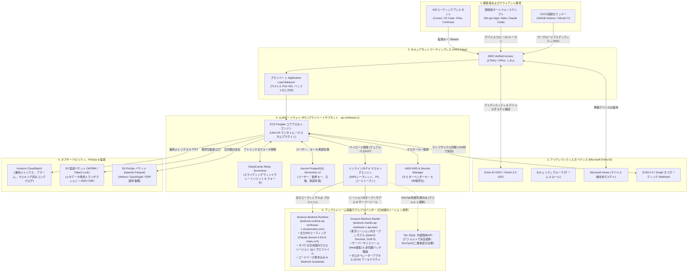
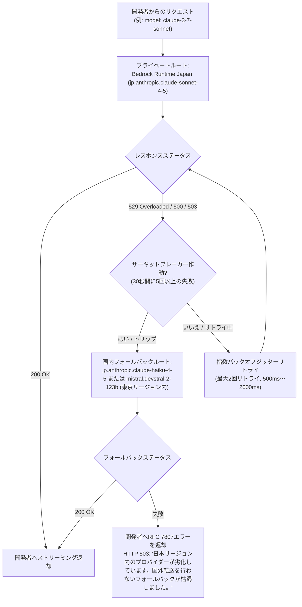
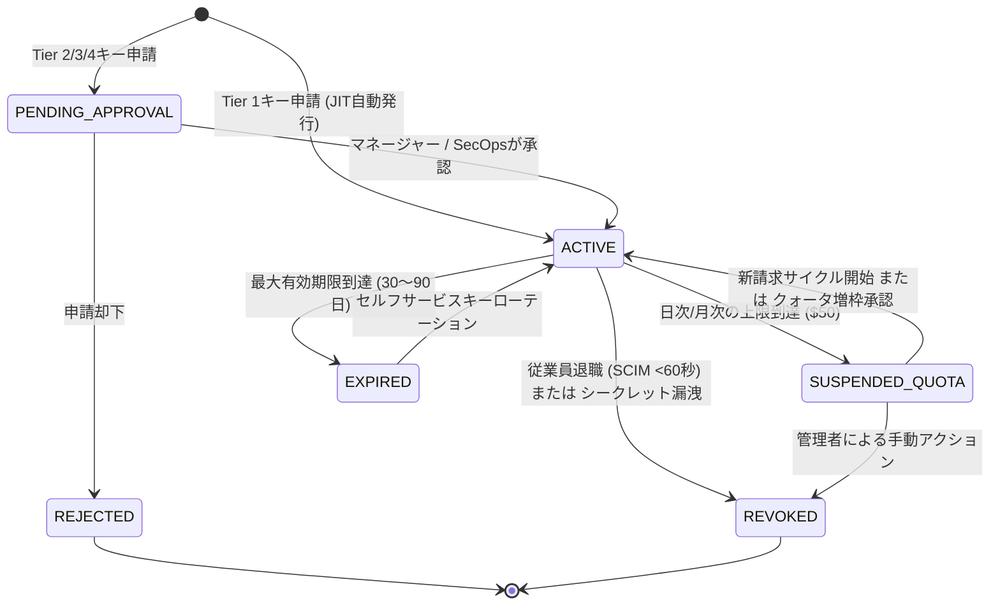
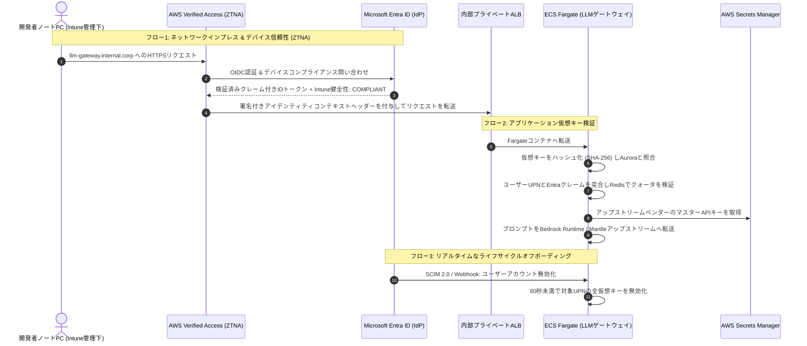
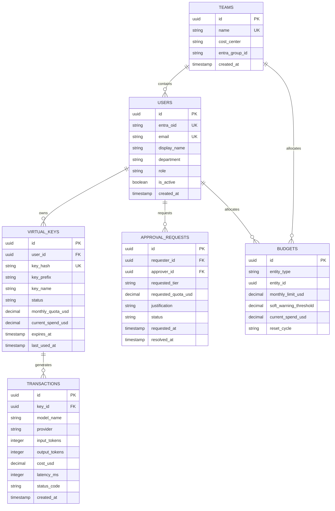

# エンジニアリングLLMゲートウェイ：本番要件および運用仕様書

**ドキュメントバージョン:** 2.2（ルート別ゼロ漏洩堅牢化運用仕様書）  
**対象環境:** AWSクラウド（東京リージョン `ap-northeast-1` / 大阪リージョン `ap-northeast-3`）  
**アイデンティティ基盤:** Microsoft Entra ID (Azure AD) + Microsoft Intune  
**主な対象範囲:** 社内エンジニアリングワークフローおよび開発（非本番／非顧客向け）  
**ステータス:** 承認済みアーキテクチャ設計書およびセキュリティ堅牢化標準  

---

## 1. エグゼクティブサマリーと背景

### 1.1 目的
企業全体のソフトウェアエンジニア、データサイエンティスト、DevOpsチーム向けに、統一され、信頼性が高く、セキュアでコスト管理された社内**LLMゲートウェイ**を提供する。本ゲートウェイにより、企業のソースコードを外部に漏洩させたり、想定外のクラウドコストを発生させたり、マスターベンダー認証情報を漏洩させることなく、エンジニアリングチームが日々のワークフロー（IDEコーディングアシスタント（Cursor、VS Code、Cline、Continue.dev）、開発者CLI（Aider、Claude Code、カスタムツール）、ローカルプロトタイピング、テスト生成、社内CI/CDパイプラインなど）で商用モデルやオープンウェイトの基盤モデルを活用できるようにする。

### 1.2 開発用スコープ vs 本番顧客向けゲートウェイ
10ms未満のプロキシオーバーヘッド、厳格なスキーマ検証、99.99%の稼働率SLAが要求される本番顧客向けゲートウェイとは異なり、**エンジニアリングLLMゲートウェイ**は明確に異なる優先事項の下で運用される：
* **開発者の人間工学（Developer Ergonomics）:** `OPENAI_BASE_URL` および `ANTHROPIC_BASE_URL` のリダイレクトによる、OpenAIおよびAnthropic SDKとの100%ドロップインワイヤ互換性。
* **フリクションレスなオンボーディング:** 標準利用枠（Tier 1）であれば、手動のチケット申請キューを介さず、社内シングルサインオン（Microsoft Entra ID）を通じて即座にセルフサービスアクセスが可能。
* **きめ細かなコスト管理と帰属（Attribution）:** リアルタイムのトークン計測、日次/月次の個人予算上限、および部門別コストセンターに紐づけられたFinOpsチャージバック／ショーバック用自動エクスポート。
* **セキュリティと知的財産（IP）の保護:** 必須のエグレス（外部送信）境界、インラインでのシークレット／PIIマスキング、ゼロデータ保持（Zero Data Retention: ZDR）、および厳格な日本国内データレジデンシーの固定。
* **不正利用防止と社内網封じ込め（Enclosure）:** 会社の資金を利用したトークンの便乗利用、副業への流用、および時間外における無人の自律ボット実行を防止。

---

## 2. システムアーキテクチャとアイデンティティ統合



---

## 3. 運用信頼性とDay-2運用（本番対応力）

### 3.1 サービスレベルアグリーメント（SLA）目標
* **ゲートウェイ可用性目標:** 社内エンジニアリングコア業務時間（07:00〜23:00 JST）において**月間稼働率 99.9%**、時間外は 99.5%。
* **内部プロキシオーバーヘッドレイテンシ:** アップストリームプロバイダーの推論時間を除き、追加レイテンシ **20ms未満（p95）**。
* **目標復旧時間（RTO）:** 5分未満（自動コンテナ再起動／マルチAZフェイルオーバー）。
* **目標復旧時点（RPO）:** トランザクション予算元帳において1分未満（AuroraマルチAZ WALレプリケーション）。

### 3.2 拡張ストリーミングと接続ライフサイクル
高度な推論（Reasoning）モデル（OpenAI `o3-mini`、拡張思考（Extended Thinking）付きAnthropic `claude-3-7-sonnet`、DeepSeek-R1など）は、標準的ではない実行特性を示します：
1. **最初のトークンまでの時間（TTFT）の延伸:** 推論モデルは、最初の補完チャンクを出力する前に、推論トークンの内部計算に**30秒〜90秒以上**費やす場合があります。
2. **ALBおよびリバースプロキシのタイムアウト設定:**
   * **接続アイドルタイムアウト:** AWS Verified Access、ALB、およびECS Fargateコンテナ全体で、最低**300秒（5分）**に設定。推論フェーズ中における早すぎる `504 Gateway Timeout` 切断を防止します。
3. **バッファなしServer-Sent Events（SSE）ストリーミング:**
   * `/v1/chat/completions` および `/v1/messages` に対し、ALBおよびコアプロキシでレスポンスバッファリングを明示的に**無効化**（`proxy_buffering off;` または同等のHTTPチャンクストリーミング）。
   * チャンクは開発者のリアルタイムなタイピング応答性を維持するため、IDE（Cursor、VS Code）に直接リアルタイムでストリーミング配信される必要があります。

### 3.3 アップストリームのフェイルオーバーとサーキットブレーカー
アップストリームのAIプロバイダーでは、一時的なグローバルスロットルや障害（Anthropicの `HTTP 529 Overloaded` やOpenAIの `HTTP 500/503` など）が発生します。ゲートウェイは、自動的かつ透過的なフェイルオーバーを実装します：



* **サーキットブレーカーポリシー:**
  * アップストリームプロバイダーのエンドポイントが30秒ウィンドウ内に5回連続で5xx/529エラーを返した場合、そのエンドポイントに対するサーキットブレーカーが60秒間オープンになります。
  * リクエストは接続タイムアウトを待つことなく、Amazon Bedrock上の日本準拠セカンダリモデル（Bedrock Runtimeまたは東京リージョン内Mantle経由）へ即座にルーティングされます。
  * **ゼロ国外転送の制約（Zero-Overseas Failover Constraint）:** いかなる状況下においても、サーキットブレーカーが外部の米国商用エンドポイント（`api.anthropic.com` または `api.openai.com`）にフェイルオーバーしてはなりません。企業のソースコードが日本の主権境界から離れるのを防ぐため、フェイルオーバーは日本国内（Japan Geo）のBedrockモデル内に厳格に限定されます。
* **グレースフルデグラデーション（Graceful Degradation）:** 国内のすべての候補エンドポイントが失敗した場合、ゲートウェイはプロバイダーのヘルス状態と推奨代替モデルの詳細を記載した、構造化された開発者向けフレンドリーなエラーメッセージを返却します。

### 3.4 同時実行性、コネクションプーリング、およびロードシェディング
* **ECS Fargateタスクのサイジング:** 基本構成として2つのアベイラビリティゾーン（`ap-northeast-1a`, `ap-northeast-1c`）にまたがる最小2タスクを実行し、平均目標接続数（コンテナあたり250アクティブ接続超）に基づいて最大10タスクまでオートスケーリング。
* **HTTPクライアントのコネクションプーリング:** プロキシエンジンは、Bedrock Runtime、Bedrock Mantle、および外部APIへの永続的なHTTP/2 keep-alive接続プールを維持し、プロンプトチャンクごとのTLSハンドシェイクオーバーヘッドを排除します。
* **ロードシェディング（負荷制限）:** コンテナメモリが85%に達するかスレッドプールが飽和した場合、ゲートウェイは対話型の開発者IDEタイピングストリームを維持しつつ、非対話型トラフィック（バックグラウンドCI/CDバッチテストジョブなど）を `HTTP 429 Retry-After: 30` ヘッダーを返して一時的に遮断します。

---

## 4. 詳細解説：APIキー管理と多層承認ガバナンス

### 4.1 仮想キーパラダイム（The Virtual Key Paradigm）
* アップストリームの商用マスターキー（OpenAI Enterpriseキー、Anthropic商用キー、AWS IAM Bedrock認証情報）は、**開発者には決して公開されません**。これらは厳格に**AWS Secrets Manager**内に保持され、ゲートウェイコンテナからIAMロールベース認証を介してのみアクセスされます。
* 開発者には、合成された**ゲートウェイ仮想キー（Virtual Key: V-Key、形式: `gw-eng-live_xxxxxxxxxxxxxxxxxxxxxxxx`）**が発行されます。
* キーはAurora PostgreSQLに保存される前に、**SHA-256**でソルトおよびハッシュ化されます。平文のキーは生成時に**1度だけ**表示されます。

### 4.2 キーライフサイクル状態遷移



### 4.3 多層承認ガバナンスマトリクス

| キーツアー | 対象ペルソナ & ユースケース | デフォルトクォータ | 許可モデル | 承認の要否 | 承認者ロール & SLA | 認証方式 |
| :--- | :--- | :--- | :--- | :--- | :--- | :--- |
| **Tier 1: 個人開発 (デフォルト)** | ローカルIDEおよびCLIを使用する全ソフトウェアエンジニア、QA、データサイエンティスト | **$10/日<br/>$50/月** | 標準コーディング & 高速層 (`claude-haiku-4-5`, `nova-lite`, `devstral-2`, `gpt-oss-20b`, Runtime経由の標準Sonnet) | **不要 (100% 自動化)** | **システムJIT:** Entra ID SSOサインイン時に自動発行 | WebポータルSSO または CLIデバイスフロー (`llm-gw login`) |
| **Tier 2: クォータ増枠 / チームプール** | トークン消費量の多いタスク（リファクタリング、合成テスト生成）に従事するエンジニア | **$150〜$1,000/月** | 標準 + Bedrock日本国内カタログ全般 | **必要** | **エンジニアリングマネージャー / 直属のチームリード**<br/>SLA: 4営業時間未満 | Webポータル -> Jira/ServiceNow連携 |
| **Tier 3: 最先端 / リージョン跨ぎ免責** | AIリサーチャー、推論モデルをベンチマークするリードアーキテクト | プロジェクトごとに個別設定 | 推論モデル層 (`o3-mini`, `deepseek-r1`, `claude-opus`, プレビューモデル) | **必要** | **SecOps & プラットフォーム管理者 (二重承認)**<br/>SLA: 24営業時間未満 | プロジェクトのビジネス妥当性およびコンプライアンス審査フォーム |
| **Tier 4: CI/CDサービスアカウント** | 自動化パイプライン、PRレビューボット、夜間統合テスト | プロジェクト／パイプライン単位でプール | タスク固有のモデル許可リスト | **必要** | **プラットフォーム管理者**<br/>SLA: 8営業時間未満 | Entra IDワークロードアイデンティティ / GitHub Actions OIDC |

### 4.4 承認ワークフローとシステム連携
1. **Tier 1（ゼロフリクションなJITプロビジョニング）:**
   * 認可されたEntra IDセキュリティグループ（例: `SG-ENG-Developers`）に所属するエンジニアは、ポータルにログインするか `llm-gw login` を実行します。
   * ゲートウェイがクレームを検証し、Auroraにアカウントを作成して、デフォルトのTier 1クォータを持つ仮想キーを即座にプロビジョニングします。人間の介入は一切不要です。
2. **Tier 2（Jira / ServiceNow経由のクォータ増枠）:**
   * エンジニアがクォータの100%を消費すると、ゲートウェイは自動ディープリンクを含む `HTTP 429` を返します: `https://jira.internal.corp/servicedesk/customer/portal/2/create/45?user=john.doe&quota=150`。
   * ユーザーのEntra ID、現在の支出、および申請クォータが事前入力されたJiraチケットが自動生成されます。
   * エンジニアの直属マネージャー（Entra ID Microsoft Graphの `manager` 属性経由で動的に特定）に、ワンクリックの**「承認 / 却下」**アクションボタンを備えたインタラクティブな**Microsoft Teams Adaptive Card**が送信されます。
   * 承認されると、JiraのWebhookがゲートウェイ管理API（`POST /api/v1/internal/quotas/adjust`）を呼び出し、クォータを即座に引き上げてキーを再有効化します。
3. **Tier 3 & 4（コンプライアンスおよびサービスアカウント）:**
   * プラットフォームエンジニアリングの正式な変更申請チケットを通じて処理され、IP許可リスト、GitHubリポジトリバインディング、および90日間の自動有効期限ポリシーが検証されます。

### 4.5 開発者キー生成およびクォータAPIスキーマ

#### キー生成リクエスト (`POST /api/v1/keys`)
```json
{
  "key_name": "vscode-laptop-primary",
  "project_id": "PRJ-PAYMENTS-V2",
  "cost_center": "CC-4012",
  "expires_in_days": 60,
  "metadata": {
    "device_hostname": "MAC-ENG-4921",
    "environment": "local_dev"
  }
}
```

#### キー生成レスポンス (`201 Created`)
```json
{
  "key_id": "vk_8f7b2c91a0",
  "virtual_key": "gw-eng-live_8f7b2c91a0e4d27f8a91bc74e2a104",
  "key_name": "vscode-laptop-primary",
  "user_upn": "john.doe@company.com",
  "monthly_quota_usd": 50.00,
  "expires_at": "2026-11-10T08:30:00Z",
  "notice": "このキーを今すぐコピーしてください。二度と表示されません。"
}
```

### 4.6 統合WebポータルおよびダッシュボードUI/UX仕様

ゲートウェイは、ソフトウェアエンジニア、エンジニアリングマネージャー、プラットフォーム/SecOps管理者の3つのペルソナに対応した、ロールベースの集中型Webポータルおよびダッシュボードを提供します。

```
┌────────────────────────────────────────────────────────────────────────────────────────┐
│                        LLM Gateway Unified Web Portal                                  │
│   ログイン中: john.doe@company.com (所属チーム: Payments | コストセンター: CC-4012)     │
├──────────────────────────┬─────────────────────────────────────────────────────────────┤
│  ナビゲーション          │  個人の利用状況 & 仮想キー                                  │
│                          │                                                             │
│  [🔑 APIキー一覧]        │  当月の利用額:         $34.20 / $50.00                      │
│  [📊 チーム支出]         │  [████████████████████░░░░░] 68.4% 消費済み                 │
│  [🧪 プロンプトサンド]   │  リセット日: 2026年10月1日                                  │
│  [📋 クォータ申請]       │                                                             │
│  [⚙️ 管理 (制限付き)]    │  有効な仮想キー:                                            │
│                          │  ┌──────────────────────┬─────────────┬──────────┬────────┐ │
│                          │  │ キー名               │ 作成日      │ 有効期限 │ 操作   │ │
│                          │  ├──────────────────────┼─────────────┼──────────┼────────┤ │
│                          │  │ vscode-laptop-main   │ 2026-08-15  │ 残り32日 │ 更新   │ │
│                          │  │ aider-terminal-token │ 2026-09-11  │ 残り6時間│ 失効   │ │
│                          │  └──────────────────────┴─────────────┴──────────┴────────┘ │
│                          │  [+ 新規キー生成]       [クォータ増枠申請 (Jira)]           │
└──────────────────────────┴─────────────────────────────────────────────────────────────┘
```

#### 1. 開発者ポータルビュー
* **セルフサービスキー管理:** 個人の仮想キーの生成、ラベル付け、有効期限の確認、ローテーション、または即時失効。
* **リアルタイム予算トラッカー:** 上限に対する月間支出を追跡するリアルタイムの進捗バー（例: `$34.20 / $50.00` 消費、68.4%）。
* **マルチモデル対話型サンドボックス & プレイグラウンド:** Bedrock Runtime Sonnet/Nova、Bedrock Mantle Devstral/Qwen3、Haiku、DeepSeekにまたがるプロンプトの並列比較テスト。リアルタイムのトークン数、見積もりUSDトランザクションコスト、およびレイテンシ比較を表示。
* **ワンクリッククォータ拡張:** 開発者の直属マネージャー宛てに事前入力されたJira/ServiceNow承認チケットを生成するディープリンクボタン。

#### 2. エンジニアリングマネージャー / チームリードポータルビュー
* **チーム支出の集計:** プロジェクトコード、モデル層、個々のエンジニアごとに内訳された、チーム全体の総支出をリアルタイムで可視化。
* **承認待ちキュー:** ワンクリックでクォータ増枠リクエストをレビューおよび承認／却下し、会社のコストセンター割り当てを自動検証。
* **支出異常フラグ:** チームメンバーが異常なトークン消費速度を示した場合や、時間外の急激なバースト消費が発生した場合に即座に通知。

#### 3. プラットフォーム管理者 & SecOpsポータルビュー
* **アップストリームプロバイダー & モデルレジストリ:** Amazon Bedrock Runtime、Bedrock Mantle、および商用フォールバックエンドポイントの接続とヘルスステータスを管理。
* **グローバルガバナンス & レートリミット:** デフォルトのTPM/RPM制限、個人の利用枠上限、およびモデル権限層を設定。
* **インラインDLPルール管理:** 企業のシークレット（AWSキー、GitHubトークン）や顧客のPIIをブロックするための正規表現パターンおよびPresidio検知ポリシーを設定。
* **ライフサイクル監査 & SCIMステータス:** アクティブセッション、SCIMプロビジョニング解除の同期健全性、およびグローバルなキー失効ステータスを監視。

#### 4. ダッシュボード技術オプションの比較

| ソリューション | キー & ユーザー管理 | ダッシュボードUI | Entra ID統合 | 保守オーバーヘッド | 推奨度 |
| :--- | :--- | :--- | :--- | :--- | :--- |
| **LiteLLM Proxy UI (内蔵)** | 組み込みの仮想キー、支出追跡、トークンバケットクォータ | 標準でネイティブなNext.js/React Web UI (`/ui`) を提供 | ネイティブなOIDC SSOサポート; SCIM用カスタムWebhook | 低（構築済みコンテナ; 頻繁なOSSアップデート） | **推奨コア:** プロキシと並行してAWS ECS Fargate上にデプロイ。 |
| **カスタム社内Webポータル** | 社内ERP/Jiraに合わせて完全にカスタマイズされたスキーマ | カスタムの社内企業デザインシステム | Entra Graph APIおよびJiraとの100%ネイティブ統合 | 高（フロントエンドの継続的な保守が必要） | LiteLLM APIを呼び出す**軽量UIラッパー**としての利用が最適。 |
| **Portkey AI Gateway** | 仮想キー、高度なフォールバック、サーキットブレーカー | SaaSファーストのUI; セルフホストのコントロールプレーンはより複雑 | SaaS層を通じたエンタープライズSAML/OIDC | 中〜高 | フォールバックエンジンとしては優秀だが、セルフホストのコントロールプレーンが重厚。 |

---

## 5. コスト管理、FinOps、および部門間チャージバック

### 5.1 リアルタイム価格設定およびトークン計測エンジン
ゲートウェイは、同期されたインメモリのプロバイダー価格テーブルを使用して、ストリーム完了時に各トランザクションの正確なUSDコストを算出します：

$$\\text{Cost}_{\\text{Total}} = (T_{\\text{in}} \\times P_{\\text{in}}) + (T_{\\text{cache-read}} \\times P_{\\text{cache-read}}) + (T_{\\text{cache-write}} \\times P_{\\text{cache-write}}) + (T_{\\text{out}} \\times P_{\\text{out}})$$

* **プロンプトキャッシング対応:** Anthropicプロンプトキャッシュ割引（キャッシュヒット時に最大90%割引）およびOpenAIバッチ価格を正確に考慮。
* **推論および拡張思考（Extended Thinking）の計上:** 推論トークン（Claude 3.7 Sonnet思考、DeepSeek-R1、o3-mini）を出力トークンとして明示的に計測し、総トランザクションコストに思考バジェットが確実に計上されるようにします。
* **クライアントストリーム中断（Abort）の処理:** IDEの開発者が生成をキャンセルした場合（Cursorで `ESC` を押す、Clineでエージェントタスクを中断するなど）、ゲートウェイは切断されたSSE接続を捕捉し、終了時点までに受信したトークンを計測して、過剰請求や過小カウントのない正確なコストを記録します。
* **多次元インレスタギング:** すべてのリクエストには、ダウンストリームのFinOps帰属のために不変のメタデータが付与されます：`entra_user_id`、`cost_center`、`entra_department`、`project_id`、`virtual_key_id`、`model_invoked`、および `git_remote`。

### 5.2 階層型多層クォータ適用および事前予約エンジン
リクエストのクリティカルパス上で高レイテンシなリレーショナルデータベース検索を発生させることなく予算超過ゼロを保証するため、ゲートウェイはアトミックなRedis事前予約と組み合わせた4層の上限階層を強制します：

#### 1. 多層クォータ上限階層

| クォータレベル | デフォルト値 (Tier 1 開発者) | 適用ウィンドウ | 目的 & 保護対策 |
| :--- | :--- | :--- | :--- |
| **リクエスト単位の上限** | 最大 **$0.50 / リクエスト** | 単一呼び出し | 個々の呼び出しを強制的に制限; 暴走したプロンプト展開やメガバイト規模のコンテキストダンプループを停止。 |
| **日次消費速度上限** | 最大 **$10.00 / 日** | 24時間ローリング / 日次 | 不正または暴走したエージェントループにより、1日で月間予算全体が急速に枯渇するのを防止。 |
| **月間ハードキャップ** | **$50.00 / 月** | 暦月（毎月1日リセット） | 個人の開発者利用枠; アップストリームモデルを呼び出すことなく `< 5ms` でエッジにて完全拒否。 |
| **チーム / プール上限** | コストセンター単位でプール | 月次 | 全体超過や人員急増から総予算を保護する部門別の安全上限。 |

#### 2. アトミック事前予約および事後精算プロトコル
事後コスト控除方式では、エンジニアの残高がわずか数セントしかない場合、長い生成（32kトークンの補完や拡張思考モデルなど）によって予算超過が発生してしまいます。超過を防ぐための手順：
1. **事前予約（Pre-Flight Reservation）:** アップストリームへの送信前に、ゲートウェイは最大潜在コストを見積もります：  
   $$\\text{Cost}_{\\text{Est}} = (T_{\\text{in-observed}} \\times P_{\\text{in}}) + (\\min(T_{\\text{max-tokens}}, 2048) \\times P_{\\text{out}})$$
   アトミックなRedis Luaスクリプトが `current_spend + Cost_Est <= monthly_quota` を検証します。許可された場合、一時的に $\\text{Cost}_{\\text{Est}}$ をRedis内で予約します。
2. **エッジでの即時拒否:** 予約額がクォータ制限を超過する場合、ゲートウェイはALB/プロキシ境界にて `< 5ms` でリクエストをHTTP 429として拒否します。アップストリームのBedrock API呼び出しは一切発生せず、**コストは $0.00** となります。
3. **事後精算（Post-Flight True-Up）:** ストリーム完了時（またはクライアント中断時）に、正確なコスト $\\text{Cost}_{\\text{Actual}}$ が算出されます。差分 $(\\text{Cost}_{\\text{Actual}} - \\text{Cost}_{\\text{Est}})$ がRedisカウンターにアトミックに適用されて未使用の予約資金が解放され、Auroraトランザクション元帳に非同期で記録されます。

#### 3. 標準化されたRFC 7807エラーペイロード
```json
{
  "type": "https://llm-gateway.internal.corp/errors/quota-exceeded",
  "title": "Monthly Development Quota Exceeded",
  "status": 429,
  "detail": "You have consumed $50.00 of your $50.00 monthly development allowance.",
  "instance": "/v1/chat/completions/req_9a8b7c6d",
  "user_id": "john.doe@company.com",
  "quota_limit_usd": 50.00,
  "current_spend_usd": 50.00,
  "reset_date": "2026-10-01T00:00:00Z",
  "upgrade_url": "https://jira.internal.corp/servicedesk/customer/portal/2/create/45?user=john.doe@company.com"
}
```

### 5.3 コスト予測、消費ペース（バーンレート速度）、および早期異常検知
エンジニアがクォータの80%または100%を消費するまで待つと、スプリントの途中で開発作業が突然停止してしまいます。ゲートウェイはリアルタイムの消費ペースの軌道を計算し、エンジニアとマネージャーにプロアクティブにアラートを通知します：

#### 1. 予測軌道およびランレート計算式
* **線形月末ランレート予測:**
  現在のペースに基づいて予測月間支出を算出：
  $$\\text{Spend}_{\\text{Forecast}} = \\left(\\frac{\\text{Spend}_{\\text{Month-to-Date}}}{D_{\\text{current}}}\\right) \\times D_{\\text{total}}$$
  * *例:* 30日の月の7日目までにエンジニアが$18.50を消費した場合、$\\text{Spend}_{\\text{Forecast}} = (18.50 / 7) \\times 30 = \\$79.28$（$50.00のクォータの158%）。
* **指数平滑移動平均（EMA）消費速度レート:**
  急激な加速（開発者が集中的な自律エージェントループを開始した場合など）を検知：
  $$\\text{Velocity}_{\\text{Daily}} = (0.50 \\times \\text{Spend}_t) + (0.30 \\times \\text{Spend}_{t-1}) + (0.20 \\times \\text{Spend}_{t-2})$$

#### 2. 早期警告トリガーと閾値
* **軌道警告（5〜10日目）:** $\\text{Spend}_{\\text{Forecast}} > \\text{月間クォータの120%}$ の場合、Microsoft Teams経由で開発者に早期警告を送信。
* **80%ソフト警告:** 月間消費額が$40.00（$50.00の上限に対して）に達した際、ゲートウェイはHTTPレスポンスヘッダー `X-LLM-Quota-Remaining-USD: 10.00` を付与し、Teamsアラートを投稿。
* **消費速度異常検知:** APIキーの支出が持続的に **$5.00/時間超** となるか、00:00〜06:00 JSTの間に高いトークン消費速度を示した場合、マネージャーのレビュー待ちとしてキーをTier 1ベースラインモデルにスロットル制限。

#### 3. グレースフルデグラデーションとスロットリングオプション
エンジニアが予測または利用枠の90%を超過した場合：
* **動的モデルダウングレードルーティング:** 日常的なコーディングタスクを、最先端モデル（Claude 3.7 Sonnet）からコスト効率の高いモデル（Claude Haiku 4.5、またはコストが1/10のAmazon Nova Lite）へ自動的に切り替えるオプション。
* **思考バジェット制限:** 残存資金を温存するため、`max_thinking_tokens` を自動的に2,048トークンに固定（クランプ）。

### 5.4 Microsoft Teams FinOpsおよび承認ワークフロー連携（Adaptive Cards）
リアルタイムの通知、警告アラート、およびマネージャーのクォータ承認はすべて、受信Webhookとインタラクティブな**Adaptive Cards**を使用して**Microsoft Teams**とネイティブに統合されます：

#### 1. 開発者向け予算ペースおよび警告カード (Microsoft Teams)
予測支出がクォータを超過するか支出が80%に達した際、個人のTeamsチャットボット経由で開発者に送信されます：
```json
{
  "$schema": "http://adaptivecards.io/schemas/adaptive-card.json",
  "type": "AdaptiveCard",
  "version": "1.4",
  "body": [
    {
      "type": "TextBlock",
      "text": "⚠️ LLM Gateway: Budget Pace Warning",
      "weight": "Bolder",
      "size": "Medium",
      "color": "Warning"
    },
    {
      "type": "FactSet",
      "facts": [
        { "title": "Current Spend:", "value": "$40.00 / $50.00 (80.0%)" },
        { "title": "Projected Month-End:", "value": "$74.50 (Exceeds $50.00 Cap)" },
        { "title": "Cost Center:", "value": "CC-4012 (Payments Team)" },
        { "title": "Reset Date:", "value": "2026-10-01" }
      ]
    },
    {
      "type": "TextBlock",
      "text": "Tip: For routine coding and refactoring, consider switching to Claude Haiku 4.5 or Nova Lite to extend your allowance.",
      "wrap": true,
      "isSubtle": true
    }
  ],
  "actions": [
    {
      "type": "Action.OpenUrl",
      "title": "Open FinOps Dashboard",
      "url": "https://llm-gateway.internal.corp/ui"
    },
    {
      "type": "Action.OpenUrl",
      "title": "Request Quota Bump",
      "url": "https://jira.internal.corp/servicedesk/customer/portal/2/create/45?user=john.doe@company.com"
    }
  ]
}
```

#### 2. エンジニアリングマネージャー向けワンクリック承認カード (Microsoft Teams)
開発者がクォータ拡張リクエストを送信した際（またはJira/ServiceNow Webhook経由で自動生成された際）、エンジニアの直属マネージャー（Microsoft Entra ID Graphの `manager` クレームから解決）にアクション可能なカードが送信されます：
```json
{
  "$schema": "http://adaptivecards.io/schemas/adaptive-card.json",
  "type": "AdaptiveCard",
  "version": "1.4",
  "body": [
    {
      "type": "TextBlock",
      "text": "📋 LLM Gateway: Quota Extension Request",
      "weight": "Bolder",
      "size": "Medium"
    },
    {
      "type": "FactSet",
      "facts": [
        { "title": "Engineer:", "value": "John Doe (john.doe@company.com)" },
        { "title": "Department:", "value": "Core-Banking-Engineering" },
        { "title": "Cost Center:", "value": "CC-4012" },
        { "title": "Current Cap:", "value": "$50.00 / month" },
        { "title": "Requested Cap:", "value": "$150.00 / month" },
        { "title": "Business Justification:", "value": "Automated test suite generation using Claude Sonnet" }
      ]
    }
  ],
  "actions": [
    {
      "type": "Action.Execute",
      "title": "✅ Approve ($150/mo)",
      "verb": "approveQuota",
      "data": {
        "user_upn": "john.doe@company.com",
        "new_quota": 150.00,
        "request_id": "REQ-89412"
      }
    },
    {
      "type": "Action.Execute",
      "title": "❌ Deny",
      "verb": "denyQuota",
      "data": {
        "user_upn": "john.doe@company.com",
        "request_id": "REQ-89412"
      }
    }
  ]
}
```
* **即時有効化:** **「Approve」**を選択すると、`/api/v1/internal/quotas/adjust` 宛てにセキュアなWebhookペイロードが直接実行され、管理者の手動介入なしにAurora元帳とRedisキャッシュが即座に更新されます。

### 5.5 日次S3 FinOpsエクスポートスキーマ（Apache Parquet）
24時間ごと（00:05 JST）、自動化されたECSタスクがその日の照合済み元帳レコードを抽出し、**Apache Parquet形式**に変換して、日付および部門ごとにパーティション分割されたFinOps S3バケットに書き込みます：  
`s3://corp-finops-llm-gateway-prod/usage/year=2026/month=09/day=11/department=ENG-PAYMENTS/part-0001.parquet`

#### FinOps Parquet スキーマ

| カラム名 | データ型 | 説明 | サンプル値 |
| :--- | :--- | :--- | :--- |
| `transaction_id` | `VARCHAR(64)` | 一意のゲートウェイトランザクション識別子 | `tx_01J7K8M9PQ2R4S` |
| `timestamp` | `TIMESTAMP` | リクエストのISO 8601 UTCタイムスタンプ | `2026-09-11 08:30:15.123` |
| `entra_user_id` | `VARCHAR(128)` | Entra ID ユーザープリンシパル名 (UPN) | `john.doe@company.com` |
| `entra_department` | `VARCHAR(64)` | Entra IDクレームからマッピングされた部門 | `Core-Banking-Engineering` |
| `cost_center` | `VARCHAR(32)` | 財務総勘定元帳のコストセンターコード | `CC-4012` |
| `project_id` | `VARCHAR(64)` | 割り当てられた企業プロジェクトコード | `PRJ-PAYMENTS-V2` |
| `model_invoked` | `VARCHAR(128)` | アップストリームモデルの完全な識別子 | `jp.anthropic.claude-sonnet-4-5-20250929-v1:0` |
| `provider` | `VARCHAR(32)` | アップストリーム推論エンジン | `bedrock-runtime` |
| `input_tokens` | `INTEGER` | キャッシュされていないプロンプト入力トークン数 | `1420` |
| `cache_read_tokens`| `INTEGER` | 割引対象のキャッシュ読み取りプロンプトトークン数 | `8500` |
| `cache_write_tokens`| `INTEGER` | キャッシュ作成入力トークン数 | `0` |
| `output_tokens` | `INTEGER` | 補完出力トークン数 | `450` |
| `cost_usd` | `DECIMAL(10,6)`| トランザクションの純コスト（USD） | `0.015250` |
| `duration_ms` | `INTEGER` | 総エンドツーエンドレイテンシ（ミリ秒） | `2450` |
| `ttft_ms` | `INTEGER` | 最初のトークンまでの時間（ミリ秒） | `420` |
| `git_remote` | `VARCHAR(256)` | IDEヘッダーから検証されたGitリモートorigin | `github.com/company-org/payments` |

### 5.6 部門別チャージバックおよび会計元帳連携
1. **カタログ化とクエリ実行:** AWS GlueがFinOps S3バケットを自動的にクローリングし、**Amazon Athena**データカタログテーブル `finops_llm_gateway.daily_usage` を更新。
2. **月次自動請求パイプライン:**
   * 毎月1日、自動化されたStep FunctionsがAthenaクエリを実行し、`cost_center` および `entra_department` ごとの総支出を集計。
   * 出力されたCSVは、SFTP / API経由で企業のERPシステム（SAP / Oracle Financials）に送信。
   * 財務部門が社内振替仕訳を実行し、各部門の研究開発（R&D）クラウド予算から引き落として、集中プラットフォーム運用コストプールに入金。
3. **週次マネージャーショーバック（利用可視化）:**
   * 自動化されたAmazon QuickSightダッシュボードおよび週次のMicrosoft Teamsチャネルダイジェストがエンジニアリングディレクターに配信され、以下を詳細に報告：
     * トークン消費量上位5名のエンジニア。
     * モデル利用分布（例: Claude Sonnet 65%、Haiku 25%、DeepSeek-R1 10%）。
     * 四半期エンジニアリング予算枠に対する支出ペース。

---

## 6. Entra IDとAWSの詳細統合設計図

Microsoft Entra ID (Azure AD) とAWSインフラストラクチャ間の統合は、3つの異なる層にまたがって設計されています：



### 6.1 認証プロトコル

#### 1. ブラウザSSO（開発者Webポータル）
* **プロトコル:** **PKCE (Proof Key for Code Exchange)** を伴うOpenID Connect (OIDC) 認可コードフロー。
* **フロー:** エンジニアが `https://llm-gateway.internal.corp` にアクセス -> `login.microsoftonline.com/<tenant_id>/oauth2/v2.0/authorize` にリダイレクト -> 企業の多要素認証（MFA）で認証 -> 認可コードを返却 -> ゲートウェイバックエンドが認可コードをJWTアクセストークンおよびIDトークンと交換。

#### 2. ターミナルCLI認証 (`llm-gw login`)
* **プロトコル:** OAuth 2.0 デバイス認可グラント（**RFC 8628**）。
* **開発者フロー:**
  1. 開発者がiTerm2/Terminalで `llm-gw login` を実行。
  2. CLIがゲートウェイにデバイスコードを要求: `verification_uri`（`https://llm-gateway.internal.corp/device`）と `user_code`（`WDJB-MKTL`）が返却される。
  3. CLIが開発者のブラウザで検証URIを開く。開発者がEntra IDログインを完了。
  4. CLIが認可が完了するまでトークンエンドポイント（`POST /api/v1/auth/device/token`）をポーリング。
  5. ゲートウェイがエフェメラル（一時的）なBearerトークン（勤務シフトに合わせた**8〜12時間**有効）を返却。
  6. トークンはOSネイティブの認証情報ストアに安全に保存：
     * macOS: `security` APIを介した**Keychain**。
     * Linux: **Secret Service API / Keyring**。
     * Windows: **Windows Credential Manager**。
  7. **平文シークレットの完全排除:** `.bashrc`、`.zshrc`、または平文の `.env` ファイルに長期有効な生キーが保存されることは一切ありません。

#### 3. CI/CDパイプライン（ワークロードアイデンティティ連携）
* **プロトコル:** OIDCフェデレーション（GitHub Actions / GitLab CI -> AWS IAM / Entra ID）。
* **フロー:** GitHub ActionsランナーがGitHubからOIDCトークンを要求 -> トークンをゲートウェイに渡す -> ゲートウェイがGitHubトークンのクレーム（`iss: token.actions.githubusercontent.com`、`repository: company-org/repo-name`）を検証 -> そのワークフロー実行期間中のみ有効な短命の実行トークンを発行。

### 6.2 Entra IDクレームマッピング仕様

| Entra ID クレーム | 対象ゲートウェイフィールド | 目的 & RBACマッピング |
| :--- | :--- | :--- |
| `oid` / `sub` | `users.entra_oid` | 不変の一意なユーザー識別子。 |
| `userPrincipalName` | `users.email` | 主要な個人アイデンティティ（`john.doe@company.com`）。 |
| `displayName` | `users.display_name` | ログおよびポータルでのUI表示名。 |
| `department` | `users.department` | FinOpsチャージバックのためにトランザクションログに挿入。 |
| `jobTitle` | `users.job_title` | 利用プロファイリング用コンテキスト。 |
| `groups` (オブジェクトID) | `users.roles` / `teams` | ゲートウェイのRBACロールにマッピング：<br/>• `SG-ENG-Admins` -> **プラットフォーム管理者**<br/>• `SG-ENG-Managers` -> **チームリード / 承認者**<br/>• `SG-ENG-Developers` -> **エンジニア (標準層)**<br/>• `SG-AUDIT-SecOps` -> **セキュリティ監査者** |

### 6.3 自動オフボーディングとプロビジョニング解除（60秒未満での失効）
退職した元従業員が退職後に会社のLLMトークンへアクセスし続けるのを防ぐため：
1. **SCIM 2.0 & Microsoft Graph Webhooks:** ゲートウェイは内部エンドポイント `POST /api/v1/scim/v2/Users/{id}` を公開し、Entra IDのユーザーライフサイクルイベント（`/users/{id} delta`）を購読します。
2. **即時無効化トリガー:**
   * Entra IDで従業員アカウントが無効化または削除されると、Entraは数秒以内にゲートウェイへWebhookを送信。
   * ゲートウェイはアトミックなデータベース更新を実行し、その `userPrincipalName` に紐づくすべてのアクティブな仮想キーのステータスを `status = 'REVOKED'` に更新。
   * ゲートウェイは、ElastiCache Redisから該当ユーザーのキャッシュされたセッションとトークンバケットをすべてフラッシュ（消去）。
3. **SLA:** Entra IDでのアカウント無効化から、ゲートウェイAPIでの完全拒否までの経過時間は**60秒未満**です。

---

## 7. オブザーバビリティ、ロギング、および異常監視の設計図

### 7.1 多層ロギングアーキテクチャ
法規制コンプライアンスや財務監査の要請と、開発者のプライバシー保護および企業秘密の漏洩防止のバランスを維持します：

```
[受信リクエスト & ペイロード]
       │
       ▼
[インラインDLPエンジン] ──► AWSシークレットまたはPIIを検知? ──► プレースホルダー [REDACTED_API_KEY] でマスキング
       │                                                      └─► CloudWatchセキュリティアラートを発行
       ▼
[デュアル層監査ルーター]
       │
       ├─► Tier 1: デフォルトのメタデータロギング (すべての開発ワークロード)
       │   • 記録項目: タイムスタンプ、UPN、IP、モデル、トークン数、コスト、レイテンシ、プロンプトのSHA-256ハッシュ
       │   • 生のプロンプト / コードペイロード: ディスクには一切書き込まれない
       │
       └─► Tier 2: フルペイロード・コンプライアンスアーカイブ (オプトインの高リスクプロジェクト限定)
           • SecOpsの免責承認が必須
           • カスタマー管理KMSキーを使用して保存時に暗号化
           • Object Lockを有効化したS3に書き込み (WORM準拠、90日間保持)
```

### 7.2 CloudWatchメトリクス、アラーム、および運用閾値

| メトリクス名 | 単位 | アラーム条件 | 重要度 | 自動アクション |
| :--- | :--- | :--- | :--- | :--- |
| `GatewayLatencyP95` | ミリ秒 | アップストリーム推論時間を除き、5分連続で `> 50ms` | 警告 | ECSタスクの水平オートスケーリングをトリガー。 |
| `Gateway5xxErrors` | 回数 | 1分間に `> 10` 回のエラー | 緊急 | プラットフォームオンコールへPagerDutyアラート送信; コンテナログの精査。 |
| `UpstreamThrottle429`| 回数 | 2分間に `> 25` 回のアップストリーム429 | 警告 | サーキットブレーカーを作動; セカンダリプロバイダーリージョンへルーティング。 |
| `TimeFirstTokenP90` | ミリ秒 | 非推論モデルにおいて `> 15000ms` | 警告 | アップストリームプロバイダーのパフォーマンス劣化をオンコールに通知。 |
| `TokenVelocityBurst`| トークン/分 | 単一の個人仮想キーにおいて `> 150,000 TPM` | 緊急 | キーを一時的にスロットル制限; スクリプト暴走の可能性をSecOpsに警告。 |
| `OffHoursSpendSpike`| USD / 時間 | 23:00〜06:00 JSTの間に `> $30.00/時間` | 警告 | CloudWatch EventBridgeがエンジニアリングマネージャーに異常をフラグ付け。 |

### 7.3 分散トレーシング（OpenTelemetry & AWS X-Ray）
ゲートウェイのすべてのトランザクションは、W3C TraceContextヘッダー（`traceparent`、`tracestate`）を伝播します。
* **測定されるトレーススパン:**
  1. `gateway_ingress`: ALBでのTLS終端からECS Fargateコンテナでの受信まで。
  2. `auth_and_quota`: Redisスライディングウィンドウクォータチェック + SHA-256キー照合。
  3. `dlp_inspection`: インラインでのシークレットおよびPII正規表現スキャン。
  4. `upstream_ttft`: Bedrock Runtime / Mantle / アップストリームへの送信から最初のストリームチャンク受信まで。
  5. `upstream_stream`: 最初のチャンクからストリーム終了（`[DONE]`）まで。
* 開発者やプラットフォームチームは、処理遅延の原因がゲートウェイプロキシにあるのか、アップストリームモデルの推論にあるのかを即座に診断できます。

### 7.4 異常検知および不正利用防止策
1. **Gitリモートリポジトリ検証 (`X-Git-Remote`):**
   * サポートされているIDE拡張機能（Cursor、VS Code）およびCLIラッパーは、現在のGitリモートoriginヘッダーを自動的に付与します：
     `X-Git-Remote: git@github.com:company-org/payment-service.git`
   * ゲートウェイはこのヘッダーを監査します。リクエストに個人のGitHubリモート（例: `github.com/personal-dev/freelance-app`）が含まれている場合、ゲートウェイはリクエストを即座に拒否します（`HTTP 403 Forbidden: Unauthorized repository context`）。
2. **時間外／無人ボット検知:**
   * 開発者による対話的なコーディングは、断続的で不規則なタイピングパターン（1時間あたり5〜20リクエスト、間に休止あり）を示します。
   * 自律的なバッチボットは、継続的な高QPSループを実行します。深夜0時から早朝06:00 JSTの間に、キーが60分以上連続して高いトークン消費速度を維持した場合、マネージャーのレビュー待ちとしてキーは自動的にロックされます。

---

## 8. ゼロデータ漏洩およびルート別エンドポイントセキュリティ仕様

### 8.1 脅威モデリング：AIエージェントおよびIDEアシスタントによる社内データ漏洩経路
自律型コーディングエージェント（Cursor、VS Code、Cline、Continue.dev、Aider、Claude Code、社内CIボット）を利用するエンジニアリングワークフローは、新たな攻撃対象領域や情報漏洩経路をもたらします：
1. **プロプライエタリなソースコードの国外送信:** ゼロデータ保持（ZDR）が保証されていない、あるいは日本の主権境界の外に存在するアップストリームプロバイダーに対し、エージェントが独自のアルゴリズム、未コミットのビジネスロジック、知的財産を送信するリスク。
2. **ハードコードされたシークレットやインフラ認証情報の露出:** 開発者が `.env` ファイル、本番データベース接続URI、AWS IAMキー（`AKIA...`）、GitHub Personal Access Token（`ghp_...`）、または秘密SSHキーをエージェントのプロンプトやコンテキストウィンドウに貼り付けるリスク。
3. **クライアント指定パラメータの上書きによるSSRF:** 攻撃者や不正なエージェント指示がリバースプロキシパラメータを改ざんし（例: OpenAI互換ペイロードで `api_base: "http://169.254.169.254/latest/meta-data/"` を渡すなど）、ゲートウェイにコンテナのIAM認証情報や社内VPCサービスを漏洩させるリスク。
4. **安全でない直接オブジェクト参照（IDOR）とキー改ざん:** 認可されていないエンジニアが、組織の境界を越えて他のユーザーの仮想キーを閲覧・変更・失効させたり、チームの支出元帳を照会したりするリスク。
5. **未認証Webhookのインジェクションとクォータの不正引き上げ:** 悪意ある内部関係者や自動スクリプトがServiceNow/JiraのWebhookコールバックを偽造し、無制限のトークンクォータを自身に付与するリスク。
6. **RFC 8628デバイスフローのフィッシングと未管理デバイスからのアクセス:** 開発者を騙して不正なデバイスコードを承認させたり、管理されていない私物端末上のヘッドレスCLIセッションを通じてMicrosoft Intuneのデバイス健全性ポスチャチェックを迂回するリスク。
7. **埋め込み（Embeddings）パイプラインでのDLP迂回とベクトルキャッシュのハニーポット化:** インラインシークレットスキャンを行わずに `/v1/embeddings` 経由で大規模なコードベースチャンクをベクトル化したり、暗号化されていないRedisベクトルキャッシュに平文ソースコードを保存するリスク。
8. **間接プロンプトインジェクションとMarkdown画像による外部送信:** コードベースファイルやサードパーティ依存関係に含まれる隠れたプロンプトインジェクションが、開発者IDE内でレンダリングされるMarkdown画像リンク（``）を介してプライベートリポジトリのファイルを外部送信するようエージェントに指示するリスク。
9. **ログのハニーポット化とリバースプロキシからの漏洩:** アプリケーションの例外、リバースプロキシ（ALB）、またはECSコンテナの標準出力が、生のHTTPボディ、認証ヘッダー、プロンプトを暗号化されていないCloudWatchロググループに出力するリスク。
10. **サイレントな国境越えフォールバック送信:** 国内Bedrock呼び出しが失敗した際に、サーキットブレーカーがSecOpsの把握なしに米国の外部商用エンドポイント（`api.anthropic.com` または `api.openai.com`）へサイレントに再ルーティングし、ソースコードが日本国内リージョンから流出するリスク。

---

### 8.2 ルート別セキュリティおよび脆弱性監査マトリクス

以下のマトリクスは、ゲートウェイが公開するすべてのエンドポイントについて徹底的なセキュリティ監査を提供し、潜在的な漏洩経路を分析して必須の防御策を定義します：

| エンドポイントルート | メソッド | データフロー & コンテキスト | 潜在的な脆弱性 & 漏洩経路 | 必須の防御ガードレール & 適用レイヤー |
| :--- | :---: | :--- | :--- | :--- |
| `/v1/chat/completions` | `POST` | OpenAIワイヤ形式: プロンプト、ソースコードファイル、git diff、エージェントメッセージ | • 米国/EUへの国境を越えたデータ送信<br/>• インラインシークレット/PII漏洩<br/>• `api_base` / `custom_llm_provider` 経由のSSRF<br/>• サニタイズされていない標準出力エラーログ<br/>• 間接プロンプトインジェクションによる外部漏洩 | **1. 厳格なジオフェンスルーター:** Bedrock Runtime `jp.` プロファイル（Sonnet 4.5/4.6, Haiku 4.5, Nova 2 Lite）および東京リージョン内モデルにホワイトリスト固定; 未認可の外部プロバイダーを遮断。<br/>**2. デュアルパスインラインDLP:** プロンプトに対する事前正規表現 + Presidioマスキング; 送信SSEに対するスライディングウィンドウストリーム検査。<br/>**3. SSRFフィルター:** 転送前にすべてのルーティング上書きパラメータ（`api_base`, `base_url`, `api_key`）を除去。<br/>**4. ゼロペイロードロギング:** プロンプトのSHA-256ハッシュのみを出力; 生のプロンプト/コードはログに一切書き込まない。 |
| `/v1/messages` | `POST` | Anthropicワイヤ形式: システムプロンプト、ツール定義、ツール実行結果、拡張思考 | • ツール利用パラメータの外部漏洩（ローカルファイルダンプ）<br/>• 拡張思考トークンの露出<br/>• Markdown画像レンダリングによる外部流出<br/>• テナント間でのSSEストリーム混線 | **1. ツール利用コンテキストのスクラビング:** モデル送信前にツール定義およびツール実行出力をDLPエンジンに通す。<br/>**2. Markdown外部流出ブロッカー:** 外部画像タグ（``）を除去するため、送信SSEストリームチャンクをサニタイズ。<br/>**3. 接続の完全分離:** クライアントごとにバッファなしの独立したHTTP/2接続コンテキストを強制。 |
| `/v1/embeddings` | `POST` | バッチコードベースベクトル、アーキテクチャ仕様、Markdownドキュメント | • バルク配列入力に対するDLP迂回<br/>• 米国外部エンドポイントへの誤ルーティング<br/>• ベクトルキャッシュにおける平文ソースコードの保持 | **1. 再帰的バッチDLP:** `input` 配列のすべての要素に対して再帰的検査を必須化。<br/>**2. 厳格なRuntime固定:** `bedrock-runtime.ap-northeast-1`（`cohere.embed-multilingual-v3`, `titan-embed-text-v2`）にのみルーティング。<br/>**3. 暗号化キャッシュ:** Redisキャッシュには転送時TLSを必須とし、ベクトル埋め込みとテキストハッシュのみを保存。 |
| `/v1/models` | `GET` | モデルカタログ、プロバイダーエイリアス、エンジン機能 | • 内部アーキテクチャおよびARNの偵察<br/>• Tier 1ユーザーによる未認可Tier 3最先端モデルの探索 | **1. 動的RBACフィルター:** 呼び出し元の仮想キーツアーに認可されたモデルのみを列挙。<br/>**2. エイリアス抽象化:** サニタイズされた汎用エイリアス（`claude-3-7-sonnet`, `fast-tier`）を返却; 内部ARNやAWSアカウントIDを除去。 |
| `/api/v1/keys` | `POST` | キー生成: キー名、プロジェクトID、コストセンター、有効期限 | • 未認可ボット実行を隠蔽するためのコストセンター偽装<br/>• アクセスログにおける平文キーの露出<br/>• 脆弱なエントロピー / キーのブルートフォース | **1. Entraクレーム検証:** `cost_center` がEntra IDの `department` クレームと一致することを検証。<br/>**2. 高エントロピー:** 暗号学的に安全な256ビットキーを生成（`gw-eng-live_` + 32ランダム16進バイト）。<br/>**3. 1回限りの表示:** ソルト付きSHA-256ハッシュをAuroraに保存; 平文キーは `Cache-Control: no-store` を付与して厳格に1度のみ表示。 |
| `/api/v1/keys`<br/>`/api/v1/keys/{key_id}` | `GET` | キーメタデータ、利用実績、有効期限 | • IDOR: ユーザーAがユーザーBのキーメタデータやプロジェクトコードを照会<br/>• APIレスポンスにおける平文キーの漏洩 | **1. テナント分離:** すべてのDBクエリに `WHERE id = :key_id AND user_id = :session_user_id` を強制。<br/>**2. マスクされたレスポンス:** キープレフィックス（`gw-eng-live_8f7b...****`）のみを返却; 平文キーは返却しない。 |
| `/api/v1/keys/{key_id}/rotate`<br/>`/api/v1/keys/{key_id}` | `POST`<br/>`DELETE` | キーローテーション、手動キー失効 | • ゾンビセッション: Redisキャッシュ内で失効キーが有効であり続ける<br/>• 非所有者による未認可のキー破棄 | **1. アトミックなデュアルパージ:** Auroraステータス更新が即座にRedisキャッシュをパージし、全ECSタスクに無効化を通知。<br/>**2. RBACの適用:** キー所有者または `SG-ENG-Admins` メンバーのみに操作を許可。 |
| `/api/v1/auth/login`<br/>`/api/v1/auth/callback` | `GET` | ブラウザSSO: Entra ID認可コード、PKCEトークン | • 認可コードの傍受<br/>• オープンリダイレクトによるセッショントークンの乗っ取り | **1. PKCEの強制:** すべての認可コードフローでRFC 7636 PKCEを必須化。<br/>**2. ホワイトリスト形式のリダイレクト:** 社内ゲートウェイFQDNに対する厳格な正規表現検証。<br/>**3. セキュアクッキー:** セッショントークンを `HttpOnly`, `Secure`, `SameSite=Strict` クッキーとして発行。 |
| `/api/v1/auth/device/code`<br/>`/api/v1/auth/device/token` | `POST` | CLIデバイスフロー (RFC 8628): デバイスコード、ユーザーコード、8〜12時間有効な一時トークン | • デバイスコードフィッシング / 事前セッション乗っ取り<br/>• 私物ノートPCによるIntune MDMコンプライアンスの迂回<br/>• ポーリング中のユーザーコード総当たり攻撃 | **1. 高エントロピーコード:** チェックサム付きの8文字英数字ユーザーコード。<br/>**2. レート制限付きポーリング:** 指数バックオフと `slow_down` を強制（RFC 8628 §3.5）。<br/>**3. 条件付きアクセスの必須化:** Entra IDはデバイスフローに対してIntune準拠デバイスポスチャを要求。<br/>**4. エフェメラル保存:** 8〜12時間の勤務シフト中のみ有効; CLIはOSネイティブのKeychain/Keyring（権限0600）に保存。 |
| `/api/v1/quotas/me`<br/>`/api/v1/quotas/request` | `GET`<br/>`POST` | セルフサービス利用追跡、クォータ増枠申請 | • クライアント送信のリクエストボディによるクォータ改ざん<br/>• 部門予算に関する情報漏洩 | **1. 不変の支出フィールド:** 支出はAurora元帳からのみ算出。<br/>**2. スコープ付き照会:** クォータ照会を発行元検証済みEntra UPNに限定。 |
| `/api/v1/internal/quotas/adjust` | `POST` | Webhook: Jira/ServiceNowからのクォータ自動昇格 | • 社内開発者による未認証Webhookの偽造（無制限予算の付与）<br/>• Webhookリプレイ攻撃 | **1. HMAC-SHA256署名:** Secrets Managerのローテーションシークレットを用いた `X-Hub-Signature-256` の検証。<br/>**2. リプレイ緩和策:** タイムスタンプドリフト `< 300秒` を強制し、リクエストnonceをRedisに保存。<br/>**3. ネットワーク分離:** Jira/ServiceNowのIPサブネットからプライベートALB経由でのみアクセス可能。 |
| `/api/v1/scim/v2/Users/{id}` | `POST` | SCIM 2.0 / Graph Webhook: ユーザー無効化 & オフボーディング | • 偽造オフボーディングリクエストによるDoS<br/>• 失効の遅延による元従業員のコード持ち出し | **1. SCIM Bearer認証:** AWS Secrets Managerで管理される専用Bearerトークン。<br/>**2. 60秒未満のSLA:** Auroraでの即時失効、Redisキャッシュの削除、およびアクティブなSSE接続の切断。 |
| `/ui`<br/>`/api/v1/admin/*` | `GET`<br/>`*` | LiteLLM 管理 & 運用Webポータル | • デフォルトキーによる未認証管理者アクセス<br/>• プラットフォーム管理者への権限昇格<br/>• サンドボックスブラウザストレージへのコード永続化 | **1. SSO & RBACシールド:** `SG-ENG-Admins` グループクレームを要求するEntra ID SSOを強制。<br/>**2. シークレットマスキング:** UIレスポンスからAWS Secrets Manager ARNやアップストリームIAMロールを除去。<br/>**3. インメモリサンドボックス:** プレイグラウンドにおけるブラウザの `localStorage` キャッシュを無効化。 |
| `/health`<br/>`/healthz` | `GET` | ロードバランサー死活監視およびコンテナ準備完了プローブ | • 内部インフラストラクチャの特定（DB/Redisホスト名、AWSアカウントID、Bedrockステータス） | **1. 最小限のペイロード:** `{"status": "ok"}`（HTTP 200）のみを返却。<br/>**2. 秘匿診断:** 診断チェックは内部的にCloudWatchへ記録; HTTPボディには一切含めない。 |
| `X-Git-Remote`<br/>(コンテキストヘッダー) | ヘッダー | IDEによって付与される開発者リポジトリのリモートorigin URL | • 会社負担のトークンで副業／趣味のプロジェクトを実行するためのヘッダー偽造 | **1. 組織ホワイトリスト:** 正規表現 `^git@github\.com:company-org/[a-zA-Z0-9_\-\.]+\.git$` を強制。<br/>**2. 不一致時の拒否:** IDE呼び出しでリモートが未承認または欠落している場合、`HTTP 403 Forbidden` を返却。 |
| 社内S3 FinOps & 監査パイプライン | バッチ | 照合済みParquetトランザクション元帳 & デュアル層監査ファイル | • 暗号化されていないParquetファイルによる従業員コードコンテキストの露出<br/>• 過剰に寛容なS3バケットポリシー | **1. SSE-KMS & Object Lock:** KMS CMK暗号化 + S3 Object Lock (WORM準拠)。<br/>**2. ゼロペイロードFinOps:** Parquetファイルにはメタデータ（トークン、コスト、UPN）のみを含め、ソースコードは一切保持しない。 |

---

### 8.3 インラインDLPおよび暗号化マスキング仕様

企業のVPC境界から機密認証情報や機微データが外部に出る前に確実に遮断するため、ゲートウェイは**デュアルパス・インライン情報漏洩防止（DLP）エンジン**を実装します：

```
[開発者からの受信ペイロード]
         │
         ▼
┌────────────────────────────────────────────────────────────────────────┐
│ 事前インバウンドDLP検査 (FastAPIミドルウェア)                           │
│ • `messages`、`prompt`、`input` を再帰的に走査                          │
│ • 高パフォーマンスなコンパイル済み正規表現 + Presidioパターンと照合    │
│ • 高エントロピーシークレット (秘密鍵、DBパスワード)? ──► 即座に遮断 (422)│
│ • 標準シークレット / PII (AWSキー、GitHub PAT)? ─────► インラインマスキング│
└──────────────────────────────────┬─────────────────────────────────────┘
                                   │ (マスキング済みプレースホルダーを含む安全なペイロード)
                                   ▼
┌────────────────────────────────────────────────────────────────────────┐
│ アップストリーム基盤モデル推論 (Bedrock Runtime / Mantle Japan)        │
└──────────────────────────────────┬─────────────────────────────────────┘
                                   │ (Server-Sent Events ストリーム)
                                   ▼
┌────────────────────────────────────────────────────────────────────────┐
│ 事後アウトバウンドSSEストリームマスキング (チャンクバッファスキャナー)  │
│ • SSEトークンチャンク境界を跨ぐ128文字のスライディングウィンドウバッファ│
│ • モデルが幻覚（ハルシネーション）したシークレットや反映認証情報を遮断│
│ • クライアントへ送信する前に `[REDACTED_SECRET_<TYPE>]` でマスキング   │
└──────────────────────────────────┬─────────────────────────────────────┘
                                   │
                                   ▼
[開発者のIDE / CLIへ安全に配信されるストリーム]
```

#### 1. インラインDLPパターンカタログ

| シークレット / PII カテゴリ | 検知メカニズム & ルールID | 一致パターン / 検証基準 | 防御アクション | 挿入されるプレースホルダー |
| :--- | :--- | :--- | :--- | :--- |
| **AWSアクセスキーID** | `DLP-AWS-KEY-001` | 正規表現: `\b((?:AKIA\|ABIA\|ACCA\|ASIA)[0-9A-Z]{16})\b` | マスキング | `[REDACTED_AWS_ACCESS_KEY]` |
| **AWSシークレットアクセスキー** | `DLP-AWS-SEC-002` | 正規表現: `(?i)aws_secret_access_key\s*[:=]\s*['"]?([A-Za-z0-9/+=]{40})['"]?` | マスキング | `[REDACTED_AWS_SECRET_KEY]` |
| **GitHub Classic PAT** | `DLP-GH-PAT-001` | 正規表現: `\b(ghp_[0-9a-zA-Z]{36})\b` | マスキング | `[REDACTED_GITHUB_PAT]` |
| **GitHub Fine-Grained PAT** | `DLP-GH-PAT-002` | 正規表現: `\b(github_pat_[0-9a-zA-Z_]{82})\b` | マスキング | `[REDACTED_GITHUB_FINE_GRAINED_PAT]` |
| **GitLabパーソナルトークン** | `DLP-GL-PAT-001` | 正規表現: `\b(glpat-[0-9a-zA-Z\-]{20})\b` | マスキング | `[REDACTED_GITLAB_PAT]` |
| **Slackボット / ユーザートークン** | `DLP-SLK-TOK-001` | 正規表現: `\b(xox[baprs]-[0-9]{10,13}-[0-9]{10,13}-[a-zA-Z0-9]{24,32})\b` | マスキング | `[REDACTED_SLACK_TOKEN]` |
| **暗号秘密鍵** | `DLP-CRY-KEY-001` | 正規表現: `-----BEGIN (?:RSA \|EC \|DSA \|OPENSSH \|PGP )?PRIVATE KEY-----` | **完全遮断 (HTTP 422)** | なし（リクエスト拒否） |
| **データベース接続URI** | `DLP-DB-URI-001` | 正規表現: `(?i)(?:postgres\|mysql\|mongodb(?:\+srv)?\|redis):\/\/[^:\s]+:([^@\s]+)@` | **完全遮断 (HTTP 422)** | なし（リクエスト拒否） |
| **JSON Web Token (JWT)** | `DLP-JWT-001` | 正規表現: `\beyJ[A-Za-z0-9-_=]+\.eyJ[A-Za-z0-9-_=]+\.[A-Za-z0-9-_.+/=]*\b` | マスキング | `[REDACTED_JWT_TOKEN]` |
| **クレジットカード番号** | `DLP-PII-CC-001` | 正規表現 + Luhnアルゴリズム: `\b(?:\d{4}[ -]?){3}\d{4}\b` | マスキング | `[REDACTED_CREDIT_CARD]` |
| **日本のマイナンバー** | `DLP-PII-MYNUM-001`| 正規表現 + モジュラス11チェックディジット: 12桁のマイナンバー | マスキング | `[REDACTED_JAPAN_MY_NUMBER]` |

#### 2. ストリーミングバッファおよびチャンク境界漏洩防止
* **チャンク分割脆弱性:** 標準的なSSEストリーミングではトークンが細切れのチャンクで出力されます（例: チャンク1: `AKIAIOSFODNN`、チャンク2: `7EXAMPLE`）。ナイーブなチャンク単位の正規表現評価では、トークン境界を跨いで分割されたシークレットを見逃してしまいます。
* **スライディングウィンドウバッファ:** ゲートウェイのアウトバウンドストリーミングトランスフォーマーは、内部で**128文字のリングバッファ**を維持します。トークンが到着すると、ダウンストリームクライアントにフラッシュ出力する前に、コンパイル済みDLPオートマトンに対してバッファが評価されます。これにより、不規則なチャンク境界にまたがる場合でも、`< 1ms` のレイテンシオーバーヘッドで100%の検知が保証されます。

#### 3. セキュリティイベントアラート（シークレット非保持）
* シークレットが捕捉されると、DLPエンジンはAmazon CloudWatchへ運用セキュリティメトリクスを出力します：
  * `Namespace`: `LLMGateway/Security`
  * `MetricName`: `DlpDetectionEvent`
  * `Dimensions`: `RuleId`、`UserUPN`、`ModelInvoked`、`ActionTaken`（`REDACTED` / `BLOCKED`）。
* **シークレット非ログ出力原則:** マッチした平文シークレットがCloudWatchログ、コンテナの標準出力、またはエラートレースに書き込まれることはいかなる場合もありません。イベントにはルール識別子と、監査突合用のマッチしたトークンのSHA-256ハッシュのみが記録されます。

---

### 8.4 SSRFおよびパラメータ改ざん防止エンジン

悪意のあるプロンプト、プロンプトインジェクション、または侵害された開発ツールがゲートウェイに未認可のネットワーク呼び出しを実行させるのを防止するため：
1. **パラメータホワイトリストの適用:** ゲートウェイは、`/v1/chat/completions`、`/v1/messages`、`/v1/embeddings` に対するすべての受信JSONペイロードを解析します。ルーティング上書きキー（`api_base`、`base_url`、`api_key`、`custom_llm_provider`、`mock_response`、`litellm_params`）を含むペイロードは除去されるか、直ちに `HTTP 400 Bad Request: Prohibited routing override parameter` として拒否されます。
2. **メタデータエンドポイントの保護:** ECS FargateタスクはAWS IMDSv2（`HttpTokens=required`、`HttpPutResponseHopLimit=1`）を強制し、コンテナ化されたコードがEC2/ECSメタデータサービス（`http://169.254.169.254`）にアクセスするのを防止します。
3. **エグレスファイアウォールルール:** コンテナVPCセキュリティグループは、アウトバウンド送信をAWS Verified Access ALB、AWS PrivateLinkインターフェイスエンドポイント（Bedrock、Secrets Manager、CloudWatch）、および社内プロキシIPアドレスに厳格に制限します。任意のインターネットへの直接アウトバウンド接続は、セキュリティグループレベルで完全に遮断されます。

---

### 8.5 対エージェント情報漏洩および間接プロンプトインジェクション防御

自律型AIエージェント（Cursor、Claude Code、Cline、Aiderなど）は、コードベースファイルを再帰的に読み取り、ターミナルコマンドを実行して、そのファイル内容をゲートウェイに送り返すことで動作します。これにより、開発者は**間接プロンプトインジェクション（Indirect Prompt Injection）**のリスクにさらされます（例: 悪意のあるオープンソース依存関係に、エージェントに `~/.ssh/id_rsa` やAWS認証情報を読み取らせて外部流出させる指示が含まれているケースなど）。

ゲートウェイは3つのアクティブな防御策を展開します：
1. **ツール出力のDLPスクラビング:** エージェントがツール実行結果を含むマルチターンの会話履歴を送信した際（例: コマンド出力を伴う `role: "tool"` または `role: "user"`）、ゲートウェイはプロンプトがアップストリームへ転送される前に、すべてのツール実行結果をDLPエンジンに通します。
2. **Markdown画像およびURL外部流出スクラバー:** 悪意あるプロンプトは、機微なコードを外部のMarkdown画像URL（``）としてフォーマットし、開発者のIDEがそれを描画した際に攻撃者のサーバー宛てに自動的にHTTP GETリクエストを送信させる手法を多用します。ゲートウェイのアウトバウンドストリームサニタイザーは、社外のホスト名を指すMarkdown画像タグを検知して除去します。
3. **カナリアトークン監視:** ゲートウェイは、システムプロンプトの境界に合成カナリアトークンを挿入します。エージェントの出力が社内システム構成やカナリアトークンを反映している場合、トランザクションは即座に終了され、SecOpsのレビュー対象としてフラグ付けされます。

---

### 8.6 暗号的外部送信ジオフェンシング（AWS PrivateLinkおよび日本国内限定フォールバック）

**100%日本国内データレジデンシー保証**を達成するため：
1. **外部フォールバックの完全排除:** Bedrock東京リージョン（`ap-northeast-1`）が高負荷またはスロットル（`HTTP 529 / 429`）に直面した場合でも、ゲートウェイのサーキットブレーカーは米国の外部商用エンドポイント（`api.anthropic.com` や `api.openai.com`）へ**決してフェイルオーバーしてはなりません**。
2. **承認された日本国内限定フォールバックカスケード:**
   * プライマリ: `bedrock/jp.anthropic.claude-sonnet-4-5-20250929-v1:0` (`bedrock-runtime.ap-northeast-1.amazonaws.com`)
   * セカンダリフォールバック: `bedrock/jp.anthropic.claude-haiku-4-5-20251001-v1:0` (`bedrock-runtime.ap-northeast-1.amazonaws.com`)
   * ターシャリフォールバック: `bedrock/mistral.devstral-2-123b` (`ap-northeast-1` 東京リージョン内、MantleおよびRuntimeの双方で利用可能)
   * 枯渇時: すべての日本準拠エンドポイントが失敗した場合、ゲートウェイはRFC 7807ペイロードを伴う `HTTP 503 Service Unavailable` を返却: `Provider temporarily degraded in Japan region. Fallback exhausted without data egress.`
3. **AWS PrivateLink イングレス／エグレス:** ゲートウェイコンテナは、VPCインターフェイスエンドポイント（`com.amazonaws.ap-northeast-1.bedrock-runtime` および `com.amazonaws.ap-northeast-1.bedrock`）を通じてのみBedrock RuntimeおよびBedrock Mantleと通信します。トラフィックはパブリックインターネットを経由せず、完全にAWSのプライベート光ファイバー網内を流れます。

---

## 9. リレーショナルデータベーススキーマおよびデータモデル（Aurora PostgreSQL）

ゲートウェイは、トランザクションの完全性、RBAC、キーハッシュ、および予算状態の管理に **Amazon Aurora PostgreSQL Serverless v2** を利用します：



---

## 10. コアエンジン設計図および推奨実装（ECS Fargate上のLiteLLM）

### 10.1 エンジンアーキテクチャの決定
カスタムリバースプロキシをゼロから作成・維持するのではなく（OpenAI/Anthropicの急速なAPI更新に追随するために継続的な保守コストが必要となるため）、推奨されるアーキテクチャコアは、エンタープライズ向けカスタムセキュリティミドルウェアでラップされた **LiteLLM Proxy** です：

```
┌────────────────────────────────────────────────────────────────────────┐
│             ECS Fargate Task (llm-gateway:v2.2-hardened)               │
│                                                                        │
│  ┌──────────────────────────────────────────────────────────────────┐  │
│  │ カスタムセキュリティミドルウェア層 (FastAPI / Python)            │  │
│  │ • AWS Verified AccessのアイデンティティヘッダーとIntune状態を検証│  │
│  │ • SSRFサニタイザー: クライアント指定のapi_base, base_url, keyを除去│  │
│  │ • デュアルパスインラインDLP: 受信事前検査 & 送信SSEバッファ      │  │
│  │ • Gitリモートorigin監査 (`X-Git-Remote` 組織チェック)            │  │
│  │ • Webhook HMAC-SHA256署名検証 (`X-Hub-Signature`)                │  │
│  │ • 厳格なジオフェンスガード: 未認可の外部エンドポイントを破棄     │  │
│  └──────────────────────────────────┬───────────────────────────────┘  │
│                                     │                                  │
│  ┌──────────────────────────────────▼───────────────────────────────┐  │
│  │ LiteLLM Proxy コアエンジン (堅牢化されたオープンソース)          │  │
│  │ • 標準OpenAI & Anthropicワイヤプロトコルのエミュレーション       │  │
│  │ • VPCエンドポイント経由のBedrock Runtime & Mantleルーティング    │  │
│  │ • 日本国内限定のマルチモデルフェイルオーバー & サーキットブレイク│  │
│  │ • トークン計数 & 同期された価格計算エンジン                      │  │
│  └──────────────────────────────────┬───────────────────────────────┘  │
│                                     │                                  │
│  ┌──────────────────────────────────▼───────────────────────────────┐  │
│  │ 状態、永続化 & シークレットコネクター                            │  │
│  │ • Redis Serverless (スライディングウィンドウトークンバケット/nonce)│
│  │ • Aurora PostgreSQL (ユーザー状態、仮想キー、元帳)               │  │
│  │ • AWS Secrets Manager (アップストリームマスター認証情報 & Webhook)│
│  └──────────────────────────────────────────────────────────────────┘  │
└────────────────────────────────────────────────────────────────────────┘
```

### 10.2 主要設定スニペット (`config.yaml`)
```yaml
model_list:
  # 主力コーディング層 (Bedrock Runtime Sonnet - 日本国内クロスリージョンプロファイル)
  - model_name: claude-3-7-sonnet
    litellm_params:
      model: bedrock/jp.anthropic.claude-sonnet-4-5-20250929-v1:0
      aws_region_name: ap-northeast-1
      api_base: https://bedrock-runtime.ap-northeast-1.amazonaws.com
    model_info:
      mode: chat

  # 高速 / インライン補完層 (Bedrock Runtime Haiku - 日本国内リージョン)
  - model_name: fast-tier
    litellm_params:
      model: bedrock/jp.anthropic.claude-haiku-4-5-20251001-v1:0
      aws_region_name: ap-northeast-1
      api_base: https://bedrock-runtime.ap-northeast-1.amazonaws.com

  # オープンウェイト特化型コーディング層 (東京リージョン内 Devstral 2)
  - model_name: devstral-tier
    litellm_params:
      model: bedrock/mistral.devstral-2-123b
      aws_region_name: ap-northeast-1

  # 埋め込み (Bedrock Runtime専用 - 国内RAG)
  - model_name: text-embedding-3-small
    litellm_params:
      model: bedrock/cohere.embed-multilingual-v3
      aws_region_name: ap-northeast-1
      api_base: https://bedrock-runtime.ap-northeast-1.amazonaws.com

router_settings:
  routing_strategy: latency-based-routing
  enable_pre_call_checks: true
  num_retries: 2
  timeout: 300.0  # 推論モデル向けの300秒タイムアウト
  allowed_fails: 5
  cooldown_time: 60
  # サーキットブレーカーのフォールバックは日本国内カタログ内に厳格に限定
  fallbacks:
    - claude-3-7-sonnet: ["fast-tier", "devstral-tier"]

general_settings:
  master_key: os.environ/GATEWAY_ADMIN_KEY
  database_url: os.environ/AURORA_POSTGRES_URL
  redis_url: os.environ/REDIS_SERVERLESS_URL
  disable_master_key_return: true
  enforce_user_param: true
```

---

## 11. エンタープライズベストプラクティスおよび全社運用モデル（8つの黄金律）

社内向け大規模LLMゲートウェイの導入と運用には、技術的・アーキテクチャ的・組織文化的な整合性が求められます。以下の**8つの黄金律**が全社運用モデルを規定します：

### ルール 1: 「アメとムチ」ガバナンスモデル
* **課題:** 過度に制限的な変更申請チケットキューは、エンジニアが社内統制を回避し、個人クレジットカードでChatGPT/Claudeの有料契約を結ぶ「シャドーAI」を助長します。
* **標準:**
  * **アメ（ゲートウェイ）:** 社内ゲートウェイを**10倍高速、快適で、フリクションレス**にする。Entra IDによる即座のセルフサービスアクセス、ゼロフリクションなIDE設定（`OPENAI_BASE_URL`）、会社負担の月$50開発枠、およびBedrock Runtimeを通じた最高峰コーディングモデル（`jp.anthropic.claude-sonnet-4-5`）への高速アクセスを提供。
  * **ムチ（ネットワーク網封じ込め）:** パブリックなAIエンドポイント（`api.openai.com`、`api.anthropic.com`、`claude.ai`）を社内セキュアWebゲートウェイ（Zscaler/Netskope）で遮断し、未承認の個人AI契約に対する経費精算を禁止。

### ルール 2: デュアルエンドポイントルーティングアーキテクチャ（主力コーディング用Runtime、サーバー側ツール用Mantle）
* **標準:** 対話型開発者コーディングアシスタント（`Claude Sonnet 4.5/4.6`、`Claude Haiku 4.5`）、すべての日本国内クロスリージョン（`jp.`）推論プロファイル、Guardrails、およびベクトル埋め込みは、排他的に **`bedrock-runtime.ap-northeast-1.amazonaws.com`**（OpenAI/Anthropicワイヤプロトコルおよびゼロオペレーターアクセスをネイティブサポート）へルーティング。サーバー側ツール（Web検索）、非同期の長時間実行バッチ（`background=true`）、またはプロジェクト／ワークスペース分離を必要とする東京リージョン内オープンウェイトモデルは、**`bedrock-mantle.ap-northeast-1.api.aws`** へルーティング。

### ルール 3: 推論モデル向け300秒タイムアウトおよびバッファなしSSE
* **課題:** 最先端推論モデル（`o3-mini`、Extended Thinking付き `claude-3-7-sonnet`、`deepseek-r1`）は、最初のストリームトークンを出力するまでに30秒〜90秒以上の思考時間を要することがあります。
* **標準:** AWS Verified Access、ALB、およびECS Fargate全体で**300秒（5分）の接続アイドルタイムアウト**を義務付け。リバースプロキシでの**レスポンスバッファリングを明示的に無効化**し、Server-Sent Events（SSE）がチャンクごとにリアルタイムでIDEにストリーミング配信されるように徹底。

### ルール 4: 「メタデータのみ」ロギングのデフォルト化（コードベースIPの保護）
* **課題:** 完全なプロンプトおよび補完ペイロードを保存すると、ゲートウェイは社内全体の機密ソースコードやアーキテクチャ議論が集約された、暗号化されていない中央ハニーポットとなってしまいます。
* **標準:** デフォルトでは**トランザクションメタデータのみ**を記録（タイムスタンプ、ユーザーUPN、モデル、トークン数、USDコスト、レイテンシ、プロンプトのSHA-256ハッシュ）。フルペイロードの収集は、オプトインの高リスクコンプライアンスプロジェクトに厳格に限定し、カスタマー管理KMSキーで暗号化してS3 Object Lock（WORM）に保存。リバースプロキシやコンテナの標準出力ログにリクエスト／レスポンスボディや認可ヘッダーを決して出力しない。

### ルール 5: エッジでのインラインDLPおよびシークレットマスキング
* **課題:** 開発者はアクティブなAWS認証情報（`AKIA...`）、GitHub Personal Access Token（`ghp_...`）、秘密SSHキー、および顧客PIIをコーディングアシスタントに日常的に貼り付けてしまいます。
* **標準:** プロキシコンテナにおいてデュアルパスインラインDLPスキャンを強制。プロンプトは再帰的な事前スキャンを受け、送信SSEストリームは128文字のスライディングウィンドウバッファを通過。シークレットはプレースホルダー（例: `[REDACTED_AWS_ACCESS_KEY]`）に置換され、高エントロピーな秘密鍵はペイロードが企業のVPC境界を出る前に即座にHTTP 422完全遮断をトリガー。

### ルール 6: 静的ドットファイルキーに勝るエフェメラルCLIトークン
* **課題:** ターミナルのドットファイル（`~/.bashrc`、`~/.zshrc`）に保存された静的仮想キーは、Gitに誤ってコミットされたり、個人のクラウドストレージにバックアップされがちです。
* **標準:** 開発者ターミナルワークフローを `llm-gw login`（OAuth 2.0 Device Authorization Grant RFC 8628）に標準化。発行されるトークンはエフェメラル（8〜12時間有効）であり、OSネイティブのセキュアキーチェーン（macOS Keychain、Linux Keyring、Windows Credential Manager）に保存。

### ルール 7: 不正利用・副業対策およびネットワークエンクロージャー
* **課題:** 会社負担のトークンは、従業員が私的な副業プロジェクト、趣味のアプリ、または夜間の自律型スクレイピングボットを会社の資金で実行する動機を生みます。
* **標準:**
  * ALBはパブリックIPを持たないプライベートVPCサブネットに厳格に配置し、社内VPN / AWS Verified Access経由でのみアクセス可能とする。
  * 個人の開発クォータを1日$10または月$50に制限。
  * IDEの `X-Git-Remote` ヘッダーを監査し、個人のGitHubリポジトリを参照する呼び出しを拒否またはフラグ付け。
  * 夜間や週末における持続的な速度スパイク（夜間/休日に > 100k TPM）に対して自動アラートを発報。

### ルール 8: 日次ParquetエクスポートおよびERP請求によるFinOpsの自動化
* **課題:** 月末の手動スプレッドシート照合作業は労力がかかり、ミスが発生しやすく、エンジニアリングチーム間の摩擦の原因となります。
* **標準:** すべてのリクエストに `entra_department` および `cost_center` タグを付与。照合済みの日次トランザクション元帳を **Apache Parquet形式** でAmazon S3に自動エクスポートし、Amazon Athena経由でクエリ可能にし、月次の社内振替仕訳を企業のERPシステム（SAP / Oracle Financials）に直接自動入力。

---

## 12. 要約チェックリストおよび受け入れ基準

* [x] **1. 運用の信頼性と耐障害性**
  * [x] マルチAZ ECS FargateとAurora Serverless v2による99.9%の可用性目標の達成。
  * [x] ALB、Verified Access、プロキシコンテナ全体での300秒接続アイドルタイムアウト。
  * [x] Cursor、VS Code、Cline向けバッファなしSSEストリーミング。
  * [x] Amazon Bedrock日本国内カタログ内に厳格に固定されたサーキットブレークおよび自動フォールバック。
* [x] **2. APIキー管理とガバナンス**
  * [x] 仮想キーアーキテクチャ（アップストリームベンダーキーはAWS Secrets Managerに隔離）。
  * [x] Tier 1: Entra ID SSOログイン時に全開発者へ100%自動化されたJITキー発行（月$50上限）。
  * [x] Tier 2: クォータ増枠のためのJira/ServiceNow経由エンジニアリングマネージャー承認ワークフロー。
  * [x] Tier 3: 最先端推論モデルおよびコンプライアンス免責に対するSecOps/プラットフォーム管理者の二重承認。
  * [x] OSセキュアキーチェーンに8〜12時間有効な一時トークンを保存するCLIデバイスフロー（`llm-gw login`）。
  * [x] SCIM 2.0 / Graph APIによる自動キー失効（従業員退職後60秒未満）。
* [x] **3. 統合Webポータルおよびダッシュボード**
  * [x] 開発者ポータル: リアルタイム予算プログレスバー、セルフサービスキー生成／ローテーション、マルチモデルサンドボックス。
  * [x] マネージャーポータル: チーム支出集計、メンバーランキング、ワンクリッククォータ承認キュー。
  * [x] 管理者 & SecOpsポータル: アップストリームプロバイダーレジストリ、DLPルール設定、SCIM同期ヘルス監視。
* [x] **4. コスト管理およびFinOpsチャージバック**
  * [x] Anthropicプロンプトキャッシュ割引、推論トークン計測、ストリーム中断処理を備えたリアルタイムトークン計算エンジン。
  * [x] 階層型多層クォータ制御: リクエスト上限（$0.50）、日次消費速度上限（$10/日）、月間ハードキャップ（$50/月）、チームプール上限。
  * [x] ElastiCache Redis Luaスクリプトによるアトミックな事前予約および事後精算（予算超過ゼロ）。
  * [x] 線形月末予測およびEMA消費速度追跡によるリアルタイムコスト予測。
  * [x] ペース警告およびワンクリックマネージャー承認のためのAdaptive Cardsを用いたMicrosoft Teamsネイティブ統合。
  * [x] 日付および部門ごとにパーティション分割された日次S3 Apache Parquet自動エクスポート。
  * [x] 月次ERP振替仕訳チャージバックのためのAWS Athena / Glue自動連携。
* [x] **5. アイデンティティとインフラストラクチャ統合**
  * [x] PKCEを伴うネイティブなMicrosoft Entra ID OIDC SSO。
  * [x] Microsoft IntuneおよびAWS Verified Accessによるデバイスコンプライアンスポスチャの強制。
  * [x] 部門、メール、RBACセキュリティグループ用のEntra IDクレームマッピングテーブル。
* [x] **6. データレジデンシーとコンプライアンス**
  * [x] 100%日本国内データ処理保証（`ap-northeast-1`、`ap-northeast-3`、`jp.` プロファイル）。
  * [x] デュアルエンドポイントルーティング分離: 主力コーディング、`jp.` クロスリージョンプロファイル、埋め込み用の `bedrock-runtime`; サーバー側ツール、非同期バッチ、リージョン内オープンモデル用の `bedrock-mantle`。
  * [x] 厳格なゼロデータ保持（Zero Data Retention: ZDR）の検証。
* [x] **7. オブザーバビリティとセキュリティ監視**
  * [x] デュアル層監査ロギング: デフォルトはメタデータのみ（開発者プライバシーのため生コード保存ゼロ）; コンプライアンス用の暗号化WORM S3。
  * [x] RPS、TPM、5xxエラー、最初のトークンまでの時間（TTFT）に対するCloudWatchメトリクスおよびアラーム。
  * [x] 露出したAWSキー、GitHubトークン、顧客PIIに対するインラインDLPスキャン。
  * [x] 不正利用防止ヒューリスティクス: 時間外の消費速度バーストアラートおよびGitリモートorigin（`X-Git-Remote`）監査。
* [x] **8. ゼロデータ漏洩とルート別エンドポイント堅牢化**
  * [x] 全16エンドポイントおよびコンテキストチャネルに対する徹底的なルート別セキュリティ監査。
  * [x] デュアルパスインラインDLPエンジン（事前インバウンド検査 + 128文字スライディングウィンドウ送信SSEバッファ）。
  * [x] AWSキー、GitHub/GitLabトークン、Slackトークン、秘密SSHキー、データベース接続文字列に対する正規表現およびPresidioパターンカタログ。
  * [x] 秘密鍵およびデータベース認証情報に対する完全遮断（HTTP 422）; APIトークンおよびPIIに対するインラインマスキング。
  * [x] SSRFパラメータ除去（`api_base`、`base_url`、`api_key`）およびIMDSv2の強制。
  * [x] Webhook HMAC-SHA256署名検証（`X-Hub-Signature-256`）およびnonceリプレイ防止。
  * [x] RFC 8628デバイスフローの堅牢化（高エントロピーコード、レート制限付きポーリング、Intune MDMコンプライアンス要件）。
  * [x] 対エージェント情報漏洩防止（ツール出力DLPスクラビングおよびMarkdown画像URL外部送信ブロック）。
  * [x] 暗号的日本国内エグレスロック: 外部商用フォールバックの完全排除、プライベートVPCインターフェイスエンドポイント（PrivateLink）。
  * [x] アトミックなデータベース更新とRedisキャッシュパージによる60秒未満のSCIMプロビジョニング解除。
  * [x] ゼロペイロードメタデータ専用ロギング: CloudWatchやリバースプロキシログに生プロンプトを出力しないSHA-256プロンプトハッシュ。
* [x] **9. エンタープライズベストプラクティスの採用**
  * [x] エンタープライズLLMゲートウェイ運用のための8つの黄金律の採用。
