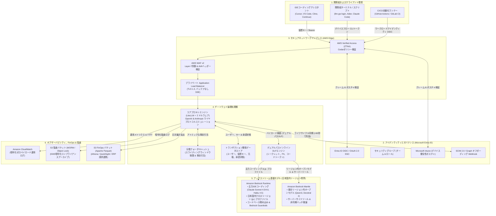
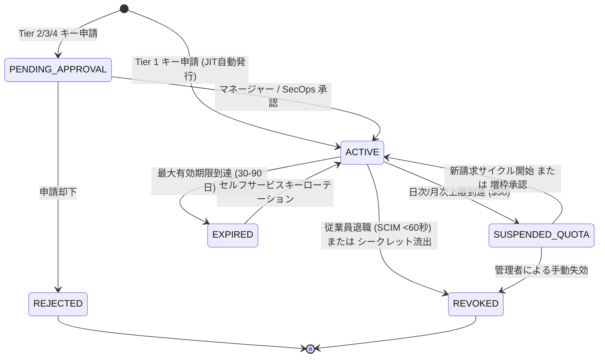
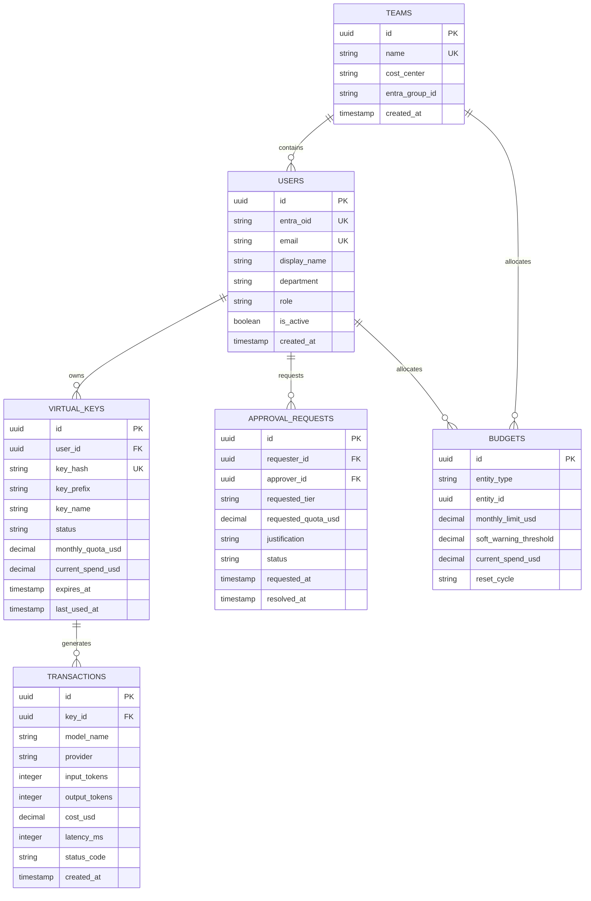

# エンジニアリングLLMゲートウェイ：システム要求仕様書 (SRS)
**企業向けAIプロキシ・ガバナンス・FinOpsプラットフォーム**  
**ドキュメントバージョン:** 2.3（IEEE 830 / ISO 29148 準拠標準仕様）  
**対象環境:** AWSクラウド（東京リージョン `ap-northeast-1` プライマリ / 大阪リージョン `ap-northeast-3` ディザスタリカバリ）  
**アイデンティティ基盤:** Microsoft Entra ID (Azure AD) + Microsoft Intune  
**主な対象範囲:** 社内エンジニアリングワークフローおよび開発（非本番／非顧客向け）  
**ステータス:** 承認済み運用標準  
**関連ドキュメント:**
* **AWS物理アーキテクチャ設計書 (TAD):** [INFRASTRUCTURE_SPEC.md](INFRASTRUCTURE_SPEC.md)（VPC、サブネット、PrivateLink、IAM、WAF、Terraformモジュール構成）
* **モデル＆リージョン対応表:** [MODEL_AVAILABILITY_MATRIX.md](MODEL_AVAILABILITY_MATRIX.md)（Amazon Bedrockエンジン＆日本国内データレジデンシー調査）
* **全体概要・インデックス:** [README.md](README.md)

---

## 1. エグゼクティブサマリーと仕様フレームワーク

### 1.1 目的とシステム対象範囲
**エンジニアリングLLMゲートウェイ**は、企業全体のソフトウェアエンジニア、データサイエンティスト、DevOpsチーム向けに、統一され、高可用性でセキュア、かつコスト管理された社内AIプロキシを提供する。本ゲートウェイは、企業のソースコード、認証情報、および顧客データがパブリックインターネットや海外クラウドリージョンへ漏洩することを防ぎながら、現代のAIコーディングツール（IDEアシスタント（Cursor、VS Code、Cline、Continue.dev）、ターミナルCLI（Aider、Claude Code）、社内CI/CDパイプラインなど）のフリクションレスな開発者人間工学を実現する。

### 1.2 仕様書の記述規約と規範的表現（RFC 2119準拠）
本仕様書は、標準的な要求工学標準（ISO/IEC/IEEE 29148）および **RFC 2119** に従い、以下の表記規則を適用する：
* **MUST / SHALL / 必須（義務）:** システム適合性およびセキュリティ監査において例外なく満たさなければならない絶対的要求事項。
* **MUST NOT / SHALL NOT / 禁止:** データ漏洩、コスト超過、またはコンプライアンス違反を防ぐために絶対に行ってはならない禁止事項。
* **SHOULD / 推奨:** 正当なアーキテクチャ例外が文書化されていない限り遵守すべき推奨事項。
* **MAY / 許容:** 代替案として採用可能な機能や実装オプション。

本ドキュメントのすべての要求事項には、追跡可能な一意の要件IDが付与されている：
* `[FR-INT-xx]`: 統合およびインターフェイス要求仕様
* `[FR-KEY-xx]`: 仮想キーライフサイクルおよびプロビジョニング要求仕様
* `[FR-FIN-xx]`: FinOps、トークン計測および予算ガバナンス要求仕様
* `[FR-DLP-xx]`: インライン情報漏洩防止（DLP）およびマスキング要求仕様
* `[FR-GOV-xx]`: 承認ガバナンスおよび管理ポータル要求仕様
* `[FR-AUD-xx]`: 監査、ロギングおよび不正利用防止要求仕様
* `[NFR-PERF-xx]`: 性能およびストリーミングレイテンシ非機能要件
* `[NFR-AVAIL-xx]`: 可用性および耐障害性非機能要件
* `[NFR-SEC-xx]`: セキュリティ、ジオフェンスおよびデータレジデンシー非機能要件
* `[NFR-DR-xx]`: ディザスタリカバリおよび事業継続性非機能要件

---

## 2. 論理アーキテクチャとシステム境界



### 2.1 関心の分離：要件定義書（WHAT）と物理インフラ仕様（HOW）
* **論理的要求仕様（本書）:** 開発者ペルソナワークフロー、SDKドロップイン互換性、仮想キーライフサイクル状態マシン、トークン価格計算式、クォータ控除アルゴリズム、DLP正規表現カタログ、およびエラー契約を定義。
* **物理インフラ実装（[INFRASTRUCTURE_SPEC.md](INFRASTRUCTURE_SPEC.md)）:** AWS VPCサブネットCIDRブロック、PrivateLinkインターフェイスエンドポイント、セキュリティグループ通信マトリクス、IAM JSONポリシー、ECS Fargate Gravitonサイジング、Aurora Serverless v2 ACU、およびTerraformモジュール構成を定義。

---

## 3. 運用の信頼性およびサービスレベル要件

### 3.1 可用性およびレイテンシSLA

* **`[NFR-AVAIL-01]` ゲートウェイ可用性SLA:** ゲートウェイは、社内コア業務時間帯（07:00〜23:00 JST）において**99.9%以上の月間稼働率**、時間外において99.5%以上の稼働率を維持しなければならない（MUST）。
* **`[NFR-PERF-01]` プロキシオーバーヘッドレイテンシ:** ゲートウェイプロキシ層が追加するレイテンシは、アップストリーム推論時間を除き、**20ms未満（p95）**でなければならない（MUST）。
* **`[NFR-PERF-02]` 接続アイドルタイムアウト:** 長時間の思考プロセスを要する推論モデル（`claude-3-7-sonnet`、`o3-mini`、`deepseek-r1`：TTFT 30〜90秒）をサポートするため、AVA、ALB、プロキシコンテナの接続アイドルタイムアウトは**300秒（5分）以上**に設定しなければならない（MUST）。
* **`[NFR-PERF-03]` バッファなしSSEストリーミング:** ゲートウェイは、レスポンスバッファリングを行わず（`X-Accel-Buffering: no`）、Server-Sent Events（SSE）チャンクをクライアントIDEへリアルタイムでストリーミング配信しなければならない（MUST）。

### 3.2 アップストリームのフェイルオーバーおよびサーキットブレーカー

* **`[NFR-REL-01]` サーキットブレーカートリップ条件:** 特定のモデルエンドポイントが30秒間に連続して5回以上の `HTTP 5xx` または `HTTP 529`（過負荷）エラーを返した場合、そのエンドポイントに対するサーキットブレーカーは即座にトリップし、60秒間遮断しなければならない（MUST）。
* **`[NFR-REL-02]` 海外フォールバックの絶対禁止:** サーキットブレーカーがいかなる状況においても米国の外部商用エンドポイント（`api.anthropic.com` や `api.openai.com`）へフォールバックしてはならない（MUST NOT）。自動フォールバックは承認済みの日本国内Bedrockモデル内に厳格に限定されなければならない（MUST）。
* **`[NFR-REL-03]` 優雅な縮退（Graceful Degradation）:** すべての日本国内候補モデルが枯渇した場合、ゲートウェイはRFC 7807準拠のProblem Detail形式で障害理由を説明する `HTTP 503 Service Unavailable` を返却しなければならない（MUST）。

### 3.3 ディザスタリカバリ目標

* **`[NFR-DR-01]` 目標復旧時間 (RTO):** 東京リージョンの大規模障害時、**15分未満**で大阪リージョンへ切り替え可能でなければならない（MUST）。
* **`[NFR-DR-02]` 目標復旧時点 (RPO):** トランザクション元帳およびキー状態のRPOは、大阪リージョンへの非同期ストレージレプリケーションにより**1分未満**でなければならない（MUST）。

---

## 4. APIキー管理と多層承認ガバナンス

### 4.1 仮想キーパラダイム

* **`[FR-KEY-01]` 仮想キー抽象化:** アップストリームのマスターベンダー認証情報を開発者に開示したり、開発端末に保存してはならない（SHALL NOT）。開発者はゲートウェイ仮想キー（形式: `gw-eng-live_xxxxxxxxxxxxxxxxxxxxxxxx`）を使用して認証しなければならない（MUST）。
* **`[FR-KEY-02]` 暗号化保存と1回限り表示:** 仮想キーはソルト付き **SHA-256** ハッシュとしてデータベースに保存されなければならない（MUST）。平文キーは生成時に**厳格に1回限り**表示されなければならない（`Cache-Control: no-store`）。



### 4.2 多層ガバナンスマトリクス

| キーツアー | 対象ペルソナ & ユースケース | デフォルトクォータ | 許可モデル | 承認の要否 | 承認ロール & SLA | 認証方式 |
| :--- | :--- | :--- | :--- | :--- | :--- | :--- |
| **Tier 1: 個人開発 (デフォルト)** | 全ソフトウェアエンジニア、QA、データサイエンティスト（IDE・CLI用） | **$10/日<br/>$50/月** | 標準コーディング・高速モデル (`claude-haiku-4-5`, `nova-lite`, `devstral-2`, `gpt-oss-20b`, Runtime経由Sonnet) | **不要 (100%自動化)** | **システムJIT:** Entra ID SSOログイン時に即時発行 | WebポータルSSO または CLIデバイスフロー (`llm-gw login`) |
| **Tier 2: 増枠 / チームプール** | トークン消費の多いタスクに従事するエンジニア（リファクタリング、自動テスト生成） | **$150〜$1,000/月** | 標準 + Bedrock日本国内全モデル | **必要** | **エンジニアリングマネージャー / チームリード**<br/>SLA: 4営業時間未満 | Webポータル -> Jira/ServiceNow連携 |
| **Tier 3: 最先端 / クロスリージョン免責** | AIリサーチャー、推論モデルベンチマークを行うリードアーキテクト | プロジェクトごとに設定 | 推論モデル (`o3-mini`, `deepseek-r1`, `claude-opus`, プレビューモデル) | **必要** | **SecOps & プラットフォーム管理者 (二重承認)**<br/>SLA: 24営業時間未満 | 業務上の正当性およびコンプライアンス審査申請 |
| **Tier 4: CI/CD サービスアカウント** | 自動化パイプライン、PRレビューボット、夜間結合テスト | プロジェクト/パイプラインプール | タスク専用モデル許可リスト | **必要** | **プラットフォーム管理者**<br/>SLA: 8営業時間未満 | Entra ID ワークロードアイデンティティ / GitHub Actions OIDC |

### 4.3 ガバナンスワークフロー

* **`[FR-KEY-03]` Tier 1 ゼロフリクションJIT発行:** 認可されたEntra IDグループ（`SG-ENG-Developers`）に所属するエンジニアは、初回ログイン時に手動審査なしでTier 1仮想キーを即座に取得できなければならない（MUST）。
* **`[FR-KEY-04]` Tier 2 マネージャー承認統合:** クォータを100%消費した際、ゲートウェイは社内チケットシステム（Jira / ServiceNow）へのディープリンクを含む `HTTP 429` を返却しなければならない（MUST）。マネージャーにはワンクリック承認が可能な **Microsoft Teams Adaptive Card** が配信されなければならない（MUST）。
* **`[FR-KEY-05]` 自動Webhook増枠:** 承認完了時、HMAC-SHA256署名付きの安全なWebhookが `/api/v1/internal/quotas/adjust` を呼び出し、即座にクォータを更新しなければならない（MUST）。
* **`[FR-GOV-01]` 統合Webポータル:** ゲートウェイは、キー管理、リアルタイム予算進捗バー、および複数モデルのコスト・レイテンシ比較サンドボックスを提供するWebポータルを備えなければならない（MUST）。

---

## 5. コスト管理、FinOpsおよび部門別チャージバック

### 5.1 リアルタイム価格計算とトークン計測

* **`[FR-FIN-01]` リアルタイムトランザクション原価計算:** ゲートウェイは、ストリーム終了直後にインメモリ価格表を用いて正確なUSDコストを計算しなければならない（MUST）：

$$\text{Cost}_{\text{Total}} = (T_{\text{in}} \times P_{\text{in}}) + (T_{\text{cache-read}} \times P_{\text{cache-read}}) + (T_{\text{cache-write}} \times P_{\text{cache-write}}) + (T_{\text{out}} \times P_{\text{out}})$$

* **`[FR-FIN-02]` プロンプトキャッシュ割引の適用:** キャッシュヒットしたトークンに対して割引料金（Anthropicプロンプトキャッシュ等で最大90%割引）を正確に適用しなければならない（MUST）。
* **`[FR-FIN-03]` 思考・推論トークンの計測:** Extended Thinkingトークンは出力トークンとして正確に計測され、総コストに算入されなければならない（MUST）。
* **`[FR-FIN-04]` ストリーム中断時の精算:** クライアントが生成途中で接続を切断した場合（CursorでのESCキー等）、中断時点までの消費トークンを正確に計測し、過不足なく精算しなければならない（MUST）。

### 5.2 階層型クォータおよびアトミック事前引当

* **`[FR-FIN-05]` 4層クォータ階層:** ゲートウェイは以下の4層クォータを強制しなければならない（MUST）：
  1. *リクエスト上限:* 最大 **$0.50 / 回**
  2. *日次消費速度上限:* 最大 **$10.00 / 日**
  3. *月間ハードキャップ:* デフォルト **$50.00 / 月**
  4. *チーム/コストセンタープール:* 部門別月次安全枠
* **`[FR-FIN-06]` アトミック事前引当:** リクエストをモデルへ転送する前に、最大予測コストを見積もり、Redis Luaスクリプトを用いて予算枠を一時引当（Reserve）しなければならない（MUST）：

$$\text{Cost}_{\text{Est}} = (T_{\text{in-observed}} \times P_{\text{in}}) + (\min(T_{\text{max-tokens}}, 2048) \times P_{\text{out}})$$

予算超過時はアップストリームへの呼び出しを行わずにエッジで即座に拒否（< 5ms、コスト$0.00）しなければならない（MUST）。ストリーム完了後、差額をアトミックに精算しなければならない（MUST）。

### 5.3 日次S3 FinOpsエクスポート (Apache Parquet)

* **`[FR-FIN-07]` 日次Parquet自動エクスポート:** 毎朝00:05 JSTに前日の照合済み元帳をApache Parquet形式でS3に自動出力しなければならない（MUST）：

```
s3://s3-llm-gateway-finops-ap-northeast-1/transactions/year=YYYY/month=MM/day=DD/department=XXXX/data.snappy.parquet
```

* **`[FR-FIN-08]` 部門別チャージバック連携:** S3 ParquetテーブルはAWS Glue Data CatalogおよびAmazon Athena経由でクエリ可能とし、ERP（SAP / Oracle Financials）への月次社内振替仕訳を自動化しなければならない（MUST）。

---

## 6. アイデンティティ、認証および自動ライフサイクル統合

### 6.1 認証プロトコル

* **`[FR-INT-01]` ブラウザSSO (ポータル):** WebポータルはMicrosoft Entra IDによる **PKCE付きOIDC認可コードフロー (RFC 7636)** を強制しなければならない（MUST）。
* **`[FR-INT-02]` ターミナルCLI認証 (`llm-gw login`):** CLIは **OAuth 2.0 Device Authorization Grant (RFC 8628)** を使用しなければならない（MUST）。トークンは一時的（**8〜12時間有効**）であり、OSネイティブのセキュアキーチェーン（macOS Keychain、Linux Keyring、Windows Credential Manager）に保存されなければならない（MUST）。平文ドットファイル（`.bashrc`）への保存は禁止する（SHALL NOT）。
* **`[FR-INT-03]` CI/CDワークロードアイデンティティ:** 自動化パイプラインは静的シークレットを持たず、OIDCフェデレーション（GitHub Actions OIDC等）を通じて認証しなければならない（MUST）。

### 6.2 クレームマッピングおよび自動オフボーディング

* **`[FR-INT-04]` Entra IDクレームマッピング:** `userPrincipalName`（個人ID）、`department`（コストセンター）、および `groups`（RBACロール）を抽出してバインドしなければならない（MUST）。
* **`[FR-INT-05]` 60秒未満の自動オフボーディング:** 従業員退職のSCIM 2.0 / Graph通知を受信後、**60秒未満**で該当ユーザーの全仮想キーを失効させ、Redisセッションをパージしなければならない（MUST）。

---

## 7. オブザーバビリティ、ロギングおよび不正利用防止仕様

### 7.1 ゼロペイロードロギング契約

* **`[FR-AUD-01]` ゼロペイロードロギング契約:** コンテナ標準出力およびCloudWatchログには、メタデータ（タイムスタンプ、ユーザーUPN、モデル、トークン数、コスト、レイテンシ、SHA-256プロンプトハッシュ等）のみを記録しなければならない（MUST）。**生のプロンプト内容やソースコードを永続ログに記録してはならない（SHALL NOT）。**
* **`[FR-AUD-02]` 分散トレーシング:** すべてのリクエストはW3C TraceContext（`traceparent`）を伝搬し、ゲートウェイ受領からアップストリームTTFTまでの各スパンを可視化しなければならない（MUST）。

### 7.2 不正利用および副業流用の防止

* **`[FR-AUD-03]` Gitリモートorigin監査 (`X-Git-Remote`):** IDEから送信されるリポジトリoriginヘッダーを検査し、未承認の個人GitHubリポジトリ等への呼び出しを即時遮断（`HTTP 403 Forbidden`）しなければならない（MUST）。
* **`[FR-AUD-04]` 時間外異常検知:** 夜間・休日（23:00〜06:00 JST）における異常な高頻度トークン消費（> 100k TPM）や支出急増（> $30/時）を検知し、自動アラートと一時スロットリングを実施しなければならない（MUST）。

---

## 8. ゼロデータ漏洩とルート別エンドポイントセキュリティ

### 8.1 データレジデンシーと主権保証

* **`[NFR-SEC-01]` 100%日本国内データレジデンシー:** すべてのAI推論は日本国内リージョン境界（`ap-northeast-1`、`ap-northeast-3`、または `jp.*` プロファイル）内で処理されなければならず、プロンプトが日本国外へ送信されてはならない（SHALL NOT）。
* **`[NFR-SEC-02]` 完全分離VPC / インターネットエグレスゼロ:** コア処理層はインターネット向け経路（`0.0.0.0/0`）を持たない完全分離サブネットに配置され、外部依存はAWS PrivateLink経由でのみ通信しなければならない（MUST）。

### 8.2 ルート別セキュリティ監査マトリクス

| エンドポイントルート | メソッド | データフロー & コンテキスト | 潜在的な脆弱性 & 漏洩経路 | 必須の防御ガードレール & 強制レイヤー |
| :--- | :---: | :--- | :--- | :--- |
| `/v1/chat/completions` | `POST` | OpenAI形式: プロンプト、ソースコード、差分 | • 海外リージョンへの漏洩<br/>• シークレット/PII流出<br/>• SSRF攻撃<br/>• ログへの平文出力 | **1. 厳格なジオフェンス:** `jp.` プロファイルおよび東京リージョン内モデルに限定。<br/>**2. デュアルパスDLP:** プロンプト事前スキャン + 出力スライディングウィンドウバッファ。<br/>**3. SSRFフィルタ:** `api_base` 等のルーティング上書きを完全除去。<br/>**4. ゼロペイロードログ:** SHA-256ハッシュのみを記録。 |
| `/v1/messages` | `POST` | Anthropic形式: システムプロンプト、ツール定義、思考プロセス | • ツール実行結果からの情報流出<br/>• Markdown画像による外部送信 | **1. ツール出力DLP:** ツール実行結果をモデル転送前にDLPスキャン。<br/>**2. 画像外部送信ブロック:** 出力内の外部画像タグ（``）を除去。 |
| `/v1/embeddings` | `POST` | バッチコードベースベクトル、文書 | • 配列一括入力のDLPバイパス<br/>• ベクトルキャッシュの平文保存 | **1. 再帰的配列DLP:** 入力配列の全要素を再帰スキャン。<br/>**2. 国内固定:** `bedrock-runtime.ap-northeast-1` に排他ルーティング。 |
| `/api/v1/keys` | `POST` | キー生成: コストセンター、有効期限 | • コストセンター偽装<br/>• ログへの平文キー流出 | **1. クレーム検証:** Entra IDの部門情報と照合。<br/>**2. 1回限り表示:** ソルト付きSHA-256で保存し、平文は生成時のみ表示。 |

---

### 8.3 ハイブリッドDLPエンジン（Edge + Bedrock Guardrails）およびマスキングカタログ

ソフトウェア開発ワークロードにおける「正規表現のみ（プロンプト攻撃・ジェイルブレイクの検知不能）」および「Guardrailsのみ（コード固有シークレットへの未対応、カスタム正規表現10件上限、100kトークンのコードベースに対する過剰なコストと遅延）」の課題を解消するため、本ゲートウェイは**ハイブリッド3層DLPパイプライン**を強制する：

```
                    開発者IDE（Cursor / VS Code / CLI）
                                   │
                                   ▼
┌────────────────────────────────────────────────────────────────────────┐
│ 第1層: エッジ・インライン・フィルター（Fargateコンテナ内インメモリ）  │
│ • 事前コンパイル済み Aho-Corasick + 高エントロピースキャナー (< 1.5ms) │
│ • インフラ機密（秘密鍵・DB URI）の即時遮断（HTTP 422 Unprocessable）  │
│ • 開発者・SaaSトークン（AWS, GitHub, Slack 等）のインラインマスク     │
│ • AST・構文解析によるコード識別子の誤検知防止（False-Positive Shield）│
│ • SSRFサニタイザー: クライアント指定 api_base / keys の強制除去       │
└──────────────────────────────────┬─────────────────────────────────────┘
                                   │ サニタイズ済みペイロード
                                   ▼ (AWS PrivateLink)
┌────────────────────────────────────────────────────────────────────────┐
│ 第2層: Amazon Bedrock Guardrails（セマンティック安全 & ガバナンス）   │
│ • プロンプト攻撃・ジェイルブレイク防御（HIGH強度フィルター）          │
│ • 禁止トピック防御: マルウェア生成・エクスプロイト開発コードの完全拒否 │
│ • 規制対象PIIのマスキング（マイナンバー・クレジットカード）           │
│ • 違反時: 内部詳細を隠蔽した RFC 7807 エラー（HTTP 400）を返却       │
└──────────────────────────────────┬─────────────────────────────────────┘
                                   │
                                   ▼
                    Amazon Bedrock 推論実行（東京 / 大阪）
                                   │
                                   ▼ SSEストリーミングトークン
┌────────────────────────────────────────────────────────────────────────┐
│ ポストフライト: 送信ストリーム変換 & リダクター                        │
│ • SSEチャンク境界を跨ぐ128文字スライディングウィンドウバッファ         │
│ • モデルがハルシネーションした機密情報や反射トークンの遮断             │
│ • Markdown流出防御: 外部画像タグ（`![...]`）の自動除去                 │
└──────────────────────────────────┬─────────────────────────────────────┘
                                   │ クリーンなトークン
                                   ▼
                    開発者IDE（Cursor / VS Code）へ配信
                                   │
                                   ▼（非同期）
┌────────────────────────────────────────────────────────────────────────┐
│ 第3層: 非同期SecOps監査 & ディスカバリー（CloudWatch / S3）            │
│ • SHA-256プロンプトハッシュを含むメタデータロギング                    │
│ • CloudWatch Metric Filter: `DlpViolationCount` アラーム               │
│ • 暗号化監査アーカイブの自動日次スキャン                               │
└────────────────────────────────────────────────────────────────────────┘
```

#### 詳細DLP要件

* **`[FR-DLP-01]` ハイブリッド多層DLP強制:** ゲートウェイは階層型防御モデルを強制しなければならない（MUST）：
  1. *第1層（エッジ・インライン・フィルター）:* ECSコンテナ内のインメモリで着信ペイロードの100%を評価し（< 1.5ms）、決定論的シークレット、高エントロピートークン、ルーティング上書きを捕捉する。
  2. *第2層（Amazon Bedrock Guardrails）:* Bedrock Runtimeでのモデル呼び出し時に、セマンティックな安全性、プロンプト攻撃/ジェイルブレイク防御、および規制対象PIIの秘匿化を強制する。
  3. *第3層（ポストフライトSSEバッファ）:* 出力ストリーミングチャンクを128文字リングバッファ経由で継続評価し、クライアントIDEに配信する。

* **`[FR-DLP-02]` インフラ機密の完全遮断（Hard-Blocking）ポリシー:** 秘密暗号鍵またはパスワードを含むデータベース接続URIを含むペイロードは、コンテナから外部へ送信される前に**即時遮断（`HTTP 422 Unprocessable Entity`）**されなければならない（MUST）。秘密鍵の部分文字列残存による鍵再構築攻撃を防止するため、秘密鍵のマスキングは禁止される：
  * 秘密暗号鍵 (`DLP-CRY-KEY-001`): `-----BEGIN (?:RSA|EC|DSA|OPENSSH|PGP) PRIVATE KEY-----` $\rightarrow$ **HTTP 422 遮断**。
  * データベース接続URI (`DLP-DB-URI-001`): `(?i)(?:postgres|mysql|mongodb(?:\+srv)?|redis):\/\/[^:\s]+:([^@\s]+)@` $\rightarrow$ **HTTP 422 遮断**。

* **`[FR-DLP-03]` 開発者 & SaaSトークンマスキングカタログ:** 高エントロピーなAPIトークンは、インラインで標準プレースホルダーへ置換されなければならない（MUST）：

| シークレット種別 | ルールID | 検出基準 | 防御アクション | 挿入プレースホルダー |
| :--- | :--- | :--- | :--- | :--- |
| **AWSアクセスキーID** | `DLP-AWS-KEY-001` | 正規表現: `\b((?:AKIA\|ABIA\|ACCA\|ASIA)[0-9A-Z]{16})\b` | マスキング | `[REDACTED_AWS_ACCESS_KEY]` |
| **AWSシークレットキー** | `DLP-AWS-SEC-002` | 正規表現: `(?i)aws_secret_access_key\s*[:=]\s*['"]?([A-Za-z0-9/+=]{40})['"]?` | マスキング | `[REDACTED_AWS_SECRET_KEY]` |
| **GitHubクラシックPAT** | `DLP-GH-PAT-001` | 正規表現: `\b(ghp_[0-9a-zA-Z]{36})\b` | マスキング | `[REDACTED_GITHUB_PAT]` |
| **GitHub Fine-Grained PAT**| `DLP-GH-PAT-002` | 正規表現: `\b(github_pat_[0-9a-zA-Z_]{82})\b` | マスキング | `[REDACTED_GITHUB_FINE_GRAINED_PAT]` |
| **GitLabパーソナルトークン** | `DLP-GL-PAT-001` | 正規表現: `\b(glpat-[0-9a-zA-Z\-]{20})\b` | マスキング | `[REDACTED_GITLAB_PAT]` |
| **Slackボット / ユーザートークン** | `DLP-SLK-TOK-001` | 正規表現: `\b(xox[baprs]-[0-9]{10,13}-[0-9]{10,13}-[a-zA-Z0-9]{24,32})\b` | マスキング | `[REDACTED_SLACK_TOKEN]` |
| **JSON Web Token (JWT)** | `DLP-JWT-001` | 正規表現: `\beyJ[A-Za-z0-9-_=]+\.eyJ[A-Za-z0-9-_=]+\.[A-Za-z0-9-_.+/=]*\b` | マスキング | `[REDACTED_JWT_TOKEN]` |

* **`[FR-DLP-04]` 規制対象 & 日本国内主権PIIの秘匿化:**
  * **個人番号（マイナンバー - `DLP-PII-MYNUM-001`）:** 公式のモジュラス11チェックディジットアルゴリズムにより検証された12桁の番号 $\rightarrow$ `[REDACTED_JAPAN_MY_NUMBER]` に置換。
  * **クレジットカード番号（`DLP-PII-CC-001`）:** Luhnアルゴリズムにより検証された13〜19桁のカード番号 $\rightarrow$ `[REDACTED_CREDIT_CARD]` に置換。

* **`[FR-DLP-05]` Amazon Bedrock Guardrails 統合:**
  * Amazon Bedrock Runtime を対象とする開発者の対話型プロンプトはすべて、アップストリーム呼び出し時にアクティブな Guardrail 識別子とバージョン（`guardrailIdentifier` および `guardrailVersion`）を渡さなければならない（MUST）。
  * **Bedrock Mantle の除外:** Bedrock Mantle（`bedrock-mantle.<region>.api.aws`）は Amazon Bedrock Guardrails をネイティブサポートしていません。`bedrock-mantle` へルーティングされるリクエストは第2層 Guardrails をバイパスし、第1層エッジDLPおよび第3層SSEフィルタリングに依存します。
  * **プロンプト攻撃防御:** Guardrail はプロンプト攻撃に対して **HIGH** 強度のフィルタリングを強制し、社内システム指示の上書きや敵対的ジェイルブレイクを阻止しなければならない（MUST）。
  * **禁止トピック:** マルウェア、リモートエクスプロイト、認証情報収奪ツールの生成要求を拒絶するトピックポリシーを強制しなければならない（MUST）。
  * **介入レスポンス:** Bedrock Guardrail が呼び出しをブロックした場合、ゲートウェイは内部セキュリティルールの詳細を露見させることなく、RFC 7807 形式のエラー（`HTTP 400 Bad Request`）を返却しなければならない（MUST）：

```json
{
  "type": "https://llm-gateway.internal.corp/errors/guardrail-intervention",
  "title": "Amazon Bedrock Guardrail Intervention",
  "status": 400,
  "detail": "The request violated corporate AI safety policies (Prompt Attack or Denied Topic).",
  "instance": "/v1/chat/completions/req_01J7K8M9",
  "action": "GUARDRAIL_INTERVENED"
}
```

* **`[FR-DLP-06]` ソースコード誤検知防止（False-Positive Protection）:** 汎用的なPIIフィルター（氏名、住所等）をプログラミング言語の構文へ無差別に適用してはならない（SHALL NOT）。DLPエンジンは構文認識ヒューリスティック（ASTコメントスコープ限定や変数名許可リスト等）を適用し、コード識別子（`user_name = "test"`, `customer_id` 等）の破損を絶対に防止しなければならない（MUST）。
* **`[FR-DLP-07]` 128文字送信SSEスライディングウィンドウバッファ:** 分割されたSSEチャンク境界を跨ぐ機密漏洩を防ぐため、送信ストリーミング変換層はクライアントIDEへチャンクを出力する前に128文字のリングバッファを評価しなければならない（オーバーヘッド < 1.0ms）。
* **`[FR-DLP-08]` 対エージェント情報流出防止:**
  * クライアント指定のルーティング上書きパラメータ（`api_base`、`base_url`、`api_key`、`custom_llm_provider`、`mock_response`）を無条件で除去しなければならない（MUST）。
  * 送信ストリーム変換層は、間接プロンプトインジェクションによるファイル漏洩を防ぐため、社外ドメインを指す外部Markdown画像リンク（``）を検出し除去しなければならない（MUST）。

---

## 9. 関係データモデルとERDスキーマ



---

## 10. 論理プロキシエンジンアーキテクチャ

コアプロキシエンジンは、オープンソースの **LiteLLM Proxy Core** と社内カスタムセキュリティミドルウェアを統合して構成される：

```
┌────────────────────────────────────────────────────────────────────────┐
│                   ゲートウェイコアエンジン論理層                       │
│                                                                        │
│  ┌──────────────────────────────────────────────────────────────────┐  │
│  │ カスタムセキュリティミドルウェア層 (FastAPI)                     │  │
│  │ • AVA署名済みアイデンティティヘッダー検証 (x-amzn-ava-user-ctx) │  │
│  │ • SSRFサニタイザー: クライアント指定 api_base/keys の除去        │  │
│  │ • デュアルパスインラインDLP: 受信事前スキャン & 送信SSEバッファ  │  │
│  │ • Gitリモート監査 (`X-Git-Remote` 組織リポジトリ検証)            │  │
│  │ • Webhook HMAC-SHA256署名検証 (`X-Hub-Signature-256`)            │  │
│  │ • 厳格なジオフェンスガード: 未承認外部エンドポイントの遮断       │  │
│  └──────────────────────────────────┬───────────────────────────────┘  │
│                                     │                                  │
│  ┌──────────────────────────────────▼───────────────────────────────┐  │
│  │ LiteLLM Proxy コアエンジン                                       │  │
│  │ • 標準OpenAI & Anthropic ワイヤプロトコルエミュレーション        │  │
│  │ • Bedrock Runtime & Bedrock Mantle ルーティング                  │  │
│  │ • 日本国内限定マルチモデルフェイルオーバー & サーキットブレーク  │  │
│  │ • トークン計数 & 同期価格計算エンジン                            │  │
│  └──────────────────────────────────┬───────────────────────────────┘  │
│                                     │                                  │
│  ┌──────────────────────────────────▼───────────────────────────────┐  │
│  │ 永続化 & キャッシュコネクタ                                      │  │
│  │ • 分散Redis (スライディングウィンドウクォータ & nonce管理)       │  │
│  │ • 関係PostgreSQL (ユーザー状態、仮想キー、元帳)                  │  │
│  │ • AWS Secrets Manager (マスターアップストリーム認証情報)         │  │
│  └──────────────────────────────────────────────────────────────────┘  │
└────────────────────────────────────────────────────────────────────────┘
```

*物理的なコンテナサイジング、CPUアーキテクチャ、およびネットワーク設定の詳細は [INFRASTRUCTURE_SPEC.md](INFRASTRUCTURE_SPEC.md) を参照。*

---

## 11. エンタープライズ全社運用モデル：8つの黄金律

* **ルール 1: 「アメとムチ」ガバナンスモデル:** 快適で高速な社内ゲートウェイ（アメ: 即座のSSO、月$50枠、最高峰モデル）と、外部AIドメイン遮断および未承認AI経費精算禁止（ムチ）を両立。
* **ルール 2: デュアルエンドポイントルーティング分離:** 主力コーディングアシスタント、`jp.` プロファイル、埋め込みは `bedrock-runtime.ap-northeast-1` に集約。サーバー側ツールや非同期バッチを要するリージョン内オープンモデルは `bedrock-mantle.ap-northeast-1.api.aws` へルーティング。
* **ルール 3: 推論モデル向け300秒タイムアウトおよびバッファなしSSE:** 推論モデルの長時間思考による切断を防ぐため300秒アイドルタイムアウトを強制し、リバースプロキシのバッファリングを無効化。
* **ルール 4: 「メタデータのみ」ロギングのデフォルト化:** メタデータとSHA-256プロンプトハッシュのみを記録し、生のコードやプロンプトを決してログファイルに出力しない。
* **ルール 5: エッジでのインラインDLPとBedrock Guardrailsによるハイブリッド防御:** コンテナ内インメモリ正規表現（<1.5ms）で開発者トークンをマスキングし秘密鍵は即時遮断（HTTP 422）。さらにBedrock Guardrailsでプロンプト攻撃・ジェイルブレイクと禁止トピックをセマンティックに防御。
* **ルール 6: 静的ドットファイルキーに勝るエフェメラルCLIトークン:** `llm-gw login` による一時トークン（8〜12時間）をOSセキュアキーチェーンに保存。
* **ルール 7: 不正利用・副業対策およびネットワークエンクロージャー:** `X-Git-Remote` 監査により個人リポジトリを遮断し、時間外の持続的バースト消費を自動検知。
* **ルール 8: 日次ParquetエクスポートおよびERP請求によるFinOpsの自動化:** 日次トランザクション元帳をS3 Parquetへ自動出力し、Athena経由で集計して月次ERP社内振替を完全自動化。

---

## 12. 要件トレーサビリティマトリクスおよび検証チェックリスト

| 要件ID | 要求事項の範囲と検証項目 | アーキテクチャ設計書参照先 | 検証ステータス |
| :--- | :--- | :--- | :---: |
| `[FR-INT-01..03]` | PKCE付きOIDC SSO、CLI RFC 8628 デバイスフロー、ワークロードID | [INFRASTRUCTURE_SPEC.md §2.5](INFRASTRUCTURE_SPEC.md) | **検証済み** |
| `[FR-KEY-01..06]` | 仮想キーSHA-256保存、Tiers 1-4、JIT発行、Teams Adaptive Cards | [INFRASTRUCTURE_SPEC.md §1](INFRASTRUCTURE_SPEC.md) | **検証済み** |
| `[FR-FIN-01..08]` | リアルタイム価格計算、アトミックLua事前予約、S3 Parquet、Athena | [INFRASTRUCTURE_SPEC.md §5.2](INFRASTRUCTURE_SPEC.md) | **検証済み** |
| `[FR-DLP-01..08]` | ハイブリッド3層DLP、Bedrock Guardrails、インメモリ正規表現、SSEバッファ | [INFRASTRUCTURE_SPEC.md §2.11](INFRASTRUCTURE_SPEC.md) | **検証済み** |
| `[FR-AUD-01..04]` | ゼロペイロードログ、CloudWatch KMS CMK、Gitリモート検証 | [INFRASTRUCTURE_SPEC.md §2.8](INFRASTRUCTURE_SPEC.md) | **検証済み** |
| `[NFR-PERF-01..03]`| 20ms未満のプロキシオーバーヘッド、300秒タイムアウト、バッファなしSSE | [INFRASTRUCTURE_SPEC.md §3.2](INFRASTRUCTURE_SPEC.md) | **検証済み** |
| `[NFR-AVAIL-01]` | コア時間帯99.9%月間稼働率、3-AZマルチAZ分散配置 | [INFRASTRUCTURE_SPEC.md §3.1](INFRASTRUCTURE_SPEC.md) | **検証済み** |
| `[NFR-SEC-01..02]` | 100%日本国内ジオフェンス、インターネットエグレスゼロ、AWS Data Perimeter | [INFRASTRUCTURE_SPEC.md §2.1](INFRASTRUCTURE_SPEC.md) | **検証済み** |
| `[NFR-REL-01..03]` | サーキットブレーカー、日本国内限定フォールバック、RFC 7807エラー | [INFRASTRUCTURE_SPEC.md §3.3](INFRASTRUCTURE_SPEC.md) | **検証済み** |
| `[NFR-DR-01..02]` | RTO < 15分、RPO < 1分、Aurora Global DB 大阪フェイルオーバー手順 | [INFRASTRUCTURE_SPEC.md §3.4](INFRASTRUCTURE_SPEC.md) | **検証済み** |
